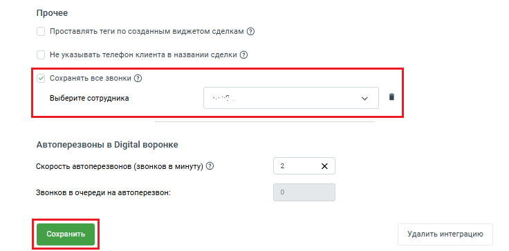

# 2.3. Настройка “Сохранять все звонки” или как сохраняются

> Трассировка: PDF §2.3 · сквозные стр. 25-28 · источники: ч.1 `kb/sources/integration_amocrm/Mango_office_integration_amoCRM.pdf` с.25-28.

звонки сотрудников, не указанных в таблице сопоставления Примечание. Данная настройка доступна только в расширенном пакете. Общее Данная настройка будет полезна, если вы указали не всех менеджеров в настройке сопоставления сотрудников, а также, если вы хотите фиксировать звонки сотрудников, которые не работают в amoCRM, но могут звонить клиентам (например, бухгалтер, курьер и т.д.). Если включена настройка “Сохранять все звонки” и в ней указан сотрудник amoCRM, то к этому сотруднику будут автоматически привязаны все звонки, совершенные несопоставленными сотрудниками (то есть, сотрудниками, не указанными в таблице сопоставления виджета интеграции). Подробно об особенностях работы Виджет интеграции игнорирует звонки несопоставленного сотрудника, если выключена настройка “Сохранять все звонки”. В таблице ниже описаны особенности в работе виджета интеграции при включенной настройке “Сохранять все звонки”: Интеграция Виртуальной АТС MANGO OFFICE и amoCRM | Версия от 25.08.2025

| Особенности | Описание работы интеграции при включенной настройке “Сохранять все звонки” |
| --- | --- |
| Обработка входящего или исходящего звонка несопоставленного сотрудника | Данные о звонках всех несопоставленных сотрудников, будут привязаны к одному сотруднику, указанному в этой настройке. |
| Обработка пропущенного звонка на несопоставленного сотрудника | Если пропущенный звонок в группу завершился на несопоставленном сотруднике, и при этом, выключена настройка “Указывать ответственного при пропущенных звонках в группу”, то звонок будет привязан к сотруднику, указанному в настройке “Сохранять все звонки”. |
| Перевод звонка: |  |
| - перевод от несопоставленного сотрудника к сотруднику, указанному в таблице сопоставления | Первое плечо звонка будет фиксироваться на сотрудника, указанного в настройке “Сохранять все звонки”, а второе плечо звонка будет фиксироваться в соответствии с настройками обработки звонков в виджета интеграции. Пример. Бухгалтер позвонил Клиенту, чтобы уточнить сумму заказа, а затем бухгалтер перевел звонок на оператора для уточнения заказа. Звонок будет зафиксирован в amoCRM следующим образом: - разговор Клиента с бухгалтером (то есть, первое плечо звонка) будет сохранен в amoCRM с привязкой к сотруднику, указанному в настройке “Сохранять все звонки”; - разговор Клиента с оператором (то есть, второе плечо звонка) будет сохранен как отдельный звонок на оператора, а также в amoCRM будут созданы сущности, в соответствии с настройкой обработки входящих звонков. |
| - перевод от сотрудника, указанного в таблице сопоставления, к не сопоставленному сотруднику | Первое плечо звонка будет фиксироваться в соответствии с настройками обработки звонков приложения интеграции, а второе плечо звонка будет фиксироваться на сотрудника, указанного в настройке “Сохранять все звонки”. Пример. Клиент позвонил оператору, чтобы уточнить время доставки, а оператор перевел Клиента на курьера. Звонок будет зафиксирован в amoCRM следующим образом: - разговор Клиента с оператором (то есть, первое плечо звонка) будет сохранен как отдельный входящий звонок на оператора, а также в amoCRM будут созданы сущности, в соответствии с настройкой обработки входящих звонков; - разговор Клиента с курьером (то есть, второе плечо звонка) будет сохранен в amoCRM с привязкой к сотруднику, указанному в настройке “Сохранять все звонки”. |
| Сохранение текстов речевой аналитики | Тексты разговоров с Клиентами несопоставленных сотрудников будут сохраняться, при включении настройки “Сохранять данные Речевой аналитики” в приложении интеграции. |
| Показ карточки звонка | Карточка звонка НЕ будет отображаться в amoCRM во время звонка несопоставленного сотрудника. |

Интеграция Виртуальной АТС MANGO OFFICE и amoCRM | Версия от 25.08.2025 Как включить настройку По умолчанию данная настройка выключена. Чтобы ее включить, в окне “Основные настройки интеграции” следует: 1. перейдите на вкладку “Обработка звонков”; 2. прокрутите вкладку вниз до конца, так, чтобы отображался блок “Прочее”; 3. активируйте переключатель “Сохранять все звонки”. Будет открыто дополнительное поле;

4. укажите сотрудника amoCRM, к которому будут привязаны все звонки несопоставленных сотрудников; 5. нажмите кнопку “Сохранить”.

Интеграция Виртуальной АТС MANGO OFFICE и amoCRM | Версия от 25.08.2025
