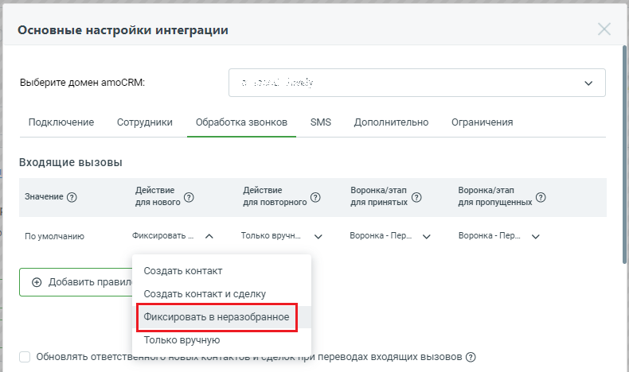
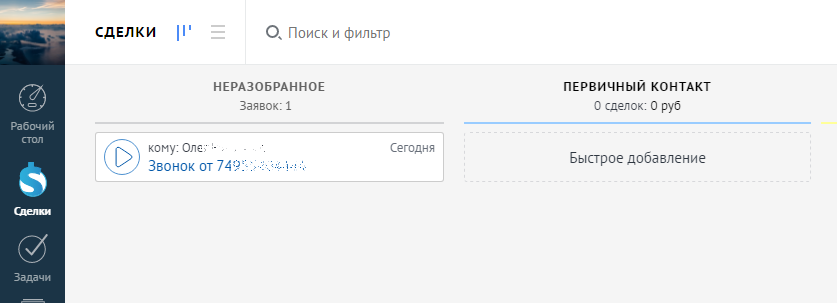
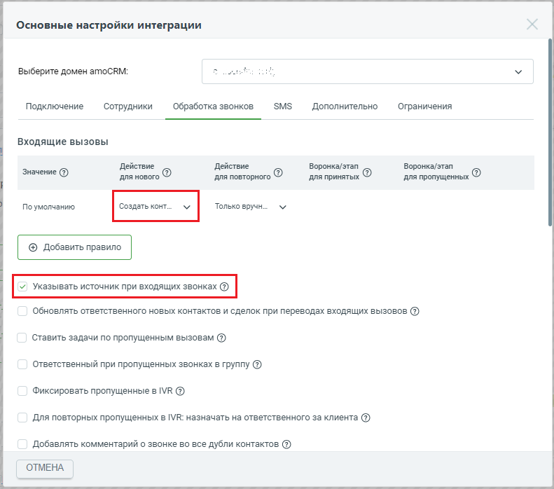
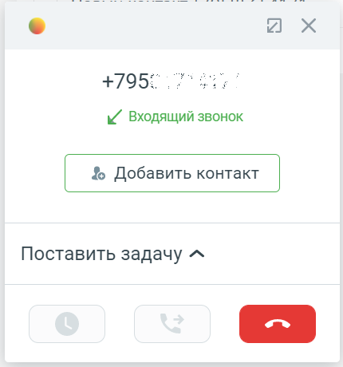

# 2.4. Обработка входящих вызовов от новых Клиентов

> Трассировка: PDF §2.4 · сквозные стр. 28-31 · источники: ч.1 `kb/sources/integration_amocrm/Mango_office_integration_amoCRM.pdf` с.28-31.

Создавать контакт при звонках с новых номеров Если в поле “Действие для нового Клиента”, в выпадающем списке выбрано значение “Создать контакт”, то после каждого принятого входящего звонка с нового номера телефона будет автоматически создан новый контакт в amoCRM. В контакте также сохранится номер телефона, с которого вам звонили. Имя контакта по умолчанию указывается в формате “Новый Клиент, ЧЧ:ММ ДД.ММ.ГГГГ” с указанием даты и времени его создания. Если звонок не был принят – контакт не создается. Можно выбрать значение “Создать контакт и сделку”, чтобы автоматически создавался не только контакт, но и сделка, связанная с контактом. Название сделки по умолчанию в формате “Сделка номер телефона” (к примеру, “Сделка 74955404444”). Примечание. При выборе значения “Создать контакт и сделку” появляется возможность настроить воронку продаж для входящих звонков.

Если при звонках от новых Клиентов нужно фиксировать их в категорию “НЕРАЗОБРАННОЕ”, то в поле “Действие для нового Клиента” нужно выбрать значение “Фиксировать в неразобранное”. Примечание. При выборе значения “Фиксировать в неразобранное” появляется возможность настроить воронку продаж для входящих звонков. Если выбрано значение “Фиксировать в неразобранное”, то при звонке от нового Клиента в amoCRM контакт и сделка не будут созданы, информация о звонке сохранится в категории “НЕРАЗОБРАННОЕ”, можно обработать его в любой момент времени:

Интеграция Виртуальной АТС MANGO OFFICE и amoCRM | Версия от 25.08.2025 Если нужно создавать Клиентов (при звонках от новых) только вручную, то нужно выбрать значение “Только вручную”. При такой настройке amoCRM: • при входящем звонке контакт и сделка не будут созданы автоматически; • во время разговора с Клиентом будет открыта карточка звонка, в которой отображена кнопка “Добавить контакт”. Если оператор нажмет на кнопку “Добавить контакт”, то в amoCRM будет создан новый контакт, в котором учтен входящий звонок. Примечание. Дополнительно можно включить настройку “Указывать источник при входящих звонках”. Указывать источник при входящих звонках Если у вас несколько номеров подключено к Виртуальной АТС и нужно разделять Клиентов, обращающихся по разным номерам, то нужно включить флаг “Указывать источник при входящих звонках”. Примечание. Флаг “Указывать источник при входящих звонках” доступен для настройки, если в поле “Действие для нового Клиента” выпадающем списке выбрано одно из следующих значений: Создать контакт, Создать контакт и сделку:

Если флаг включен, то при входящем звонке в карточке звонка отобразится информация о вашем номере, на который поступил звонок от Клиента: Интеграция Виртуальной АТС MANGO OFFICE и amoCRM | Версия от 25.08.2025

В автоматически создаваемом контакте в дополнительном поле “Номер линии MANGO OFFICE” указывается номер, на который поступил звонок:

Также можно разделять списки контактов и аналитику продаж по значениям этого поля:

Интеграция Виртуальной АТС MANGO OFFICE и amoCRM | Версия от 25.08.2025
