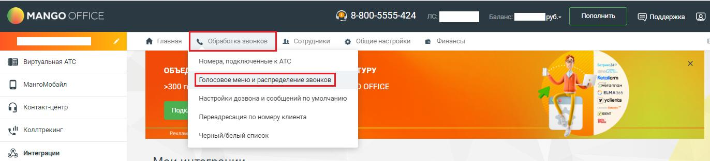
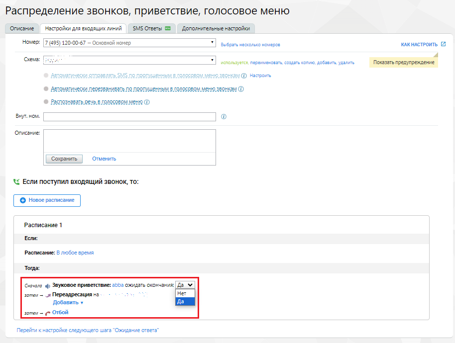
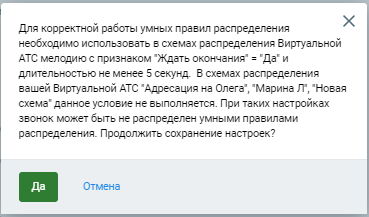
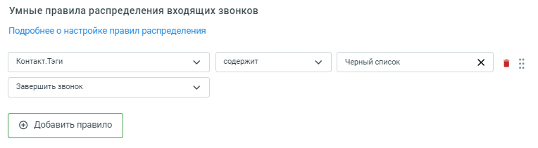
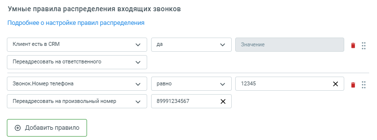
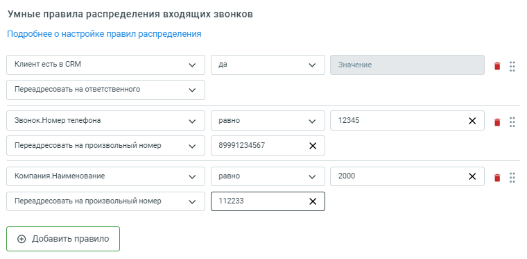
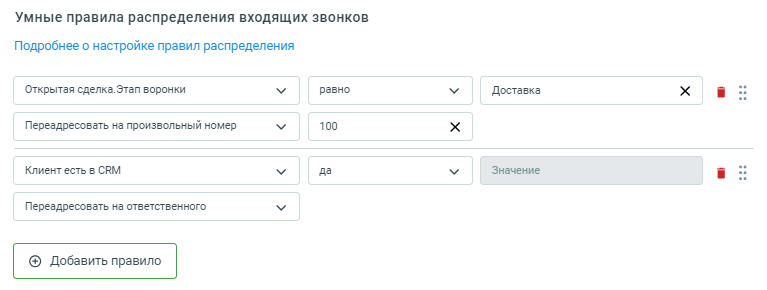
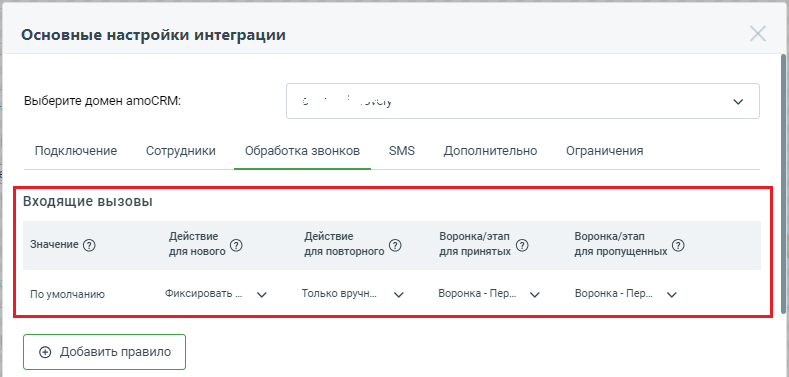
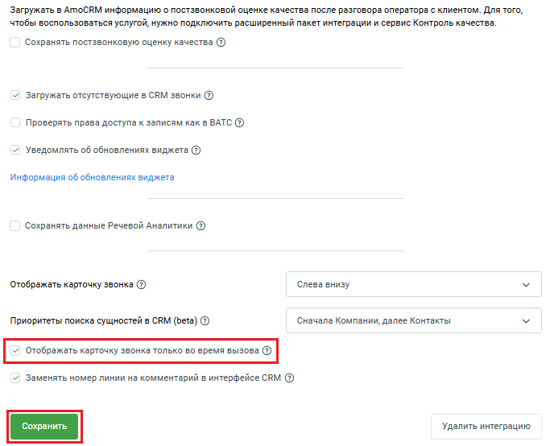
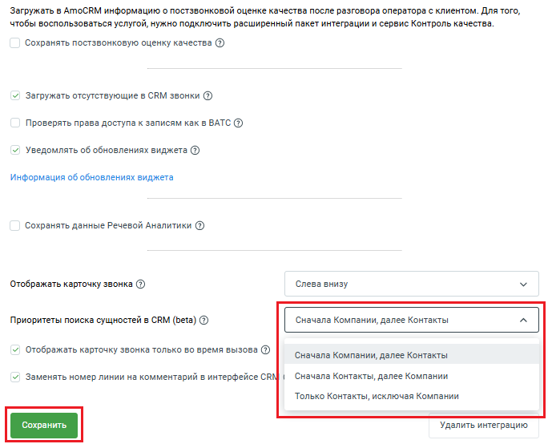

# 2.5. Обработка повторных входящих вызовов

> Трассировка: PDF §2.5 · сквозные стр. 31-41 · источники: ч.1 `kb/sources/integration_amocrm/Mango_office_integration_amoCRM.pdf` с.31-41.

Автоматические действия для повторного входящего звонка Если в поле “Действие для повторного” выпадающем списке выбрано значение “Только вручную”, то в amoCRM будут выполнены следующие действия: - при входящем звонке выполняется поиск Клиента по номеру телефона; - если Клиент найден в amoCRM, то контакт и сделка не будут созданы автоматически; • входящий звонок будет учтен в найденном контакте. Если в поле “Действие для повторного” выпадающем списке выбрано значение “Всегда создавать сделку”, то при каждом повторном звонке от Клиента будет автоматически создаваться сделка, связанная с найденным контактом. Название сделки по умолчанию в формате “Сделка номер телефона” (к примеру, “Сделка 74955404444”). Звонок автоматически учитывается для контакта. Примечание. При выборе значения “Всегда создавать сделку” или “Создавать сделку, если нет открытых” появляется возможность настроить воронку продаж для входящих звонков. Порядок настройки воронки продаж описан далее в тексте. Если в поле “Действие для повторного”, выбрать значение “Создавать сделку, если нет открытых”, то в amoCRM: 1. при входящем звонке выполняется поиск Клиента по номеру телефона. При этом, если: – Клиент найден в amoCRM, то выполняется поиск по статусу сделок данного контакта; – нет ни одной открытой сделки, то автоматически создается сделка, связанная с найденным контактом; – есть хотя бы одна открытая сделка, то сделка не создается; 2) звонок учитывается для найденного контакта.

Умные правила распределения входящих звонков Обзор Настройка доступна только для расширенного пакета интеграции. Интеграция Виртуальной АТС MANGO OFFICE и amoCRM | Версия от 25.08.2025 Умные правила могут распределять входящие звонки в зависимости от тех или иных параметров звонка / информации о Клиенте. Вы можете настроить распределение входящих звонков на основе данных о звонке, либо данных amoCRM, либо данных Коллтрекинга MANGO OFFICE. В результате, если входящий звонок соответствует параметрам того или иного умного правила, то виджет интеграции распределит звонок согласно этому правилу. Если входящий звонок НЕ соответствует ни одному умному правилу, то звонок будет распределен Виртуальной АТС по схеме распределения вызовов. Чтобы умные правила работали корректно, вам нужно сначала в схеме распределения вызовов Виртуальной АТС включить голосовое приветствие длительностью не менее 5 секунд, а уже затем, настраивать умные правила. Тогда, при звонке, во время проигрывания приветствия, виджет выполнит анализ данных о звонке / Клиенте и обработает вызов согласно настроенному умному правилу. Предварительные действия. Включение голосового приветствия Чтобы включить голосовое приветствие в схему распределения Виртуальной АТС в Личном кабинете MANGO OFFICE перейдите в раздел “Голосовое меню и распределение звонков”:

В схеме распределения перед распределением звонка укажите звуковое приветствие длительностью не менее 5 сек, а также укажите значение “да” в параметре “ожидать окончания”: Интеграция Виртуальной АТС MANGO OFFICE и amoCRM | Версия от 25.08.2025

Как создать и настроить умные правила Вам нужно открыть вкладку “Обработка звонков” и прокрутить эту вкладку вниз до конца так, чтобы была видна группа полей “Умные правила распределения входящих вызовов”.

Далее, необходимо: 1) настроить собственный алгоритм распределения, указав правила обработки звонка. Можно указать до 100 правил, при звонке правила анализируются в настроенном порядке, сверху-вниз.

Для изменения порядка правил нужно навести курсор на кнопку с точками , нажать левую кнопку мыши и, не отпуская, перетащить вверх и/или вниз нужно правило в списке правил; Интеграция Виртуальной АТС MANGO OFFICE и amoCRM | Версия от 25.08.2025 2) для добавления нового правила нужно нажать кнопку “Добавить правило”, а для удаления – кнопку “Корзина”; 3) при настройке правила указать, какое значение анализировать: - из данных о текущем звонке; - из данных коллтрекинга о текущем звонке (если к Виртуальной АТС подключен Коллтрекинг MANGO OFFICE, а также на вкладке “Дополнительно” включена интеграция с коллтрекингом). К примеру, Коллтрекинг.medium; - из данных коллтрекинга, ранее сохраненных в amoCRM (к примеру, Контакт.ДКТ:Город); - из amoCRM (для этого в amoCRM выполняется поиск по номеру звонящего и для найденного Клиента выполняется анализ данных) – для контактов, компаний, сделок. По всем полям, в том числе пользовательским, а также по тэгам; 4) указать операцию сравнения (“равно”, “не равно”, “содержит” и т.д.) и указать, с каким значением необходимо сравнивать; 5) указать, какое действие необходимо выполнить, если правило будет выполнено. Например, переадресовать на номер, переадресовать на ответственного и другие; Примечание. При вводе номера телефона в условиях умного правила, нужно указывать номер телефона начиная с 7, без символов “+” и пробелов. Например, если вы хотите указать номер +7(495) 123-45-67, то укажите его так: 74951234567. 6) если правило не будет выполнятся, то будет проверяться следующее правило. Если ни одно правило не подошло, то звонок будет обрабатываться по схеме переадресации, настроенной в Личном кабинете Виртуальной АТС; 7) нажмите кнопку “Сохранить” в нижней части формы. Будет выполнена проверка настройки умных правил, а также проверка корректной настройки схемы распределения вызовов. Если нет проблем, то настройки работы умных алгоритмов будут сохранены.

Если указанные выше требования к схеме распределения вызовов не будут выполнены, то: 1) ваши звонки не будут обработаны умными правилами распределения звонков; 2) при настройке умных правил будет выдано следующее сообщение: Интеграция Виртуальной АТС MANGO OFFICE и amoCRM | Версия от 25.08.2025

Тогда, при звонке, во время проигрывания приветствия, виджет выполнит анализ данных о звонке/Клиенте и обработает вызов согласно настроенному умному правилу распределения вызовов. Важно! Для устранения ошибки необходимо перейти в Личный кабинет Виртуальной АТС, открыть в раздел “Голосовое меню и распределение звонков” и настроить схему распределения вызовов так, чтобы она соответствовала указанным выше требованиям.

Как настроить автоматический сброс нежелательного входящего звонка Нежелательные входящие звонки можно автоматически сбрасывать. Можно настроить правило, по которому умный алгоритм распределения входящих вызовов будет распознавать нежелательные входящие вызовы и сбрасывать их. Также, наоборот, можно отменить ранее настроенное правило сброса вызова и перенаправлять входящие вызовы на того или иного сотрудника. Рассмотрим конкретный пример. Чтобы организовать “черный” список Клиентов, можно пометить нежелательные контакты каким-нибудь тэгом, к примеру, “черный список” и создать умный алгоритм с проверкой значения тэга и действием “Завершить звонок”:

Примеры настройки умного алгоритма распределения Пример 1. Интеграция Виртуальной АТС MANGO OFFICE и amoCRM | Версия от 25.08.2025 Типовой алгоритм распределения - распределение звонков по ответственным менеджерам. При входящем звонке виджет определит Клиента по номеру звонящего и затем определит сотрудника, ответственного за Клиента. После чего распределит звонок на данного сотрудника. А если звонок от нового Клиента, то пустить его далее по схеме переадресации. Примечание. В amoCRM может быть заведено несколько Клиентов с одним и тем же номером телефона. Вызов Клиента будет переведен на сотрудника, указанного в Клиенте, который был создан в amoCRM раньше всех.

Пример 2. Если звонок от существующего Клиента, то автоматически распределить его на ответственного менеджера. Если звонок от нового Клиента, то если звонок поступил на номер А, то адресовать на внутренний номер 100, а если поступил не на номер А, то не обрабатывать и пустить его далее по схеме переадресации.

Пример 3. Если звонок от существующего Клиента и, если он помечен тэгом VIP - автоматически распределить его на ответственного менеджера, а если не помечен – адресовать на внутренний номер 100. Если звонок от нового Клиента, то если звонок поступил по рекламной кампании “campaign1909”, то адресовать на внутренний номер 101. В остальных случаях не обрабатывать и пустить его далее по схеме переадресации Интеграция Виртуальной АТС MANGO OFFICE и amoCRM | Версия от 25.08.2025

Пример 4. Если звонок от существующего Клиента и, если у Клиента есть сделка на этапе “Доставка”, то распределить его на менеджера отдела доставки, внутренний номер 100. Если нет открытых сделок или сделки на других этапах, то распределить на ответственного менеджера. Новых Клиентов - не обрабатывать, пустить далее по схеме переадресации.

Примечание. При такой настройке при входящем звонке система сначала по номеру звонящего ищет компанию/контакт (приоритетнее компания) для определения Клиента. Далее анализируются все открытые сделки, связанные с Клиентом, и, если будет найдена сделка, у которой этап = “Доставка”, то первое правило сработает и звонок будет переадресован на номер 100. Управление воронкой продаж для входящих звонков Если при входящем звонке должна автоматически создаваться сделка в amoCRM, которая попадает в ту или иную воронку продаж, в форме настройки виджета следует: 1) в поле “Действие для нового” выбрать значение “Создать контакт и сделку” / “Фиксировать в неразобранное” или в поле “Действие для повторного” выбрать значение “Всегда создавать сделку” / “Создавать сделку, если нет открытых”; 2) в поле “Воронка/этап для принятых” выбрать название воронки продаж, ранее созданной в amoCRM, либо выбрать этап воронки продаж, в который должны попадать сделки, созданные автоматически, при приеме звонка от Клиента, соответственно; 3) в поле “Воронка/этап для пропущенных” выбрать название воронки продаж, ранее созданной в amoCRM, либо выбрать этап воронки продаж, в который должны попадать сделки, созданные автоматически, при пропущенном звонке от Клиента. Интеграция Виртуальной АТС MANGO OFFICE и amoCRM | Версия от 25.08.2025 Примечание. Если в поле “Действие для нового” выбрать значение “Фиксировать в неразобранное” или в поле “Действие для повторного” выбрать значение “только вручную”, то будут скрыты поля “Этап для принятых” и “Этап для пропущенных” (то есть, указать этап воронки продаж нельзя).

Отображать карточку звонка Важно! Данная настройка доступна только для пользователей расширенного пакета интеграции. При входящем / исходящем вызове (как от нового Клиента, так и при повторном вызове) в интерфейсе amoCRM появляется карточка звонка.

Чтобы настроит отображение карточки звонка, следует прокрутить закладку “Дополнительно” вниз до конца, чтобы отображалось поле “Отображать карточку звонка”:

Интеграция Виртуальной АТС MANGO OFFICE и amoCRM | Версия от 25.08.2025 В поле “Отображать карточку звонка” доступны следующие настройки ниже. После выбора режима отображения карточки звонка, нажмите кнопку “Сохранить”.

Показывать/скрывать карточку во время звонка Кроме этого, на закладке “Дополнительно” можно включить отображение карточки звонка только во время входящих и исходящих вызовов, для этого нужно установить “галочку” в поле “Отображать карточку звонка только во время вызова”. Если нужно, чтобы после окончания звонка карточка автоматически сворачивалась, то нужно снять данную “галочку”. Далее, нужно нажать кнопку “Сохранить”, чтобы активировать настройки.

Интеграция Виртуальной АТС MANGO OFFICE и amoCRM | Версия от 25.08.2025 Приоритеты поиска сущностей в CRM Вы можете увечить скорость работы своей интеграции с телефонией MANGO OFFICE, выбрав подходящий для вашей CRM режим поиска сущностей. Если вы отключите поиск по компаниям, интеграция не будет учитывать наличие новых компании в CRM, за исключением синхронизации с Адресной книгой Виртуальной АТС MANGO OFFICE. Внимание! Выбор сущности, с которой связывается звонок, выполняется на стороне CRM по своим правилам. Изменение приоритета компаний или их исключение из поиска интеграции не означает, что звонок не будет связан с компанией, если такая будет найдена по номеру телефона. Рекомендуем связывать компании и контакты с одинаковыми номерами телефонов для полного отображения звонков. Чтобы установить настройку, надо прокрутить закладку “Дополнительно” вниз до конца, чтобы стало видно поле “Приоритеты поиска сущностей в CRM (beta)”.

В поле “Приоритеты поиска сущностей в CRM (beta)” выберите то или иное значение, затем нажать кнопку “Сохранить”:

Интеграция Виртуальной АТС MANGO OFFICE и amoCRM | Версия от 25.08.2025
