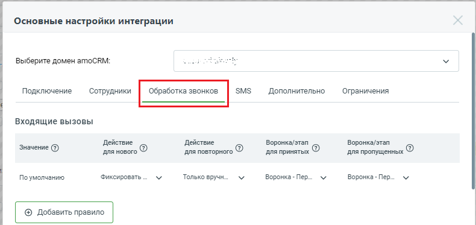
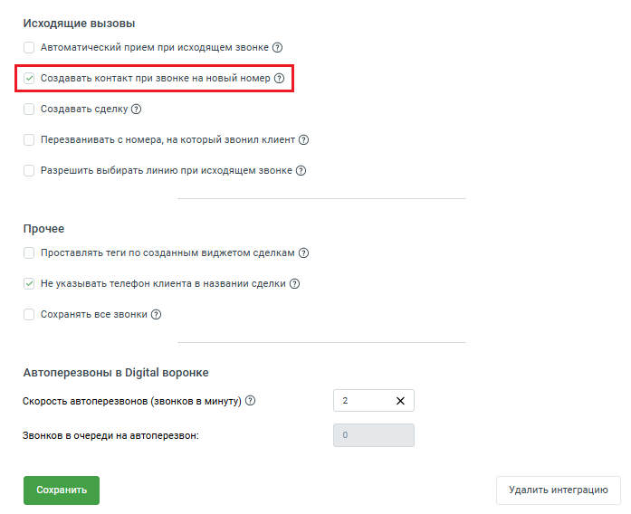
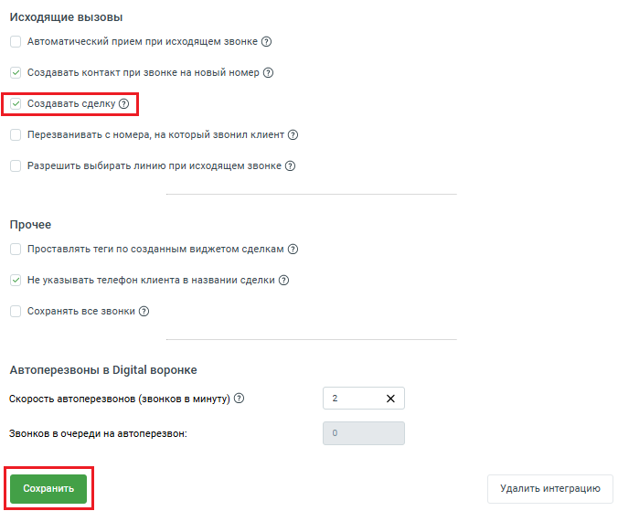

# 2.6. Обработка исходящих вызовов новым Клиентам

> Трассировка: PDF §2.6 · сквозные стр. 41-45 · источники: ч.1 `kb/sources/integration_amocrm/Mango_office_integration_amoCRM.pdf` с.41-45.

Автоматический прием при исходящем звонке Виджет поддерживает исходящий звонок по клику на номер телефона в интерфейсе amoCRM. Принцип работы этой функции следующий: 1. сотрудник кликает по номеру телефона Клиента; 2. звонит рабочий телефон этого сотрудника. Сотрудник поднимает трубку; 3. после того как сотрудник сам поднимет трубку, начнется звонок на номер телефона Клиента. Внимание! Эта возможность поддерживается не всеми моделями IP-телефонов и софтфонов. Также эта возможность недоступна при использовании сотрудником, к примеру, мобильного телефона. Чтобы установить настройку, надо прокрутить закладку “Обработка звонков” вниз до конца, чтобы стало видно настройку.

Внизу закладки “Обработка звонков”, если флаг “Автоматический прием при исходящем звонке” включен, то сотруднику не нужно самому поднимать трубку (выполнять шаг 2, см. перечисление выше). Звонок на рабочем телефоне сотрудника будет принят автоматически. Нажмите кнопку “Сохранить” внизу закладки “Обработка звонков”, чтобы сохранить настройку.

Интеграция Виртуальной АТС MANGO OFFICE и amoCRM | Версия от 25.08.2025 Создавать контакт при звонке на новый номер Если флаг “Создавать контакт при звонке на новый номер” включен (на закладке “Обработка звонков”, внизу этой закладки), то при исходящем звонке на новый номер (новый – значит не заведенный в вашей amoCRM) будет автоматически создан контакт. В контакте также сохранится номер телефона, на который вы позвонили. Имя контакта по умолчанию указывается в формате “Новый (16:03 28.11.2020)”, с указанием даты и времени его создания. Если флаг “Создавать контакт при звонке на новый номер” выключен, то при исходящем звонке на новый номер НЕ будет автоматически создан контакт. Флаг нужен, в частности, для того, чтобы при исходящих продажах информация о звонке и его результатах сохранялась в amoCRM. Примечание. Кроме того, если включен флаг “Создавать контакт при звонке на новый номер”, то станет доступна настройка “Создавать сделку”. Нажмите кнопку “Сохранить” внизу закладки “Обработка звонков”, чтобы сохранить настройку.

Создавать сделку при звонке на новый номер Важно. Эта настройка доступна только в том случае, если включен флаг “Создавать контакт при звонке на новый номер”. Интеграция Виртуальной АТС MANGO OFFICE и amoCRM | Версия от 25.08.2025

Если настройка включена (включен флаг “Создавать сделку”), то при исходящем принятом звонке на новый (незнакомый) номер автоматически создается сделка в amoCRM. Если флаг выключен, то сделка не будет создана. Нажмите кнопку “Сохранить” внизу закладки “Обработка звонков”, чтобы сохранить настройку.

Перезванивать с номера, на который звонил Клиент Если данный флаг включен, то у всех amoCRM, при клике на номер Клиента, будет совершатся исходящий звонок с номера, на который Клиент звонил ранее. Номер, с которого будет совершен звонок, вы можете посмотреть в контакте или сделке в дополнительном поле “Номер линии MANGO OFFICE”: Интеграция Виртуальной АТС MANGO OFFICE и amoCRM | Версия от 25.08.2025

Если оператор кликнет по номеру телефона, указанный в карточке компании, то звонок будет выполнен в номера первого найденного контакта, связанного с карточкой компании. Ограничения: - данная функция работает только при клике по номеру телефона в интерфейсе amoCRM. Вы можете перезвонить Клиенту другим способом (например, вручную набрать номер на телефоне/софтфоне), но тогда звонок НЕ будет совершен с номера, на который звонил Клиент; - данная функция НЕ работает, если: - Клиент звонил на пассивную SIP-линию или номер коллтрекинга; - отключена линия ВАТС (отключен номер телефона), при помощи которой совершает попытка звонка; - в поле “Номер линии MANGO OFFICE” нет номера телефона. Чтобы включить настройку и перезванивать с номера, на который звонил Клиент, в окне “Основные настройки интеграции” следует: 1) открыть вкладку “Обработка звонков”; 2) активировать переключатель “Перезванивать с номера, на который звонил Клиент” в блоке “Исходящие вызовы”; 3) нажать кнопку “Сохранить” внизу закладки “Обработка звонков”, чтобы сохранить настройку. Теперь, если оператор кликнет на номер телефона Клиента в интерфейсе amoCRM, будет выполнен звонок с номера, на который звонил Клиент.

Интеграция Виртуальной АТС MANGO OFFICE и amoCRM | Версия от 25.08.2025 Разрешить выбирать линию при исходящем звонке Если флаг установлен, то ваши сотрудники могут выбирать номер линии, с которой будет осуществлен исходящий вызов. Выбор будет доступен только для сотрудников, у которых в настройках Виртуальной АТС НЕ запрещены исходящие вызовы. Нажмите кнопку “Сохранить” внизу закладки “Обработка звонков”, чтобы сохранить настройку.

