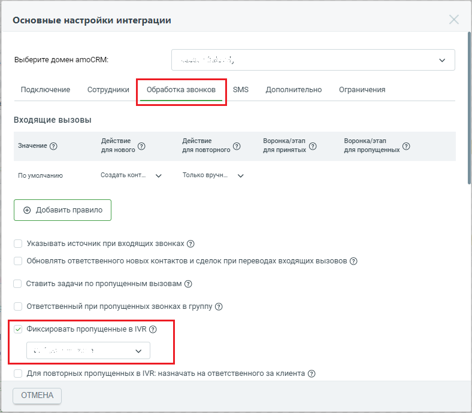
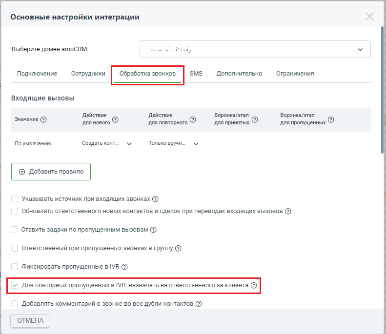

# 2.7. Пропущенные в IVR

> Трассировка: PDF §2.7 · сквозные стр. 45-47 · источники: ч.1 `kb/sources/integration_amocrm/Mango_office_integration_amoCRM.pdf` с.45-47.

Ответственный при пропущенных звонках в IVR Данная настройка позволяет связывать звонки от новых Клиентов, пропущенные в IVR (голосовом меню), с определенным ответственным сотрудником. Эта настройка недоступна, когда для всех звонков от новых Клиентов контакты и сделки создаются только вручную (то есть, настройка недоступна, когда в поле “Действие для нового” (см. рисунок ниже) выбрано значение “Только вручную”). Если включен флаг “Фиксировать пропущенные в IVR”, а также в поле “Действие для нового” выбрано одно из значений: ● Создать контакт; Интеграция Виртуальной АТС MANGO OFFICE и amoCRM | Версия от 25.08.2025 ● Создать контакт и сделку; ● Фиксировать в “неразобранное”; то при каждом звонке, пропущенном в IVR (голосовом меню) от нового Клиента будет: • автоматически создается контакт, либо сделка (если включен флаг “Создать контакт и сделку”); • в контакте (и сделке) указывается ответственный сотрудник, выбранный в данной настройке. Нажмите кнопку “Сохранить” внизу закладки “Обработка звонков”, чтобы сохранить настройку.

Для повторных пропущенных в IVR: назначать на ответственного за клиента Данная настройка (см. рисунок выше) создана для ситуаций, когда в IVR-меню пропущен звонок с номера, ранее уже сохраненного в контакте amoCRM. Если данная настройка включена, то при пропущенном на IVR звонке от Клиента, сохраненного в amoCRM, виджет интеграции будет ставить задачу по пропущенному звонку на ответственного за контакт. Например, если был пропущен в IVR звонок от Клиента ООО “Гермес”, то виджет интеграции автоматически поставит задачу на сотрудника, который назначен ответственным за данного Клиента. Если данная настройка выключена, то задачи по пропущенным в IVR звонкам Клиентов будут ставится на сотрудника, который указан ответственным за все звонки, пропущенные в IVR (см. Ответственный при пропущенных звонках в IVR). Нажмите кнопку “Сохранить” внизу закладки “Обработка звонков”, чтобы сохранить настройку. Интеграция Виртуальной АТС MANGO OFFICE и amoCRM | Версия от 25.08.2025

