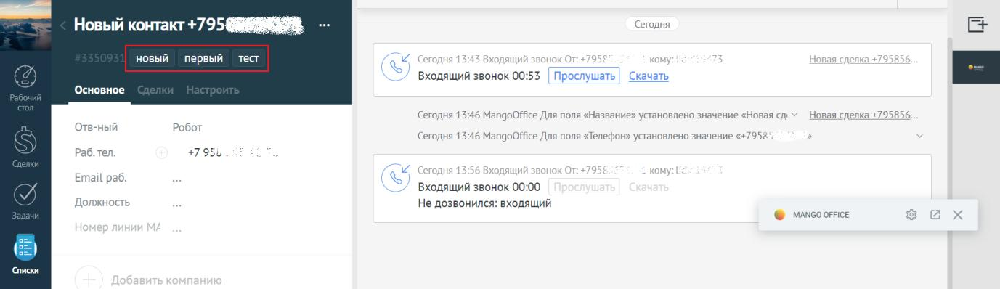
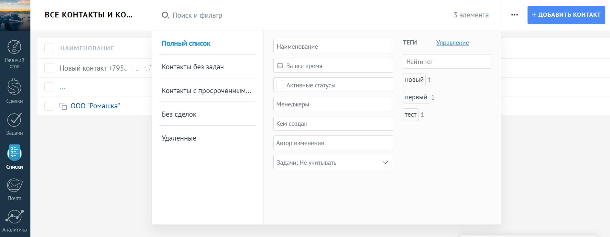
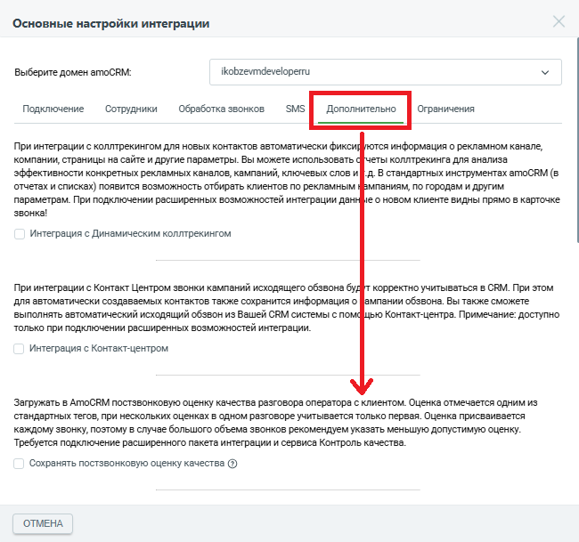
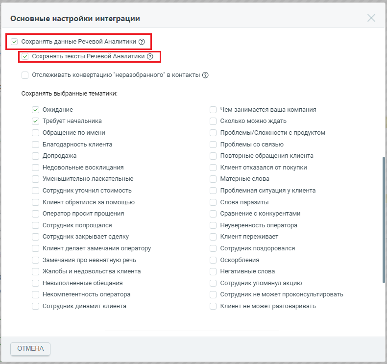
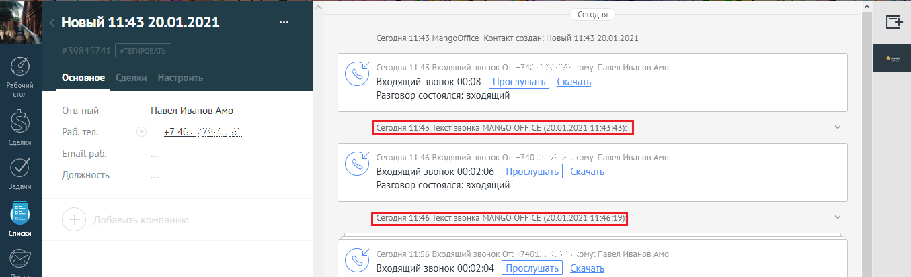
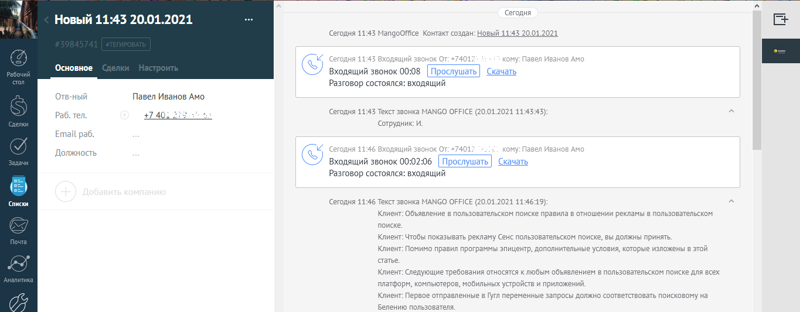

# 2.9. Сохранение данных Речевой Аналитики

> Трассировка: PDF §2.9 · сквозные стр. 48-55 · источники: ч.1 `kb/sources/integration_amocrm/Mango_office_integration_amoCRM.pdf` с.48-55.

Перед началом работы Чтобы сохранять данные Речевой Аналитики в amoCRM, вам нужно подключить: 1. сервис Речевой аналитики; Интеграция Виртуальной АТС MANGO OFFICE и amoCRM | Версия от 25.08.2025 2. сервис Записи разговоров; 3. расширенный пакет интеграции с amoCRM; Важно! Если сервисы Записи разговоров и Речевой аналитики, не будут подключены, а также не будет подключен расширенный пакет интеграции с amoCRM, то сохранять тематики и/или тексты разговоров будет невозможно. Определять тематику и/или тексты можно в разговорах тех пользователей amoCRM, которым указан сотрудник Виртуальной АТС. Определять тематику и/или тексты в разговорах других пользователей amoCRM следует после ввода их данных в основных настройках интеграции. Сохранение тематик разговоров Общие сведения Интеграция Виртуальной АТС с amoCRM предоставляет возможность сохранять тематики разговоров, поскольку они дают возможность понять, использовались ли в разговорах обязательные слова, стоп-слова или ненормативная лексика, автоматически выявлять разговоры, в которых Клиент интересовался тем или иным продуктом или выражал недовольство, конфликтовал с оператором и прочее. Примечание. Кроме данных, также есть возможность сохранять текст распознанной речи разговора. Перечислим некоторые из преимуществ, которые дают тематики разговоров в тегах контактов amoCRM: - Руководитель отдела продаж, не прослушивая записи разговора, может: - увидеть сделано ли Клиенту предложение купить тот или иной продукт, была ли попытка up-sale, что напрямую влияет на средний чек; - провести анализ проваленных сделок на основе информации о том, какие “ключевые теги” использовались в разговорах, например: дорого, нет нужного размера/конфигурации, наименование конкурента и т.д.; - автоматически предоставлять отчетность для отдела маркетинга, для экономии времени; - Руководитель отдела технической поддержки клиентского сервиса может контролировать использование обязательных или “стоп” слов (например, “я буду жаловаться” или “ужасный сервис”) и диалоге с Клиентом, что позволит повысить качество обслуживания Клиентов, быстро выявить и исправить какую-то проблему; - Маркетолог, при анализе эффективности рекламных кампаний, может: - сформировать отчет в amoCRM, в котором приведена информация о том, кто из Клиентов произнес кодовое слово и о сумме сделок с этими Клиентами; - определить целевым или нецелевым было обращение; - с каким первичным интересом приходят входящие звонки (например, чтобы сравнить между собой конкурирующие продукты) и как часто они закрываются в сделки. Как это работает В случае, если пользователю amoCRM поступил звонок, сервис Речевой аналитики (РА) Виртуальной АТС определит тематику разговора, а сервис интеграции сохранит название тематики в тегах контакта. В настройках функции сохранения тематик РА можно выбрать тематики разговора, которые будут сохраняться тегах amoCRM. После завершения разговора с Клиентом, сервис РА анализирует разговор и относит его к той или иной тематике. Если в разговоре определена тематика, выбранная вами в настройках функции сохранения данных РА, то название тематики сохраняется в amoCRM как тэг на карточке Клиента. Интеграция Виртуальной АТС MANGO OFFICE и amoCRM | Версия от 25.08.2025 Кроме этого, в сервисе Речевой аналитики можно не только настроить поиск определенных тематик в разговоре, но и контролировать ОТСУТСТВИЕ слова/фразы в разговоре. Исключение тематик позволяет: • найти контакты, не имеющие отношение к продажам ваших товаров или услуг; • оптимизировать работу операторов, определив круг тематик разговоров с Клиентами; • создавать отчеты в amoCRM, в которых приведены обобщённые данные, отфильтровав при этом узкие или “нишевые” тематики. Как включить сохранение тематик Чтобы включить функцию сохранения тематик Речевой аналитики, следует: 1) Открыть закладку “Дополнительно”, прокрутить закладку вниз, чтобы стало видно поле “Сохранять данные Речевой Аналитики”; 2) Включить флаг “Сохранять данные Речевой аналитики”. Будет показан список тематик; 3) Выбрать тематики, которые нужно сохранять в контактах amoCRM; 4) Нажать кнопку “Сохранить” (внизу окна “Основные настройки”): Как определяются тематики в неразобранных обращениях Если в вашем amoCRM используется категория “НЕРАЗОБРАННОЕ” для фиксации звонков и заведения новых Клиентов и нужно сохранять данные Речевой аналитики по результатам обработки разговора с Клиентом, то необходимо включить флаг “Отслеживать конвертацию” неразобранного” в контакты”, и нажать кнопку “Сохранить”. В этом случае, сервис интеграции будет отслеживать, в течение 24 часов после разговора, конвертацию “неразобранного” в контакт: - если конвертация произойдет, то тематики по разговору автоматически будут добавлены к контакту; - если конвертация из “неразобранного” в контакт не произойдет течении 24 часов, тематики не будут добавлены к контакту.

Интеграция Виртуальной АТС MANGO OFFICE и amoCRM | Версия от 25.08.2025 Как посмотреть тематику разговора Чтобы вывести на экран название тематики, определенной в том или ином контакте или сделке, в amoCRM следует: 1) открыть контакт или сделку; 2) посмотреть название тематики в тегах контакта или сделки:

Фильтр по тематикам Можно фильтровать список контактов по тематикам разговора, указанным в тегах. Это позволит вам посмотреть список звонков, в которых, например: - оператор сделал допродажное предложение; - использовалась ненормативная лексика, стоп-слова; - не использовались определенные слова. Целью фильтра по тематикам разговора является отображение отчетности о звонках, для контроля качества и оценки эффективности обслуживания Клиентов операторами. Для поиска контактов по тематикам, нужно использовать встроенный в amoCRM фильтр контактов и компаний по тегу. Подробнее о том, как это сделать…

Интеграция Виртуальной АТС MANGO OFFICE и amoCRM | Версия от 25.08.2025 Резюме разговора Общие сведения Сервис речевой аналитики может создавать текстовое резюме разговора на основе смыслового анализа, в котором будут отображены основные детали коммуникации. Как это работает  Система записывает разговор и проводит смысловой анализ диалога с помощью AI- технологии.  После анализа - предоставляет расшифровку в виде резюме с обобщенным содержимым разговора с разделами согласно его логическим составляющим. Как настроить Чтобы включить функцию "Резюме разговора", следует: 1) Открыть закладку “Дополнительно”, прокрутить закладку вниз, чтобы стало видно поле “Сохранять данные Речевой Аналитики”;

2) Открыть блок "Речевая аналитика"; Интеграция Виртуальной АТС MANGO OFFICE и amoCRM | Версия от 25.08.2025 3) Установить флаг в чекбоксе "Резюме разговора";

4) Нажать кнопку "Сохранить" в нижней части формы настройки приложения интеграции: Сохранение текстов Речевой аналитики Общие сведения Теперь интеграция Виртуальной АТС с amoCRM позволяет сохранять текст, распознанный сервисом Речевой аналитики. Распознанный текст автоматически сохраняется в Контакте в качестве примечания. Для получения текстов интеграция сама запрашивает результаты распознавания речи в записи разговора у сервиса Речевой аналитики. Результаты распознавания речи запрашиваются в течение 24 часов с момента формирования файла с записью разговора. Обращаем внимание, что по истечении 24 часов передача запроса прекращается, поэтому распознанный текст может не появиться в amoCRM. Распознавать текст разговора можно только в тех записях, которые были загружены интеграцией из Виртуальной АТС в amoCRM. К примеру, если в разговоре были записи А1, А2, А3, но в amoCRM передана запись А1, то только по записи А1 ожидается получение данных Речевой аналитики. Перед тем как включать сохранение текстов Речевой аналитики, следует убедиться, что необходимые сервисы и пакет подключены. Интеграция Виртуальной АТС MANGO OFFICE и amoCRM | Версия от 25.08.2025 Как настроить Чтобы включить функцию сохранения текстов Речевой аналитики, необходимо: 1) открыть закладку “Дополнительно”, прокрутить закладку вниз, чтобы стало видно поле “Сохранять данные Речевой Аналитики”; 2) включить флаг “Сохранять данные Речевой Аналитики”. Будут показаны дополнительные поля; 3) включить флаг “Сохранять тексты Речевой Аналитики”; 4) нажать кнопку “Сохранить”:

Как включить распознавание речи в обращениях категории “НЕРАЗОБРАННОЕ” Если в вашем amoCRM используется категория “НЕРАЗОБРАННОЕ” для фиксации звонков и заведения новых Клиентов и нужно сохранять тексты Речевой аналитики по результатам Интеграция Виртуальной АТС MANGO OFFICE и amoCRM | Версия от 25.08.2025 обработки разговора с Клиентом, то нужно включить флаг “Отслеживать конвертацию ”неразобранного” в контакты” и нажать кнопку “Сохранить”. В этом случае, сервис интеграции будет отслеживать, в течение 24 часов после разговора, конвертацию “неразобранного” в контакт: - если конвертация произойдет, то распознанный текст разговора автоматически будет добавлен к контакту; - если конвертация из “неразобранного” в контакт не произойдет течении 24 часов, разговор не будет распознан и не будет добавлен к контакту. Как посмотреть распознанный текст Чтобы вывести на экран распознанный текст того или иного разговора, в amoCRM следует: 1) открыть контакт или сделку; 2) кликнуть на ссылку “Текст звонка”:

3) посмотреть текст Речевой аналитики:

