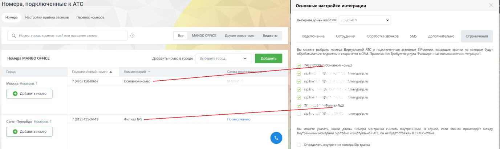

# 2.10. Ограничение номеров ВАТС

> Трассировка: PDF §2.10 · сквозные стр. 55-56 · источники: ч.1 `kb/sources/integration_amocrm/Mango_office_integration_amoCRM.pdf` с.55-56.

Можно выбрать номера Виртуальной АТС и подключенные SIP-линии, входящие звонки на которые не будут обрабатываться виджетом и не сохранятся в amoCRM. Внимание! 1) по умолчанию входящие звонки на все номера ВАТС и SIP-линии обрабатываются виджетом; Интеграция Виртуальной АТС MANGO OFFICE и amoCRM | Версия от 25.08.2025 2) функция ограничения номеров ВАТС доступна только при подключении расширенных возможностей интеграции. Установка данной настройки выполняется в поле “Вы можете выбрать номера Виртуальной АТС и подключенные активные SIP-линии…”: - если выключен флаг напротив того или иного номера, то входящие звонки на данный номер не будут обрабатываться виджетом; - если включен флаг напротив того или иного номера, то входящие звонки на данный номер обрабатываются виджетом, а сведения о звонках сохраняются в amoCRM. Примечание. На вкладке “Ограничения” в справа от номера отображается комментарий к номеру, указанный в настройках ВАТС (реализовано для удобства настройки ограничений):

