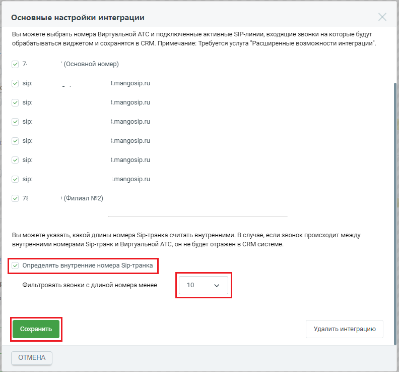

# 2.13. Определять внутренние номера SIP-транка

> Трассировка: PDF §2.13 · сквозные стр. 56-57 · источники: ч.1 `kb/sources/integration_amocrm/Mango_office_integration_amoCRM.pdf` с.56-57.

В данной настройке можно указать максимальную длину номера SIP-линии, звонки по которым не будут обрабатываться в amoCRM. Это поможет вам отделить внутренние звонки по SIP- транку и не фиксировать их в вашем amoCRM. В случае, если звонок происходит между внутренними номерами SIP-транка и Виртуальной АТС, он не будет отражен в amoCRM. Чтобы установить настройку, в окне “Основные настройки интеграции” необходимо: Интеграция Виртуальной АТС MANGO OFFICE и amoCRM | Версия от 25.08.2025 1. открыть вкладку “Ограничения”, прокрутить закладку вниз, чтобы стало видно поле “Определять внутренние номера SIP-транка”;

2. активировать переключатель “Определять внутренние номера SIP-транка”; 3. указать максимальную длину номера в поле “Фильтровать звонки с длиной номера менее”; 4. нажать кнопку “Сохранить”:

