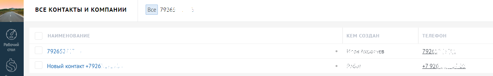
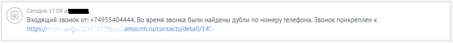
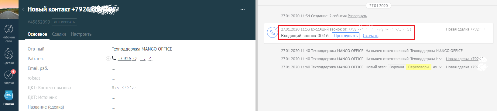
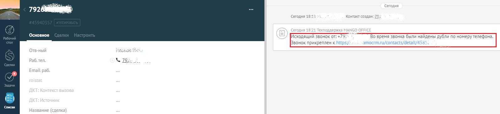

# 2.14. Наличие дублей контактов в amoCRM

> Трассировка: PDF §2.14 · сквозные стр. 57-59 · источники: ч.1 `kb/sources/integration_amocrm/Mango_office_integration_amoCRM.pdf` с.57-59.

Как сохраняется информация о звонке при дублировании контактов? В виджете по умолчанию включена автоматическая сортировка контактов/компаний во время звонка. Виджет проверяет наличие контактов/компаний, в которых указан одинаковый номер телефона (далее по тексту – дубли). Пример дублирования контактов на рисунке. Если при звонке были найдены дубли, то информация о звонке сохраняется в первом созданном контакте/компании, но не сохраняется в дубле контакта. Интеграция Виртуальной АТС MANGO OFFICE и amoCRM | Версия от 25.08.2025

Как помечать дубли контактов? Чтобы выявлять дубли контактов, помечать их, а также в каждом дубле одного контакта сохранять информацию о звонке, нужно включить флаг “Добавлять комментарий о звонке во все дубли контактов”:

Примечание. Не забудьте сохранить настройки интеграции, нажав кнопку “Сохранить” в самом низу закладки “Обработка звонков”. Тогда, при звонке по номеру контакта виджет интеграции будет выполнять следующие действия: 1) сохранять данные о звонке в первом созданном контакте/компании; 2) сможет помечать дубли контактов/компаний комментарием “Во время звонка были найдены дубли по номеру телефона”. Вот пример отображения такого комментария:

В результате: - в первом созданном контакте/компании будет сохранена информация о звонке по номеру: Интеграция Виртуальной АТС MANGO OFFICE и amoCRM | Версия от 25.08.2025

- в дубле контакта/компании будет указана информация о звонке и пометка “Во время звонка были найдены дубли по номеру телефона”:

