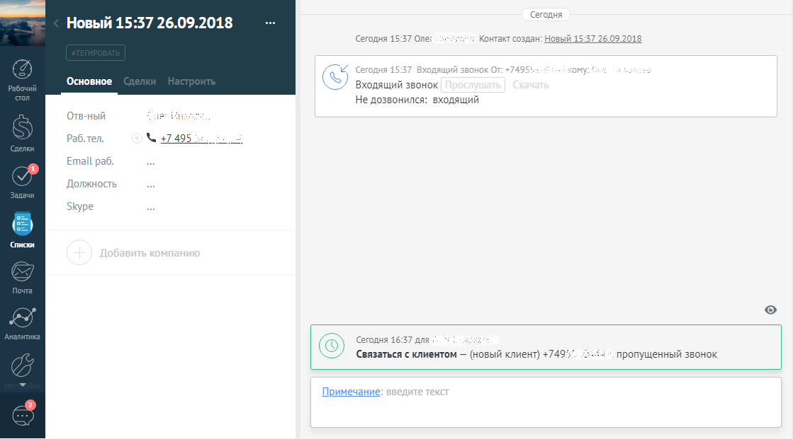
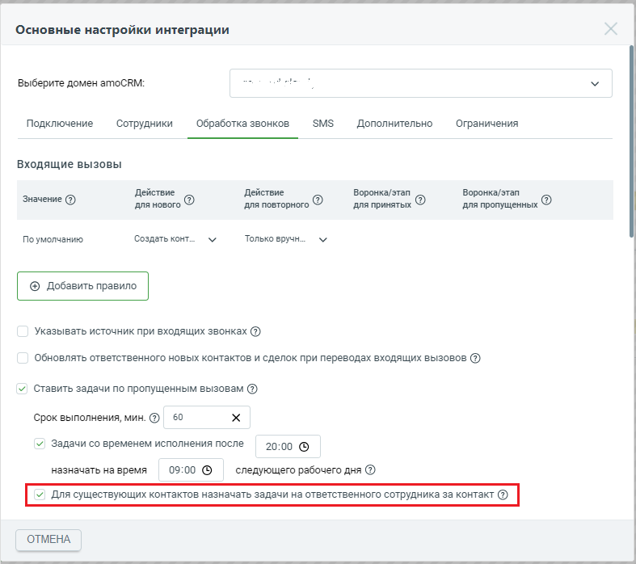

# 2.17. Ставить задачи по пропущенным вызовам

> Трассировка: PDF §2.17 · сквозные стр. 59-62 · источники: ч.1 `kb/sources/integration_amocrm/Mango_office_integration_amoCRM.pdf` с.59-62.

Общее Виджет интеграции может автоматически ставить задачи по пропущенным от Клиентов звонкам. Возможно ставить задачи как на сотрудника, пропустившего вызов, так и на ответственного за контакт (если звонок был с номера сохраненного в контакты в вашем amoCRM). Внимание! Функция постановки задач по пропущенным звонкам доступна только при подключении расширенных возможностей интеграции. Правило назначения задачи на сотрудника Если флаг “Ставить задачи по пропущенным вызовам” включен: когда виджет определяет пропущенный входящий вызовов на сотрудника, то после фиксации в amoCRM факта Интеграция Виртуальной АТС MANGO OFFICE и amoCRM | Версия от 25.08.2025 пропущенного звонка, система автоматически создает задачу с определенными параметрами на данного сотрудника. Примечание. Задача не дублируется, если по этому Клиенту уже есть аналогичная невыполненная задача. Если при этом включен флаг “Ответственный при пропущенных в IVR” и звонок пропущен в IVR, то задача ставится на выбранного в настройке сотрудника. Если флаг выключен, то ни звонок не зафиксируется с amoCRM, ни задача не будет поставлена. Аналогично, если включен флаг “Ответственный при пропущенных в группу” и звонок пропущен в группе, то задача ставится на выбранного в настройке сотрудника. Если флаг выключен, то задача не будет поставлена.

Описание параметров задачи по пропущенному вызову. Настройка некоторых из них Задачи про пропущенным звонкам, назначаемые автоматически виджетов, имеют следующие параметры: 1) дата/время завершения задачи: - через один час после окончания звонка (если звонок поступил до 20:00, с учетом настроек временной зоны в amoCRM). Это параметр можно редактировать путем изменения срока выполнения задачи. Допустимые значения: “1-1500” минут; - на 9:00 утра следующего рабочего дня (если звонок поступил после 20:00 и до 9:00, с учетом настроек временной зоны в amoCRM. Кроме того, можно настраивать данный временной период): Интеграция Виртуальной АТС MANGO OFFICE и amoCRM | Версия от 25.08.2025

2) ответственный в задаче - тот сотрудник, на кого виджет зафиксировал пропущенный звонок, в том числе если вызов пропущен в IVR/группе - на выбранного в соответствующего настройках сотрудника; Примечание. Если пропущен звонок от контакта, по которому ранее уже был назначен ответственный, то, при включении соответствующей настройки, задача по пропущенному вызову будет автоматически назначаться на ответственного за контакт. 3) если пропущенный звонок был от нового Клиента, то в задаче указывается “(новый Клиент) <номер Клиента>, пропущенный звонок”, к примеру “(новый Клиент) +79260297870, пропущенный звонок”; 4) если пропущенный звонок был от существующего Клиента, то в задаче указывается “<имя Клиента>, <номер Клиента>, пропущенный звонок”, к примеру “ООО”Березка плюс”, +79260297870, пропущенный звонок”; 5) при пропущенных внутренних звонках - задачи не создаются; 6) статус задачи - не завершена; 7) задача связывается с контактом: - но если звонок поступил от нового Клиента и звонок зафиксировался в неразобранном, то задача НЕ связывается со звонком. К сожалению, на текущий момент нет такой возможности в amoCRM; - если звонок поступил от нового Клиента и в настройках виджета указано “Создавать только вручную”, т.е. звонок НЕ зафиксировался в amoCRM, то задача ставится без связей. Задача НЕ ставится повторно, если для Клиента в ЭТОТ день уже была поставлена и не выполнена аналогичная задача по пропущенному звонку (пусть даже поставлена и на другого сотрудника). Интеграция Виртуальной АТС MANGO OFFICE и amoCRM | Версия от 25.08.2025 Как включить автоматическую постановку задачи на ответственного за контакт Если включен флаг “Для существующих контактов назначать задачи на ответственного сотрудника за контакт”, и пропущенный звонок совершен с номера, ранее сохраненного в контакте amoCRM, у которого есть ответственный, то виджет интеграции будет ставить задачу по пропущенному звонку на ответственного за контакт. Если этот флаг выключен и пропущенный звонок совершен с номера, ранее сохраненного в контакте amoCRM, то задача будет поставлена на сотрудника по общим правилам, описанным ранее.

