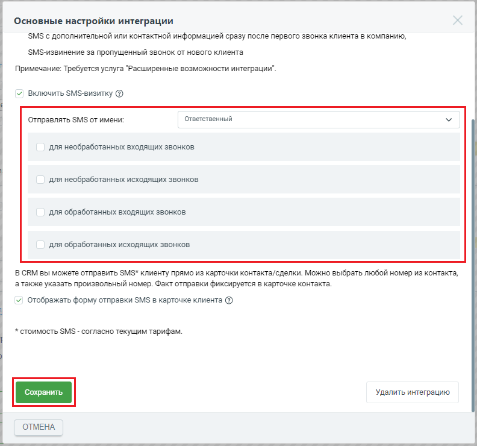

# 2.18. SMS-визитка

> Трассировка: PDF §2.18 · сквозные стр. 62-64 · источники: ч.1 `kb/sources/integration_amocrm/Mango_office_integration_amoCRM.pdf` с.62-64.

SMS-визитка - эффективный инструментом повышения лояльности ваших Клиентов. Есть несколько вариантов использования этого сервиса: - SMS с дополнительной или контактной информацией сразу после первого звонка Клиента в компанию, - SMS-извинение за пропущенный звонок от нового Клиента. Кейс 1. Клиент позвонил в вашу компанию. Он автоматически получит SMS с контактами вашей компании и персонального ответственного. Кейс 2. Клиент позвонил, но все сотрудники заняты и не успели ответить на звонок. Отправьте ему SMS-извинение и попросите дождаться обратного звонка, проявите заинтересованность и не дайте ему уйти к конкурентам. Также можно добавить в SMS-извинение предложение о дополнительной скидке или промокод, чтобы Клиент дождался звонка вашего сотрудника. Внимание! SMS-визитка доступна только при подключении расширенных возможностей интеграции. Стоимость SMS - согласно вашему тарифному плану. Для настройки SMS визитки нужно включить флаг “Включить SMS визитку”. Интеграция Виртуальной АТС MANGO OFFICE и amoCRM | Версия от 25.08.2025

После этого можно настроить раздельные шаблоны SMS для каждого из четырех случаев: - необработанный входящий звонок от нового Клиента: - “необработанный” звонок - звонок в котором не было разговора сотрудника с Клиентом; - “нового” Клиента - если в результате звонка была автоматически создана запись в “неразобранном” или “контакт”, согласно настройкам виджета; - SMS высылается после окончания звонка; - необработанный исходящий звонок новому Клиенту: - “необработанный” звонок - звонок в котором не было разговора сотрудника с Клиентом; - “нового” Клиента - если в результате звонка была автоматически создана запись в “неразобранном” или “контакт”, согласно настройкам виджета; - SMS высылается после окончания звонка; - обработанный входящий звонок от нового Клиента: - “обработанный” звонок - звонок в котором был разговор сотрудника с Клиентом; - “нового” Клиента - если в результате звонка была автоматически создана запись в “неразобранном” или “контакт”, согласно настройкам виджета; - SMS высылается после окончания звонка; - обработанный исходящий звонок новому Клиенту: - “обработанный” звонок - звонок в котором был разговор сотрудника с Клиентом; - “нового” Клиента - если в результате звонка была автоматически создана запись в “неразобранном” или “контакт”, согласно настройкам виджета; - SMS высылается после окончания звонка. SMS отправляется на номер нового/потенциального Клиента. При настройке шаблона SMS можно указать: - от какого сотрудника отправляется SMS. Можно указать конкретного сотрудника или указать “Ответственный”, тогда виджет будет самостоятельно подставлять ответственного; - в текст можно вставить макросы amoCRM. В этом случае, виджет перед отправкой SMS будет автоматически заполнять значения. Если значения нет, то подставляться в SMS не будет; - список поддерживаемых макросов приведен в выпадающем списке “Макросы”. Выбрать макрос из списка – он автоматически добавится в конец шаблона; - можно настроить шаблон и кликнув на “Пример” и посмотреть пример отправляемой SMS. Примечание. Не забудьте сохранить настройки интеграции, нажав кнопку “Сохранить” в самом низу закладки “SMS”. Интеграция Виртуальной АТС MANGO OFFICE и amoCRM | Версия от 25.08.2025

После отправки SMS, в карточке контакта автоматически добавится запись о высланном SMS сообщении. Примечания: 1. если в виджете настроено, что при звонках от новых Клиентов добавлять их в “НЕРАЗОБРАННОЕ”, то SMS отправится, но не будет добавлена запись об отправке SMS; 2. если в виджете настроено, что при звонках от новых Клиентов сохранять их как “компания”, то SMS НЕ будет отправляться.

