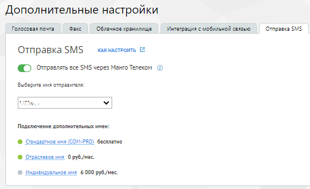

# 2.19. Отправка SMS из карточки Клиента

> Трассировка: PDF §2.19 · сквозные стр. 64-65 · источники: ч.1 `kb/sources/integration_amocrm/Mango_office_integration_amoCRM.pdf` с.64-65.

С помощью виджета интеграции MANGO OFFICE и amoCRM можно вручную отправлять SMS Клиентам из карточки Клиента или сделки. Информация об отправленной SMS автоматически фиксируется в истории коммуникаций с Клиентом и видна в карточке Клиента. Стоимость SMS - согласно текущим тарифам Виртуальной АТС. Интеграция Виртуальной АТС MANGO OFFICE и amoCRM | Версия от 25.08.2025

В настройках виджета интеграции можно включить или отключить отображение формы отправки SMS в карточке Клиента и сделки – на вкладке “SMS”, настройка “Отображать форму отправки SMS в карточке Клиента”. В Личном кабинете Виртуальной АТС в разделе Общие настройки/Дополнительные настройки/Вкладка “Отправка SMS”:

можно подключить и настроить отраслевое или индивидуальное имя отправителя SMS:

