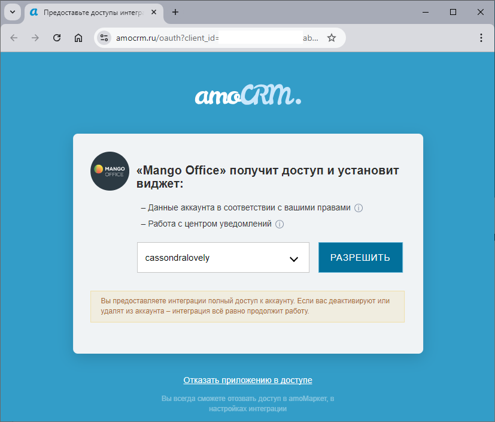

# 2.21. Интеграция Виртуальной АТС одновременно с несколькими

> Трассировка: PDF §2.21 · сквозные стр. 69-80 · источники: ч.1 `kb/sources/integration_amocrm/Mango_office_integration_amoCRM.pdf` с.69-80.

доменами amoCRM Обзор Если у вас несколько доменов amoCRM, можно настроить интеграцию Виртуальной АТС с этими доменами. Тогда учет звонков на номера Виртуальной АТС будет выполняться отдельно в соответствующих доменах amoCRM. Пример: ваша Виртуальная АТС интегрирована с доменом А amoCRM и в этом домене фиксируются все внешние звонки сотрудников, зарегистрированных в домене А. Если вы Интеграция Виртуальной АТС MANGO OFFICE и amoCRM | Версия от 25.08.2025 дополнительно настроите интеграцию с доменом Б amoCRM, то все внешние звонки сотрудников, зарегистрированных в домене Б, будут фиксироваться отдельно в домене Б. В этом разделе описано как настроить интеграцию Виртуальной АТС с несколькими доменами и какие правила и рекомендации при этом надо соблюдать. Как настроить интеграцию Виртуальной АТС с несколькими доменами amoCRM Общие инструкции Чтобы настроить интеграцию Виртуальной АТС с двумя и более доменами amoCRM, необходимо ОТДЕЛЬНО ДЛЯ КАЖДОГО ДОМЕНА amoCRM выполнить следующие действия: 1) подключить виджет интеграции в amoCRM; 2) в ваш виджет интеграции добавить домен; 3) настроить сопоставление сотрудников Виртуальной АТС и сотрудников amoCRM. Кроме этого, если вы подключен расширенный пакет интеграции, то можно настроить ограничения использования номеров виджетом интеграции. Добавление домена в виджет интеграции Чтобы добавить еще один домен в виджет интеграции, вам потребуется в окне “Основные настройки интеграции” выполнить следующие действия: 1) выберите значение “+ Добавить новый amoCRM” в поле “Выбрать домен amoCRM”; 2) нажмите кнопку “Получить код подключения”:

3) будет открыта новая вкладка вашего браузера. На ней, если вы уже вошли в аккаунт AmoCRM, будет открыта форма для предоставления доступа виджету интеграции к вашему аккаунту amoCRM (см. рисунок ниже). В противном случае вам будет предложено авторизоваться в Интеграция Виртуальной АТС MANGO OFFICE и amoCRM | Версия от 25.08.2025 AmoCRM при помощи ваших логина и пароля, а затем открыта форма для предоставления доступа виджету интеграции к вашему аккаунту amoCRM; 4) в поле “Выберите аккаунт” выберите аккаунт AmoCRM, с которым будет настроена интеграция;

5) нажмите кнопку “Разрешить”, чтобы разрешить виджету интеграции доступ к вашему аккаунту AmoCRM;

6) будет создан код подключения интеграции с amoCRM, который вам необходимо скопировать. Для этого, нажмите кнопку “Скопировать код подключения”: Интеграция Виртуальной АТС MANGO OFFICE и amoCRM | Версия от 25.08.2025

7) в окне “Основные настройки интеграции” вставьте скопированный код в поле “Код подключения”; 8) в поле “Email для уведомлений” укажите электронную почту, на которую хотите получать уведомления от amoCRM; 9) нажмите на кнопку “Сохранить”:

Теперь вам нужно настроить сопоставление сотрудников Виртуальной АТС и домена amoCRM. Настройка сопоставления сотрудников Доступно несколько вариантов настройки сопоставления сотрудников. Интеграция Виртуальной АТС MANGO OFFICE и amoCRM | Версия от 25.08.2025 Вариант 1. Вручную Если вы хотите настроить сопоставление сотрудников amoCRM и Виртуальной АТС вручную, убедитесь, что вы зарегистрировали всех нужных сотрудников в обоих системах. Укажите пару сотрудник ВАТС-сотрудник CRM в поле “Ручное”. Нажмите кнопку “Сопоставить”. Укажите все нужные вам пары сотрудник ВАТС-сотрудник CRM. Вы можете добавлять пары в любом порядке. Примечание. Если группа полей “Ручное” не отображается, значит ранее она была скрыта.

Нажмите на кнопку , чтобы эта группа полей вновь отобразилась на экране. Прокрутите окно “Основные настройки интеграции” вниз до конца, чтобы появилась кнопка “Сохранить”. Нажмите на эту кнопку.

Вариант 2. Автоматически Функция автоматического сопоставления сотрудников сравнивает ФИО иe-mail сотрудников и составляет список совпадающих сотрудников. Учтите, что автоматическое сопоставление требует, чтобы ФИО и email сотрудников были записаны одинаково в вашем amoCRM и в Виртуальной АТС. Если появится сообщение “Пары для сопоставления не найдены”, убедитесь, что ФИО и e-mail сотрудников записаны в вашем amoCRM и Виртуальной АТС одинаково. Интеграция Виртуальной АТС MANGO OFFICE и amoCRM | Версия от 25.08.2025 Чтобы выполнить автоматическое сопоставление сотрудников, выполните следующие действия в группе полей “Автоматическое”: 1) выберите параметры для сопоставления: ФИО, E-mail; 2) выберите режим сопоставления: по всем параметрам (точное совпадение) или хотя бы по одному параметру; 3) нажмите кнопку “Начать сопоставление”. В результате в поле “Сопоставленные учетные записи” будет показан список пар сотрудник ВАТС-сотрудник CRM, либо выдано сообщение “Пары для сопоставления не найдены”; 4) прокрутите окно “Основные настройки интеграции” вниз до конца, чтобы появилась кнопка “Сохранить”. Нажмите на эту кнопку.

Если группа полей “Автоматическое” не отображается (см. рисунок ниже), значит ранее она была

скрыта. Нажмите на кнопку , чтобы группа полей “Автоматическое” вновь отобразилась на экране. Правила настройки интеграции Виртуальной АТС с несколькими доменами amoCRM 1) Запрещается назначать один внутренний номер Виртуальной АТС двум разным сотрудникам amoCRM даже в случае их регистрации в разных доменах. Рассмотрим на примерах, как работает это правило:

| № | Пример | Настройки интеграции с доменом А | Настройки интеграции с доменом Б | Примечание |
| --- | --- | --- | --- | --- |

Интеграция Виртуальной АТС MANGO OFFICE и amoCRM | Версия от 25.08.2025

|  |  | Сотрудник amoCRM | Внутренний номер телефона | Сотрудник amoCRM | Внутренний номер телефона |  |
| --- | --- | --- | --- | --- | --- | --- |
| 1 | Сотрудникам одного домена выдан одинаковый номер телефона | Наталья | 12 | Нет | - | Данная настройка нарушает правило. Будет выдано сообщение об ошибке |
|  |  | Анна | 12 | Нет | - |  |
| 2 | Сотрудникам разных доменов выдан одинаковый номер телефона | Наталья | 12 | Анна | 12 |  |
| 3 | Сотрудникам разных доменов выбран разные номера телефонов | Наталья | 12 | Анна | 13 | Настройка корректная, не нарушает правило. |

2) Запрещается одного и того же сотрудника amoCRM указывать более чем в одном виджете интеграции Данное правило позволяет избежать некорректного распределения звонков между двумя доменами. Рассмотрим на примерах, как работает это правило:

| № | Пример | Настройки интеграции с доменом А |  | Настройки интеграции с доменом Б |  | Примечание |
| --- | --- | --- | --- | --- | --- | --- |
|  |  | Сотрудник amoCRM | Внутренний номер телефона | Сотрудник amoCRM | Внутренний номер телефона |  |
| 1 | В двух виджетах интеграции указан один и тот же сотрудник amoCRM | Наталья | 12 | Наталья | 14 | Данная настройка нарушает правило. Будет выдано сообщение об ошибке. |
| 2 | В двух виджетах интеграции указаны два | Наталья | 12 | Анна | 14 | Настройка корректная, не нарушает правило. |

Интеграция Виртуальной АТС MANGO OFFICE и amoCRM | Версия от 25.08.2025

|  | разных сотрудника amoCRM |  |  |  |  |  |
| --- | --- | --- | --- | --- | --- | --- |

Рекомендация Чтобы виджет интеграции корректно распределял звонки между доменами, в настройках виджета интеграции не рекомендуется указывать сотрудника Виртуальной АТС, состоящего в группе, участники которой настроены в другом виджете интеграции (зарегистрированы в другом домене amoCRM). Примечание. Настроить группу можно в любое время. Подробнее о группах см. в Справочнике абонента Виртуальной АТС. Рассмотрим на примерах, как работает эта рекомендация:

| № | Пример | Настройки интеграции с доменом А |  | Настройки интеграции с доменом Б |  | Примечание |
| --- | --- | --- | --- | --- | --- | --- |
|  |  | Сотрудник amoCRM | Внутренний номер телефона | Сотрудник amoCRM | Внутренний номер телефона |  |
| 1 | Есть группа в составе: Сергей, Наталья, Анна. Сотрудники группы зарегистрирован ы в разных доменах amoCRM | Сергей | 11 | Наталья | 12 | Не рекомендуется указывать сотрудника Сергея в настройках интеграции с доменом А, поскольку это может привести к некорректному распределению звонков между доменами. Подробнее… |
|  |  |  |  | Анна | 13 |  |
| 2 | Есть группа в составе: Сергей, Наталья, Анна. Сотрудники группы зарегистрирован ы в одном домене amoCRM | Сергей | 11 | Нет | Нет | Рекомендация выполнена. |
|  |  | Наталья | 12 | Нет | Нет |  |
|  |  | Анна | 13 | Нет | Нет |  |

Дополнительно Настройка ограничений использования номеров Если вами используется расширенный пакет интеграции, то можно настроить ограничения использования номеров Виртуальной АТС в каждом виджете интеграции Виртуальной АТС с каким-либо определенным доменом amoCRM Интеграция Виртуальной АТС MANGO OFFICE и amoCRM | Версия от 25.08.2025 Как виджет интеграции определяет, в какой домен передавать звонок? При интеграции Виртуальной АТС с несколькими доменами звонки учитываются в разных доменах amoCRM следующим образом. Рассмотрим на примере. Допустим, Виртуальная АТС интегрирована с двумя доменами А и Б, и настроено 3 (три) сотрудника. При этом, все трое сотрудников входят в одну группу Виртуальной АТС (схема распределения вызова “Одновременно всем”), однако они зарегистрированы в разных доменах amoCRM. Как в данной ситуации виджет интеграции распределяет звонки между несколькими доменами описано в таблице:

| Звонок | Домен А |  |  |  | Домен Б |  |  |  | Примечание |
| --- | --- | --- | --- | --- | --- | --- | --- | --- | --- |
|  | Номер телефона включен в настройках "Ограничения" | Сотрудник принял звонок | Звонок учтен в домене | Включена настройка автосоздания контактов и сделок или фиксировать в "Неразобранное" (зависит от настроек виджета) | Номер телефона включен в настройках "Ограничения" | Сотрудник принял звонок | Звонок учтен в домене | Включена настройка автосоздания контактов и сделок или фиксировать в "Неразобранное" (зависит от настроек виджета) |  |
| Входящий принятый | Да | Да | Да | Создан контакт и/или сделка | Нет | Нет | Нет | Нет | Номер включен в домене "А", сотрудник которого принял вызов, поэтому: - звонок учтен в домене "А"; - сущность создана только в домене "А". |
|  | Да | Нет | Нет | Нет | Нет | Да | Нет | Нет | Номер включен в домене "А", но звонок принял сотрудник домена "Б". Поэтому такой звонок вообще не будет зафиксирован в ни в одном домене amoCRM. |
|  | Да | Да | Да | Создан контакт и/или сделка | Да | Нет | Нет | Нет | Номер включен в обоих доменах. Сотрудник домена "А" первым снял трубку поэтому: - звонок будет зафиксирован в том домене, чей сотрудник первым снял трубку - сущность создана в том домене, чей сотрудник первым снял трубку. |
|  | Нет | Нет | Нет | Нет | Нет | Нет | Нет | нет | Номер отключен в обоих виджетах, звонок не будет учен ни в одном домене. |
| Входящий звонок принят и переведен на сотрудника в домене Б | Да | Да | Да | Создан контакт / сделка | Нет | Да | Да | Создан контакт / сделка | Входящий звонок принят в домене "А", затем сотрудник перевел звонок на другог сотрудника в домен "Б". Сотрудник домена "Б" принял вызов, в результате домене "Б" зафиксирован новый звонок. |
|  | Да | Да | Да | Создан контакт / сделка | Нет | Нет | Да | Зафиксирован пропущенный | Входящий звонок принят в домене "А", затем сотрудник перевел звонок на другог сотрудника в домен "Б". Сотрудник домена "Б" пропустил вызов. В результате домене "Б" зафиксирован пропущенный звонок. |
| Пропущенный | Да | Нет | Да | Зафиксирован пропущенный | Нет | Нет | Нет | Нет | Номер включен в домене "А", сотрудник которого пропустил звонок Пропущенный будет зафиксирован в домене "А". |
|  | Да | Нет | Да | Зафиксирован пропущенный | Да | Нет | Да | Зафиксирован пропущенный | Номер включен в обоих доменах, пропущенный будет зафиксирован в обои доменах. |
| Пропущенный в IVR | Да | Нет | Да | Зафиксирован пропущенный | Нет | Нет | Нет | Нет | Фиксируется пропущенный звонок в домене "А", если в настройках виджет включен номер и включена настройка "Фиксировать пропущенные в IVR" |
|  | Да | Нет | Да | Зафиксирован пропущенный | Да | Нет | Да | Зафиксирован пропущенный | Фиксируется пропущенный звонок в обоих доменах, если в настройках обои виджетов включен номер и включена настройка "Фиксировать пропущенные IVR" |

Работа с предупреждениями В процессе настройки интеграции с несколькими доменами amoCRM могут быть получены следующие сообщения:

| Предупреждение | Причина | Решение |
| --- | --- | --- |
| Этот сотрудник ВАТС уже выбран для другого пользователя из amoCRM. Не разрешается указывать один и тот же номер ВАТС для разных пользователей amoCRM. | В настройках виджета есть сотрудники amoCRM с одинаковыми номерами Виртуальной АТС. Один и тот же номер нельзя присвоить разным пользователям. | Изменить повторяющийся номер телефона или удалить его из настроек интеграции. |
| Пользователь amoCRM (<имя>) настроен в другом виджете интеграций. Чтобы звонки фиксировались корректно, не разрешено указывать одних и тех же пользователей в разных виджетах интеграций. Вы можете перенести данного пользователя в настраиваемый виджет интеграций. После переноса рекомендуется проверить в старом виджете настройки "Ответственный при пропущенных в группу", "Фиксировать пропущенные в IVR". Перенести пользователя в настраиваемый виджет интеграции? | Вы указали сотрудника / нескольких сотрудников amoCRM, который (-е) уже настроен в другом виджете интеграции. | Нажать на кнопку "Да" в сообщении, требуемый сотрудник будет перенес из одного виджета интеграции в другой. или Нажать на кнопку "Нет" и указать другого сотрудника amoCRM. |
| "Сотрудник <Наименование сотрудника ВАТС> входит в группу, для сотрудников которой настроены сопоставления с пользователями разных доменов amoCRM. Распределение звонков может работать некорректно. Продолжить сохранение?". | Указанный сотрудник Виртуальной АТС включен в группу Виртуальной АТС, в которой другие сотрудники уже настроены в других виджетах интеграции. | Выбрать другого сотрудника Виртуальной АТС или отредактируйте группу Виртуальной АТС так, чтобы в ней не было сотрудников, настроенных в разных виджетах интеграции. |
| Для корректной работы умных правил распределения необходимо использовать в схемах распределения Виртуальной АТС мелодию с признаком "Ждать окончания" = "Да" и длительностью не менее 5 секунд. В схемах распределения вашей Виртуальной АТС <Название вашей схемы>"Адресация на Олега", | В схеме распределения вызовов Виртуальной АТС неправильно настроено звуковое приветствие. | Открыть настройки распределения звонков Виртуальной АТС и настроить схему распределения так, чтобы в ней было указано звуковое приветствия с признаком "Ждать окончания" = "Да" и |

Интеграция Виртуальной АТС MANGO OFFICE и amoCRM | Версия от 25.08.2025

| Предупреждение | Причина | Решение |
| --- | --- | --- |
| "Новая схема", "По умолчанию" данное условие не выполняется. При таких настройках звонок может быть не распределен умными правилами распределения. Продолжить сохранение настроек? |  | длительностью не менее 5 секунд. |
| Вы пытаетесь подключиться к домену CRM, для которого уже есть действующая интеграция. Хотите привязать эту интеграцию к вашей Виртуальной АТС? При этом старые настройки будут удалены. | Сообщение выдается, если в процессе сохранения настроек окажется, что Вы пытаетесь подключиться к домену amoCRM, к которому уже есть активная интеграция с другой Виртуальной АТС MANGO OFFICE | Выберите один из вариантов: - Да: виджет интеграции будет привязан к текущей Виртуальной АТС, настройки не переносятся; - Нет: настройки виджета не сохранятся, т.к. домен amoCRM привязан к другой Виртуальной АТС. |
