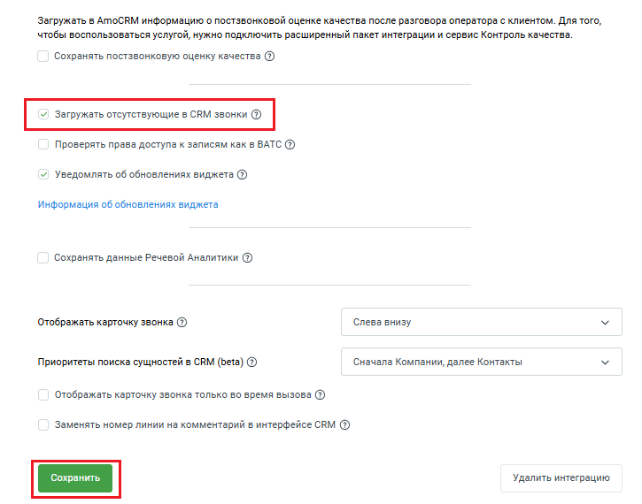

# 2.22. Загружать отсутствующие в amoCRM звонки

> Трассировка: PDF §2.22 · сквозные стр. 80-81 · источники: ч.1 `kb/sources/integration_amocrm/Mango_office_integration_amoCRM.pdf` с.80-81.

Если функция “Загружать отсутствующие в amoCRM звонки” включена, то для вашей интеграции ежедневно в 01:00 МКС будет проводиться процедура поиска и восстановления отсутствующих звонков. Имеющиеся звонки в amoCRM будут сверяться со звонками в Виртуальной АТС. Поиск потерянных звонков происходит за полный прошедший день. Примечание. Данная возможность доступна только пользователям расширенного пакета интеграции. Чтобы включить функцию загрузки отсутствующих в amoCRM звонков, в окне “Основные настройки интеграции” следует: 1. открыть вкладку “Дополнительно”; Интеграция Виртуальной АТС MANGO OFFICE и amoCRM | Версия от 25.08.2025

2. установить флаг “Загружать отсутствующие в amoCRM звонки”; 3. нажать на кнопку “Сохранить” внизу окна “Основные настройки интеграции”:

