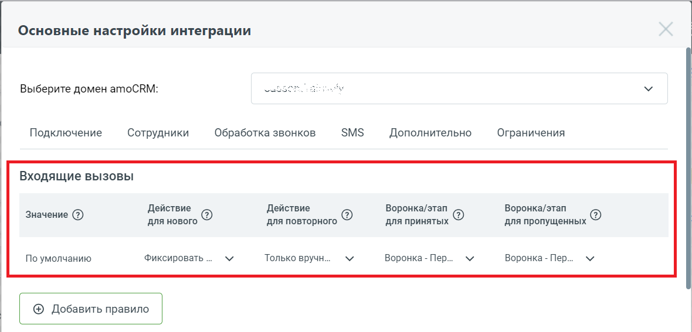
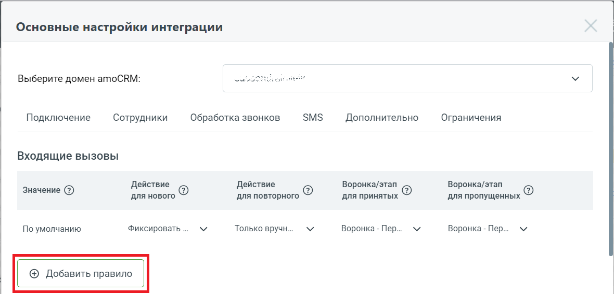
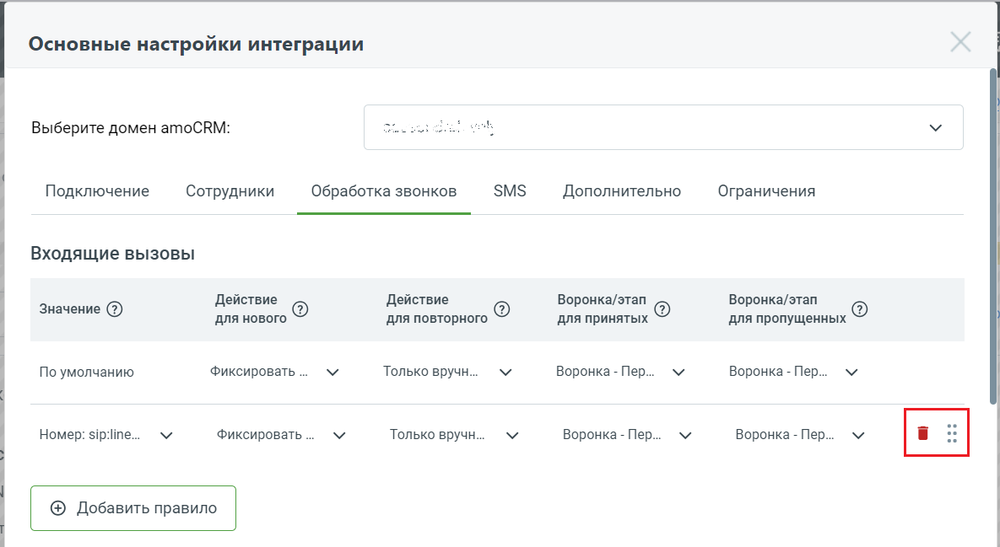

# 2.23. Создание сделок в разных воронках в зависимости от

> Трассировка: PDF §2.23 · сквозные стр. 81-85 · источники: ч.1 `kb/sources/integration_amocrm/Mango_office_integration_amoCRM.pdf` с.81-85.

группы, на которую поступил звонок Обзор Важно! Функция доступна только при подключении расширенного пакета интеграции. В виджете интеграции каждый входящий звонок обрабатывается по правилу “По умолчанию”, которое задается вами на вкладке “Обработка звонков” в таблице “Входящие вызовы”. Интеграция Виртуальной АТС MANGO OFFICE и amoCRM | Версия от 25.08.2025

Однако, если в таблицу “Входящие вызовы” добавить еще одно правило обработки входящего звонка, в котором указать группу сотрудников или телефонную линию ВАТС, а также воронку/этап amoCRM, то входящий звонок на данную группу / линию будет обработан по конкретному правилу, а не по правилу “По умолчанию”. И наоборот, когда входящий звонок поступил на группу / линию ВАТС, НЕ указанную в настройке “Входящие вызовы”, то он будет обработан по правилу “По умолчанию”. Благодаря данной настройке, в вашем amoCRM можно создавать сделки в разных воронках в зависимости от группы, на которую поступил звонок, что позволит лучше учитывать и анализировать обращения Клиентов. Важно! Основные настройки интеграции по умолчанию применяются при обработке всех звонков, не зависимо от группы сотрудников / линии ВАТС, на которую поступил звонок. Ограничения Сделки в разных воронках продаж начнут появляться только после настройки этой функции. Сделки, созданные в amoCRM до этого, не будут заново обрабатываться и распределятся по разным воронкам продаж. Как добавить “пользовательское” правило обработки входящего звонка Чтобы добавить свое правило обработки, необходимо в окне “Основные настройки интеграции”: 1) нажать кнопку “Добавить правило”: Интеграция Виртуальной АТС MANGO OFFICE и amoCRM | Версия от 25.08.2025

2) в таблице “Входящие вызовы” будет добавлена новая строка. В столбце “Значение” нужно

нажать на кнопку ;

3) в выпадающем списке выбрать группу сотрудников или линию ВАТС, для которой будет создано правило обработки входящего звонка; 4) настроить создание контакта при звонках с новых номеров, поступивших на выбранную группу сотрудников / линии ВАТС; 5) настроить обработку повторных входящих звонков, поступивших на выбранную группу сотрудников / линии ВАТС; 6) нажать кнопку “Сохранить” внизу окна “Основные настройки интеграции”: Интеграция Виртуальной АТС MANGO OFFICE и amoCRM | Версия от 25.08.2025

Управление правилами обработки входящих вызовов Общее По умолчанию правила обработки входящих звонков применяются ко входящим звонкам в том порядке, в котором они перечислены в таблице “Входящие вызовы”. Таким образом, если в таблице уже есть несколько правил обработки, то новое правило будет применяться после них. Важно. Правило “По умолчанию” распространяется на все телефонные линии и группы кроме тех, для которых указаны конкретные правила обработки звонков. Как изменить порядок применения правил Чтобы изменить порядок применения правил обработки входящих звонков, необходимо: 1) открыть основные настройки интеграции; 2) открыть вкладку “Обработка звонков”;

3) выбрать нужное правило обработки, нажать и удерживать кнопку . Нужно перетащить мышкой правило вверх или вниз. По завершении нужно нажать кнопку “Сохранить” внизу окна “Основные настройки интеграции”;

4) чтобы удалить правило из таблицы, нужно нажать на кнопку напротив него. Интеграция Виртуальной АТС MANGO OFFICE и amoCRM | Версия от 25.08.2025

