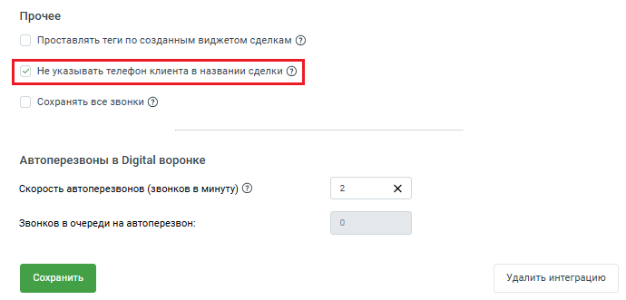

# 2.25. Прочие настройки

> Трассировка: PDF §2.25 · сквозные стр. 86-89 · источники: ч.1 `kb/sources/integration_amocrm/Mango_office_integration_amoCRM.pdf` с.86-89.

Проставлять теги по созданным виджетом сделкам Примечание. Настройка доступна только в расширенном пакете интеграции. Интеграция Виртуальной АТС MANGO OFFICE и amoCRM | Версия от 25.08.2025 Общее Данная настройка влияет на теги, которыми виджет может помечать сделки. Вы можете указать теги, которые следует проставлять в сделках, созданных виджетом интеграции. Теги добавляются в момент создания сделки. Важно. Теги не проставляются по неразобранному. Если вам не нужно тегировать один или несколько источников сделок, оставьте пустое значение тега в настройке. В зависимости от настроек интеграции (в которых определяется порядок обработки входящих и исходящих звонков и подключения интеграции с коллтрекингом), вы можете включить тегирование сделок:

| Наименование | Условие, при выполнении которого, вам будет доступна настройка тегирования | Тег, устанавливаемый по умолчанию | Ограничения |
| --- | --- | --- | --- |
| Входящий новый вызов | В правилах обработки входящих вызовов в графе "Действие для нового" есть \ вам нужно задать хотя бы одно создание сделки | "MANGO Новый входящий вызов" | Длина: 256 символов |
| Входящий повторный вызов | В правилах обработки входящих вызовов в графе "Действие для повторного" есть \ вам нужно задать хотя бы одно создание сделки | "MANGO Повторный входящий вызов" |  |
| Исходящий вызов | В правилах обработки исходящих вызовов включена настройка "Создавать сделку" И настройка "Создавать контакт при звонке на новый номер" | "MANGO Исходящий вызов" |  |
| Формы обратной связи | Если стоит флаг интеграции с ДКТ | "MANGO Формы" |  |

Как включить настройку Чтобы установить настройку, в окне настроек интеграции на вкладке “Обработка звонков” необходимо: 1) активировать переключатель “Проставлять теги по созданным виджетом сделкам”. Будут открыт дополнительные поля. Доступность полей определяется настройками интеграции, читайте таблицу выше; Интеграция Виртуальной АТС MANGO OFFICE и amoCRM | Версия от 25.08.2025 2) в открывшихся полях указаны значения по умолчанию, описанные в таблице выше. Вам нужно выбрать какие сделки нужно тегировать и вместо значения по умолчанию. Например, если нужно чтобы все сделки, созданные автоматически при входящем звонке от новых клиентов, помечались бы тегом “АБВ”, то в поле “Входящий новый вызов” удалите значение “MANGO Новый входящий вызов” и впишите значение “АБВ”; 3) нажмите на кнопку “Сохранить”.

Не указывать телефон клиента в названии сделки Если настройка включена, то в сделках, созданных виджетом интеграции, номер телефона Клиента будет заменен на дату и время создания сделки. После включения настройки, нажмите кнопку “Сохранить”, чтобы активировать настройку:

Интеграция Виртуальной АТС MANGO OFFICE и amoCRM | Версия от 25.08.2025
