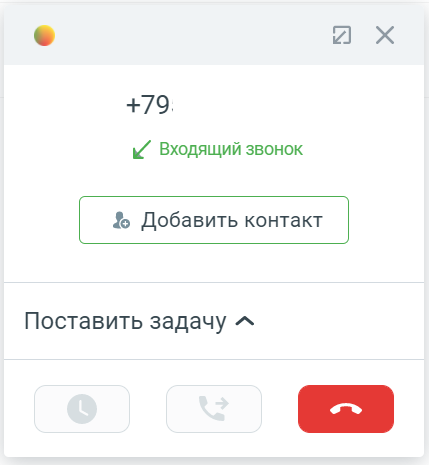

# 3.1. Общее

> Трассировка: PDF §3.1 · сквозные стр. 89 · источники: ч.1 `kb/sources/integration_amocrm/Mango_office_integration_amoCRM.pdf` с.89.

При входящем звонке у сотрудника зазвонит телефон (указанный в карточке сотрудника в Личном кабинете в качестве средства приема вызова), а в amoCRM покажется карточка звонка. Если звонит новый Клиент и нужно создать новый контакт во время разговора, то достаточно нажать на кнопку “Добавить контакт”:

Важно. Закрытие карточки звонка в amoCRM не завершает разговор. Чтобы завершить разговор нужно положить трубку, либо нажать кнопку “Завершить вызов” (если вы используете софтфон),

либо нажать кнопку в карточке звонка.
