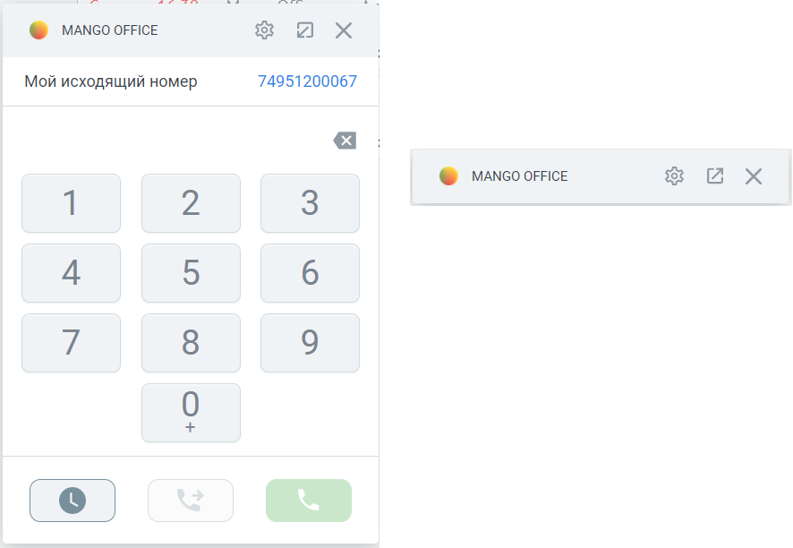
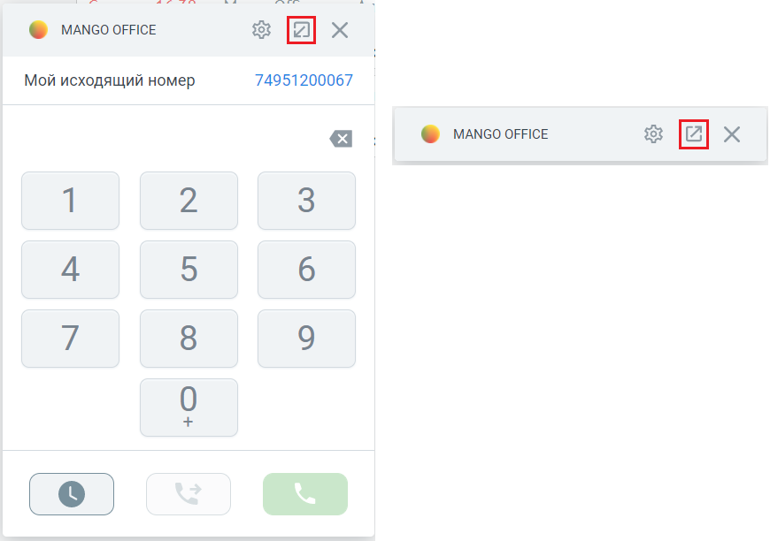
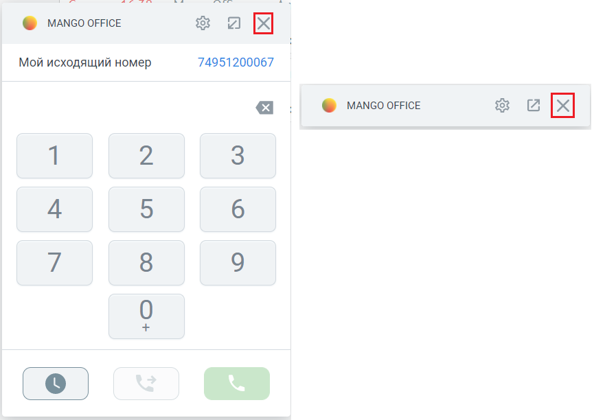

# 7.2. Как управлять отображением карточки звонка

> Трассировка: PDF §7.2 · сквозные стр. 93-95 · источники: ч.1 `kb/sources/integration_amocrm/Mango_office_integration_amoCRM.pdf` с.93-95.

Варианты Доступны следующие варианты отображения карточки звонка: - Не отображать: карточка звонка никогда не отображается в amoCRM (ни при входящем, ни при исходящем звонке); - Отображать карточку звонка только во время вызовов: карточка звонка показана в amoCRM только во время обработки звонка; - Слева внизу: карточка звонка показана в левом нижнем углу amoCRM; - Справа снизу: карточка звонка показана в правом нижнем углу amoCRM.

Как свернуть или развернуть карточку звонка Если включено отображение карточки звонка, то можно ее свернуть или развернуть. Интеграция Виртуальной АТС MANGO OFFICE и amoCRM | Версия от 25.08.2025 По умолчанию карточка отображается в свернутом виде:

а) Общий вид карточки звонка в развернутом виде б) Общий вид карточки звонка в свернутом виде Важно. Если вы свернули / развернули карточку, то настройки видимости карточки сохраняются следующим образом: - если Вы свернули карточку в момент окончания разговора, то в дальнейшем она сохранит свое свернутое состояние и положение в интерфейсе amoCRM; - если карточка развернута в момент окончания разговора, то при последующем звонке она сохранит свое развернутое состояние и положение в интерфейсе amoCRM.

Чтобы свернуть карточку звонка, нужно нажать на кнопку . Чтобы развернуть ранее

свернутую карточку звонка, нужно нажать на кнопку :

Как временно скрыть карточку звонка Если нужно временно убрать карточку звонка из интерфейса amoCRM, ее можно скрыть. При скрытии карточки она удаляется из интерфейса amoCRM. Скрывая карточку звонка, работа интеграции не останавливается – карточка будет снова показана при новом входящем звонке или при обновлении страницы браузера (если в настройках интеграции не установлено иное). Интеграция Виртуальной АТС MANGO OFFICE и amoCRM | Версия от 25.08.2025 Важно! Во время разговора скрыть карточку звонка нельзя, а можно только перевести ее в свернутое состояние.

Чтобы скрыть карточку звонка, нужно нажать на кнопку в заголовке карточки звонка:

