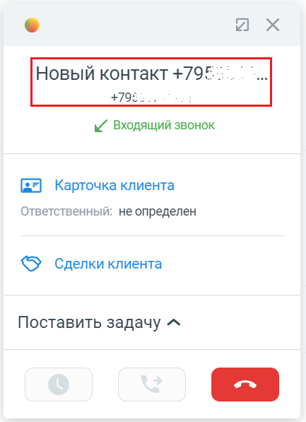
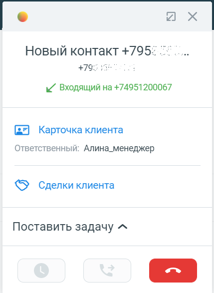

# 7.3. Об интерфейсе карточки звонка

> Трассировка: PDF §7.3 · сквозные стр. 95-97 · источники: ч.1 `kb/sources/integration_amocrm/Mango_office_integration_amoCRM.pdf` с.95-97.

При входящем / исходящем звонке При входящем либо исходящем звонке в развернутой карточке звонка можно видеть: 1) номер телефона: - номер абонента при звонке с нового номера, ЛИБО • данные контакта (например, сообщение “Новый ДД:ММ ДД.ММ.ГГГГ”), если абонент ранее был сохранен в amoCRM, ЛИБО • контактные данные абонента, если они определены по данным из amoCRM / Адресной книге: Интеграция Виртуальной АТС MANGO OFFICE и amoCRM | Версия от 25.08.2025

а) б) в) 2) направление звонка (входящий или исходящий); 3) номер линии ВАТС, через который идет вызов. Отображается, только если включена настройка “Указывать источник при входящих звонках”. 4) кнопка “Добавить контакт” при звонке с нового номера, либо, если абонент сохранен в контактах amoCRM, то вместо кнопки “Добавить контакт” будут показаны: - ссылка на карточку Клиента. Кликнув по этой ссылке, будет открыта карточка Клиента в amoCRM; • ссылка на список сделок amoCRM по данному клиенту; 5) имя ответственного сотрудника (отображается при входящем звонке), либо информационное сообщение “Ответственный: не определен”; 5) данные коллтрекинга только для входящего звонка от нового Клиента;

7) кнопка “Отбой” , при помощи которой можно завершить вызов.

а) б) в) Во время звонка Когда звонок принят в развернутой карточке, к указанным выше элементам добавляется: Интеграция Виртуальной АТС MANGO OFFICE и amoCRM | Версия от 25.08.2025 - длительность звонка;

- кнопка “Перевод вызова” :

