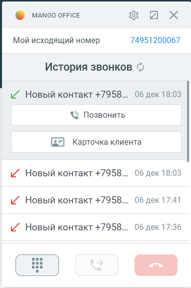
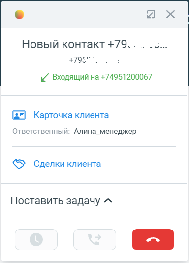

# 7.4. Как позвонить или принять звонок

> Трассировка: PDF §7.4 · сквозные стр. 97-99 · источники: ч.1 `kb/sources/integration_amocrm/Mango_office_integration_amoCRM.pdf` с.97-99.

Общее Виртуальная АТС позволяет установить телефонную связь между абонентами, а система amoCRM – анализировать взаимодействие/сделки с Клиентами. Однако ни одна из этих систем не дает возможности непосредственно совершать или принимать звонки. Поэтому, чтобы принимать и совершать звонки, нужно использовать, либо коммуникатор Mango Talker, либо любой другой телефон, подключенный к вашей Виртуальной АТС. Примечание. Ознакомьтесь с руководством пользователя Mango Talker, которое поможет Вам максимально использовать возможности коммуникатора. Важно! Если вы пользуетесь расширенным пакетом интеграции, вам доступна функция “Мой исходящий номер”, при помощи которой можно выбрать номер, с которого будет совершен звонок. Исходящий звонок Чтобы позвонить при помощи карточки звонка, следует: 1) развернуть карточку звонка, если она находится в свернутом состоянии; 2) если нужно перезвонить по номеру, который вам звонил ранее, то необходимо: - нажать на

кнопку . Будет открыта “История звонков”; - нажать на строку нужным номером. Будут открыты дополнительные поля; - нажать на кнопку “Позвонить”. Будет выполнен исходящий Интеграция Виртуальной АТС MANGO OFFICE и amoCRM | Версия от 25.08.2025 звонок: сначала зазвонит ваш рабочий телефон, и только после того как Вы поднимите трубку – начнется звонок на выбранный номер телефона.

3) если нужно набрать номер самостоятельно, то необходимо: - нажать на кнопку .

Будет открыт “Номеронабиратель”; - набрать нужный вам номер и нажать кнопку . Будет выполнен исходящий звонок: сначала зазвонит ваш рабочий телефон, и только после того как Вы поднимите трубку – начнется звонок на выбранный номер телефона.

а) б) Входящий звонок При входящем звонке у вас зазвонит телефон и покажется карточка звонка в развернутом виде. Однако, если вы отключили показ карточки звонка в настройках интеграции, карточка звонка не появится. Чтобы принять входящий звонок нужно поднять трубку вашего телефона. Интеграция Виртуальной АТС MANGO OFFICE и amoCRM | Версия от 25.08.2025

