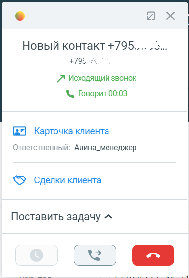

# 7.6. Как перевести звонок

> Трассировка: PDF §7.6 · сквозные стр. 99-102 · источники: ч.1 `kb/sources/integration_amocrm/Mango_office_integration_amoCRM.pdf` с.99-102.

Общее Виджет интеграции позволяет во время разговора перевести звонок на другого сотрудника или внешний номер. Перевод выполняется в карточке звонка. Доступны следующие варианты: - С консультацией. Этот вариант подходит, если нужно сначала пообщаться (консультироваться) с другим сотрудником, на которого будет переведен звонок. Интеграция Виртуальной АТС MANGO OFFICE и amoCRM | Версия от 25.08.2025 Например, если вы в карточке звонка выберите сотрудника (или введете произвольный номер) и нажмете кнопку “С консультацией”, вы будете соединены с выбранным сотрудником (или номером). При этом, будет переведен в режим удержания звонок, который вы хотите перевести. Если сотрудник, на которого переводится звонок, не берет трубку или в процессе консультации вопрос был решен без необходимости перевода звонка, то можно отменить перевод. • Без консультации. Или по-другому “слепой перевод”. При выборе этого варианта, звонок немедленно переводится на выбранного сотрудника или введенный произвольный номер. Ограничения 1) Перевод звонка можно выполнить только во время обработки звонка (когда установлено соединение между абонентами); 2) Отменить перевод звонка можно только при переводе с консультацией. Порядок действий Чтобы перевести звонок, в карточке звонка необходимо:

1) нажать кнопку . Будет показан список ваших сотрудников ВАТС и поле для поиска и ввода произвольного номера; 2) выполнить одно из следующих действий: – нажать на строку с данными сотрудника, на которого нужно перевести звонок; – в поле для поиска ввести номер телефона, на который нужно перевести звонок; Примечание. Если не видно строку с данными нужного вам сотрудника, воспользуйтесь поиском. Будут показаны кнопки для выбора варианта перевода. 3) выбрать вариант перевода звонка: • С консультацией. Текущий звонок будет поставлен на удержание и начнется звонок выбранному сотруднику или на введенный номер телефона. Как только вызываемый сотрудник снимет трубку, между вами будет установлено соединение. После разговора с сотрудником, чтобы завершить перевод звонка с консультацией нужно положить трубку

или нажать кнопку “Отбой” в софтфоне. После выполнения этого действия звонок из режима удержания будет переведен на целевого сотрудника или номер телефона. Важно. Нажатие кнопки “Отбой” в карточке звонка не приведет к завершению перевода звонка. - Без консультации. Текущий звонок сразу будет переведен выбранному сотруднику или на введенный номер телефона. Интеграция Виртуальной АТС MANGO OFFICE и amoCRM | Версия от 25.08.2025

а) б) в) г) Как отменить перевод звонка Важно! Отменить перевод звонка можно только в процессе перевода с консультацией. Чтобы отменить перевод звонка, нужно во время дозвона или разговора с сотрудником, на которого планировался перевод звонка, ДВАЖДЫ нажать на кнопку # (решетка) на вашем телефоне или на экранной клавиатуре вашего софтфона. После отмены перевода звонка: • дозвон или разговор с сотрудником, на которого планировался перевод звонка, прекратится; • звонок будет переведен из режима удержания на вас. Поиск в карточке звонка Поле для поиска находится в верхней части карточки звонка. Оно позволяет: - искать сотрудника ВАТС по имени и/или номеру телефона; - вводить произвольный номер для перевода вызова. Как искать сотрудника В поле поиска нужно начать вводить имя или название, или номер сотрудника. Будет показан список сотрудников, соответствующих параметру поиска. Чтобы перевести звонок, нужно нажать на строку нужного вам сотрудника и выбрать способ перевода. Интеграция Виртуальной АТС MANGO OFFICE и amoCRM | Версия от 25.08.2025
