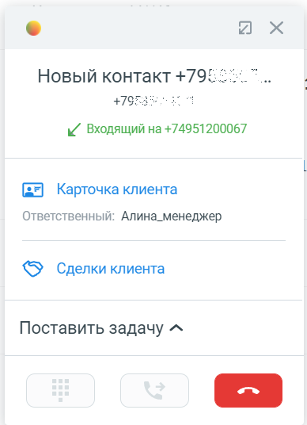
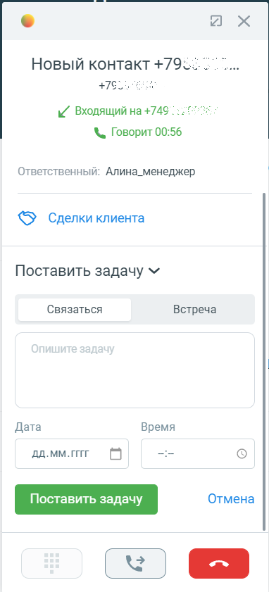

# 7.7. Ставить задачу по звонку вручную

> Трассировка: PDF §7.7 · сквозные стр. 102 · источники: ч.1 `kb/sources/integration_amocrm/Mango_office_integration_amoCRM.pdf` с.102.

Общее Прямо во время звонка или сразу после него в карточке звонка можно поставить самое себе задачу в amoCRM. В задаче можно указать ее тип (связаться или встретиться), дату и время задачи, а также краткое ее описание. Задачи, созданные при помощи карточки звонка, добавляются в список ваших задач в соответствующий раздел amoCRM. Порядок действий Чтобы поставить задачу, в карточке звонка необходимо: 1) нажать на ссылку “Поставить задачу”; 2) выбрать тип задачи “Связаться” или “Встреча”; 3) в поле “Опишите задачу” добавить описание задачи; 4) в поле “Дата” и “Время” ввести дату и время начала выполнения задачи; 5) нажать на кнопку “Поставить задачу”. А если нужно отказаться от постановки задачи, нужно нажать на кнопку “Отмена”.

а) б)
