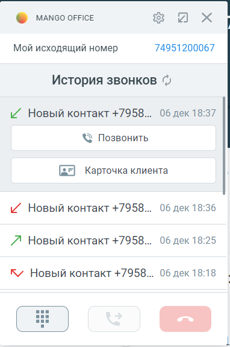

# 7.8. История звонков

> Трассировка: PDF §7.8 · сквозные стр. 102-104 · источники: ч.1 `kb/sources/integration_amocrm/Mango_office_integration_amoCRM.pdf` с.102-104.

Общее Функция “История звонков” позволяет загружать из ВАТС данные о звонках, совершенных/принятых/пропущенных определенным сотрудником, прямо в карточку звонка. Данные о звонке импортируются в карточку звонка из ВАТС сразу после завершения вызова. Интеграция Виртуальной АТС MANGO OFFICE и amoCRM | Версия от 25.08.2025 Импортированные данные дополняют данные о ранее совершенных вызовах. В результате в карточке звонка будет показана история вызовов по конкретному сотруднику. Как посмотреть историю звонков Для этого в карточке звонка, необходимо: 1) развернуть карточку звонка, если она была в свернутом состоянии;

2) нажать на кнопку в нижней части карточки звонка. Будет показан список звонков, принятых, либо пропущенных, соответствующих сотруднику. По каждому звонку отображается номер телефона второго абонента (участника звонка), дата и время его фиксации, а также тип звонка:

входящий принятый звонок;

входящий пропущенный звонок;

входящий звонок отклонен;

исходящий принятый звонок;

исходящий звонок, отклоненный вызываемым абонентом;

исходящий пропущенный звонок. Как обновить историю звонков Она обновляется автоматически, но если нужно принудительно обновить историю звонков

нужно нажать на кнопку . Как перезвонить по номеру 1) нажать на строку с данными нужного Вам номера. Будут открыты дополнительные элементы интерфейса; 2) нажать на кнопку “Перезвонить”. Будет совершен исходящий звонок на выбранный вами номер: Интеграция Виртуальной АТС MANGO OFFICE и amoCRM | Версия от 25.08.2025

а) б) Как сохранить номер после разговора 1) нажать на строку с данными нужного Вам номера. Будут открыты дополнительные элементы интерфейса; 2) нажать на кнопку “Добавить контакт”. Будет открыта форма “Новый контакт” в amoCRM, нужно заполнить ее и сохранить.
