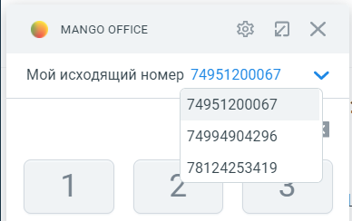

# 7.10. Мой исходящий номер

> Трассировка: PDF §7.10 · сквозные стр. 105-106 · источники: ч.1 `kb/sources/integration_amocrm/Mango_office_integration_amoCRM.pdf` с.105-106.

Важно. Чтобы использовать эту функцию необходимо использовать расширенный пакет интеграции, а также включить опцию “Разрешить выбирать линию при исходящем звонке” в настройках интеграции. Кроме этого, надо проверить, что в настройках Виртуальной АТС ВЫКЛЮЧЕНА настройка “Не указан номер – нет исходящей связи”. Функция “Мой исходящий номер” позволяет увидеть, с какого Вашего номера Виртуальной АТС совершаются исходящие звонки. Кроме этого, можно выбрать любой номер ВАТС и позвонить с выбранного номера телефона. Как изменить исходящий номер: 1) развернуть карточку звонка, если она была в свернутом состоянии; 2) в поле “Мой исходящий номер” будет показан Ваш исходящий номер;

3) нажать на кнопку в поле “Мой исходящий номер”; 4) в выпадающем списке показаны все Ваши номера Виртуальной АТС. Нужно нажать на тот или иной номер, который будет использован для совершения звонков. Интеграция Виртуальной АТС MANGO OFFICE и amoCRM | Версия от 25.08.2025

