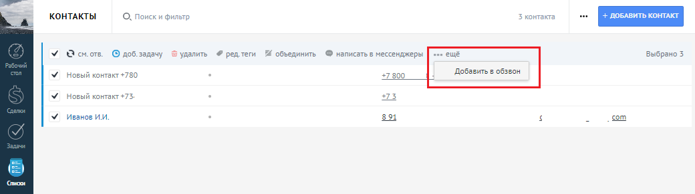
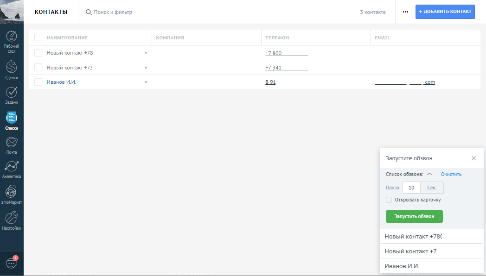
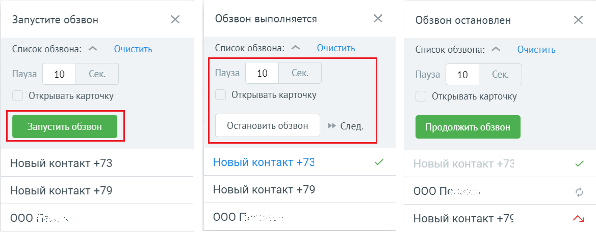
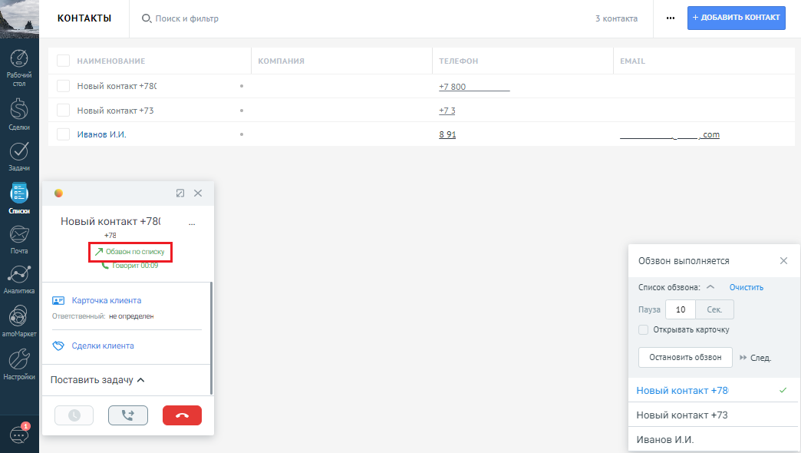
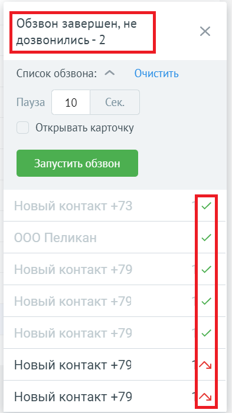

# 8. Список обзвона

> Трассировка: PDF §8 · сквозные стр. 108-111 · источники: ч.1 `kb/sources/integration_amocrm/Mango_office_integration_amoCRM.pdf` с.108-111.

Для удобства совершения массовых исходящих звонков, сотрудник может воспользоваться специальным инструментом – списком обзвона. Список обзвона можно создать из списка контактов, сделок и компаний. Сотрудник всегда может добавить в список еще контакты и/или компании и/или сделки. Внимание! Список обзвона доступен только при подключении расширенных возможностей интеграции. И только если выключен флаг “Интеграция с Контакт центром”. Если флаг “Интеграция с Контакт центром” включен, то виджет передает данные для обзвона в кампанию исходящего обзвона (один из важных инструментов Контакт Центра). Сотрудник в любой момент может поменять интервал между попытками дозвона по списку или установить флаг “Открывать контакт”. Если флаг “Открывать контакт” включен, то при звонке по строке из списка обзвона автоматически откроется соответствующая карточка контакта/компании. Сотрудник также может открыть карточку контакта/компании - кликнув на имя в карточке звонке. Для добавления записей в список обзвона – выбрать элементы в списке и на вкладке “еще” нажать на “Добавить в обзвон”:

Выбранные элементы будут добавлены в конец списка обзвона:

При этом, одинаковые контакты фильтруются и в список добавляется только одна запись. Нажать на кнопку запуска обзвона – начнется обзвон. Первый звонок начнется сразу после запуска, а последующие – через указанную паузу после завершения предыдущего звонка. Интеграция Виртуальной АТС MANGO OFFICE и amoCRM | Версия от 25.08.2025

а) б) в) Если список обзвона нужно удалить - нажать на “Очистить”. Если контакт в списке нужно удалить - нажать на кнопку “Корзина”, которая появляется при наведении курсора мыши на соответствующую строку. Если обзвон нужно приостановить во время обзвона – нажать на кнопку “Пауза”. Обзвон остановится до следующего нажатия на кнопку “Запуска обзвона”. Во время обзвона виджет сначала звонит сотруднику. После поднятия трубки сотрудником – начинается звонок Клиенту. При звонке в рамках обзвона – в карточке звонка будет указано “Обзвон по списку”.

Если с Клиентом был начат разговор, то соответствующая строка в списке обзвона становиться

серого цвета и в ней появляется значок . А, если до Клиента не дозвонились, то строка

помечается значком и перемещается в конец списка. Обзвон по списку автоматически останавливается, когда по всем элементам списка был звонок. При этом указывается, по какому числу контактов не было разговора. Сотрудник может кликнуть Интеграция Виртуальной АТС MANGO OFFICE и amoCRM | Версия от 25.08.2025 еще раз на запуск обзвона и обзвон будет совершен только по тем контактам, по которым сотрудник ранее не дозвонился.

Примечания: 1. если во время обзвона сотрудник не примет вызов, то чтобы продолжить обзвон – ему нужно остановить и продолжить обзвон. Либо обзвон автоматически через некоторое время будет поставлен на паузу. 2. обзвон по списку может выполняться только в одной вкладке браузера, чтобы не создавались ошибочно несколько обзвонов и запускать их одновременно. После очистки обзвона – его можно создать в любой другой вкладке браузера. Интеграция Виртуальной АТС MANGO OFFICE и amoCRM | Версия от 25.08.2025
