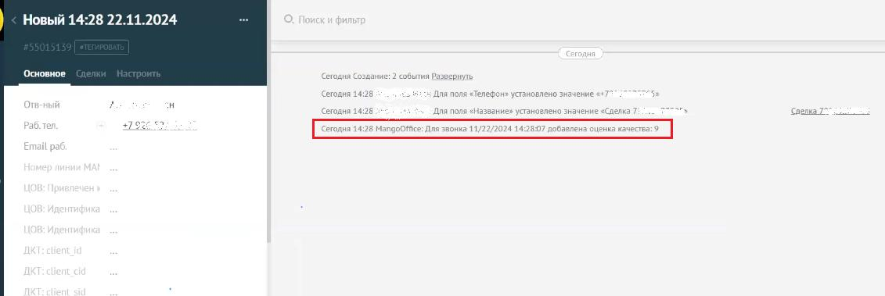
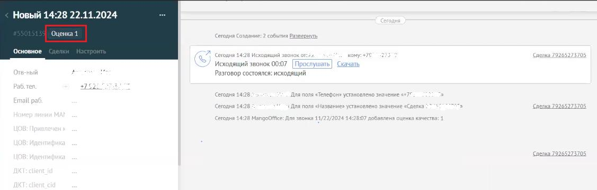

# Общее

> Трассировка: PDF §12 · сквозные стр. 116-118 · источники: ч.1 `kb/sources/integration_amocrm/Mango_office_integration_amoCRM.pdf` с.116-118.

Примечание. Настройка доступна только в расширенном пакете интеграции. Что это дает Данная настройка позволяет загружать в amoCRM оценку качества звонка, при подключении модуля “Контроль качества” MANGO OFFICE к Виртуальной АТС. В результате вы сможете в вашей amoCRM увидеть звонки, например, с низким качеством оценки от Клиента. Кроме того, используя функцию прослушивания записи звонков, сможете послушать разговор с Клиентом и самостоятельно убедиться прав был Клиент в своей оценке или нет. Если вы включите данную настройку, то свяжите виджет интеграции с сервисом “Контроль качества”. В результате в вашей amoCRM: • в данных о звонке появится запись об оценке, которую поставил Клиент после разговора с оператором; Важно. В данных о звонке отображается оценка, которую поставил Клиент, в том числе и самая высокая и самая низкая (любая).

• в тегах звонка появится оценка, которую поставил Клиент, если эта оценка будет ниже максимального порога. Важно. В теге звонка отображается оценка Клиента, если она ниже максимального порога, заданного вами в настройке функции “Сохранение постзвонковой оценки качества”. О максимальном пороге читайте далее в этом разделе …

Интеграция Виртуальной АТС MANGO OFFICE и amoCRM | Версия от 25.08.2025 О модуле “Контроль качества” Качество диалогов в контактном центре играет ключевую роль в формировании лояльности и доверия клиентов, а также напрямую влияет на вероятность покупки. Но слушать и оценивать каждый диалог долго, дорого, неэффективно, вмешивается субъективность и не учитывается оценка разговора клиентом. Модуль «Контроль качества» MANGO OFFICE предлагает единую систему управления коммуникациями: автоматическую оценку 100% диалогов в режиме реального времени, учетом обратной связи от клиентов в голосовых и текстовых каналах, а также ручным контролем выборочных диалогов и встроенными отчетами. Какие задачи решает Контроль качества: • Оценивайте качество обслуживания объективно. Проводите всестороннюю оценку диалогов сотрудников с клиентами, выявляйте точки роста и сильные стороны. • Оперативно реагируйте на негатив. Выявляйте частотные проблемы, чтобы не только устранить негатив, но и внедрить проактивные меры для их предотвращения. • Повышайте мотивацию персонала. Включайте данные из аналитики Контроля качества в систему KPI ваших сотрудников, работайте с мотивацией и сокращайте текучесть. • Определяйте потребности клиентов. Анализируйте реакцию ваших клиентов по оценкам, проставленным по итогам разговора или чата. • Развивайте экспертность сотрудников. Анализируйте оценки сотрудника и назначайте нужные обучения или разбирайте определенные темы. • Оценивайте эффективность новинок. Выявляйте реакцию ваших клиентов на новинки в продуктовой линейке, акции или другие изменения, используя автоматические тематики. Требования Функция “Сохранять постзвонковую оценку качества” доступна только при подключении модуля “Контроль качества” к Виртуальной АТС в Личном кабинете MANGO OFFICE. Подробнее о модуле “Контроль качества” … Принцип работы функции и максимальный порог качества Чтобы виджет интеграции мог загружать в amoCRM постзвонковую оценку качества, вам нужно в настройке функции указать максимальный порог, выше которого оценка звонка будет считаться не достоверной и будет игнорироваться. Например, если вами в модуле “Контроль качества” была настроена возможность оценки разговора по шкале от 1 до 10, то вы можете в функции “Сохранять постзвонковую оценку качества” указать значение порога 9. Тогда все оценки качества больше либо равные 9 будут игнорироваться. Если вы включили эту функцию и указали максимальные порог качества, но оценка звонка не достигла максимального порога, то в amoCRM в данных о звонке появится дополнительно поле «Оценка качества», в котором будет указана оценка, которую поставил Клиент после разговора с оператором. Интеграция Виртуальной АТС MANGO OFFICE и amoCRM | Версия от 25.08.2025
