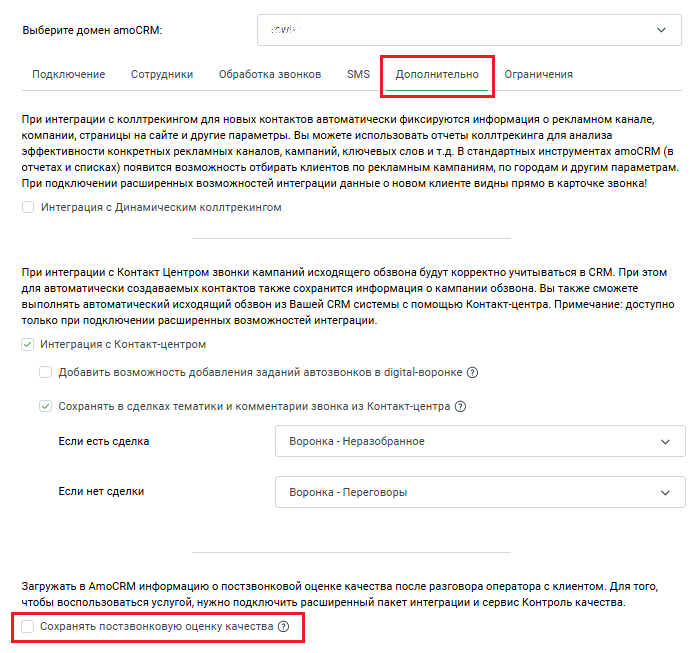
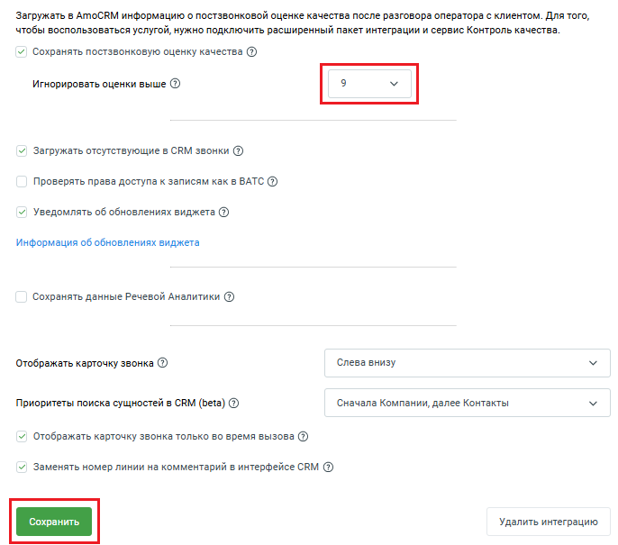

# Как настроить

> Трассировка: PDF §12 · сквозные стр. 118-119 · источники: ч.1 `kb/sources/integration_amocrm/Mango_office_integration_amoCRM.pdf` с.118-119.

Чтобы настроить передачу постзвонковой оценки качества в вашу amoCRM, в окне “Основные настройки интеграции” необходимо: 1. откройте вкладку “Дополнительно” 2. активируйте переключатель “Сохранять постзвонковую оценку качества”. Будет открыто дополнительное поле;

3. выберите порог принятия решения - оценку, выше которой нужно игнорировать оценки; 4. нажмите кнопку “Сохранить”. Интеграция Виртуальной АТС MANGO OFFICE и amoCRM | Версия от 25.08.2025

