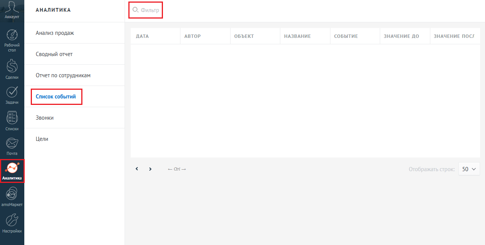
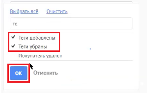
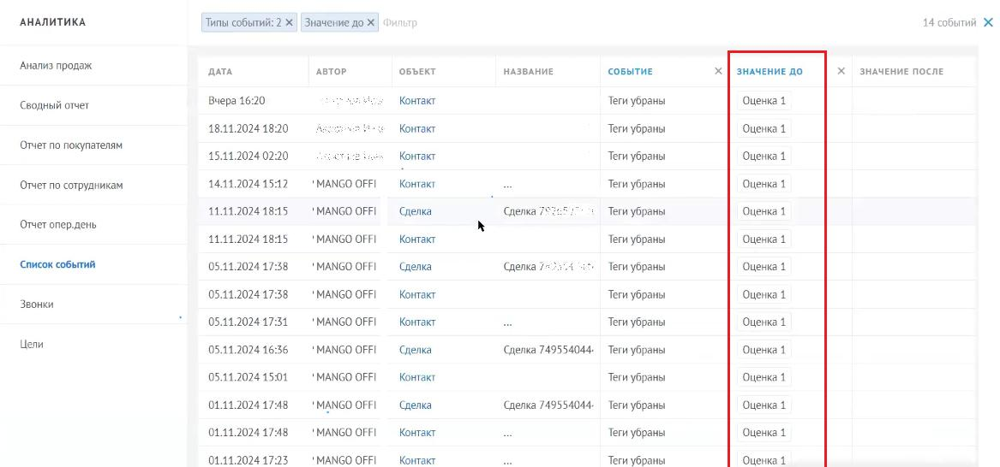
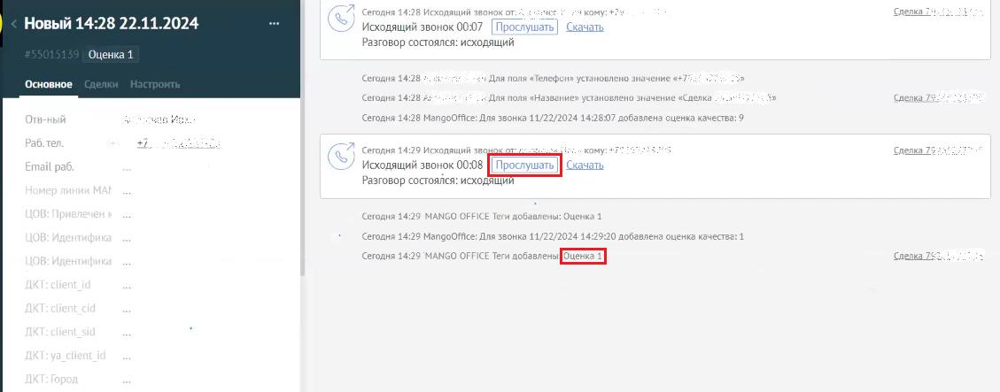

# Как посмотреть звонки с оценкой ниже, чем максимальный порог

> Трассировка: PDF §12 · сквозные стр. 119-122 · источники: ч.1 `kb/sources/integration_amocrm/Mango_office_integration_amoCRM.pdf` с.119-122.

Вы можете отфильтровать данные о звонках с оценкой качества, ниже чем установленный вами порог качества, при помощи стандартных инструментов amoCRM. Для этого, в amoCRM необходимо: 1. перейдите в раздел “Аналитика”, затем выберите пункт “Список событий” 2. нажмите на поле “Фильтр”;

3. в поле “Типы событий”. Будет открыто дополнительное поле; 4. введите слово “Тег” в поле “Поиск”; Интеграция Виртуальной АТС MANGO OFFICE и amoCRM | Версия от 25.08.2025

5. установите галочку в полях “Теги добавлены” и “Теги убраны” и нажмите кнопку “Ок”;

6. в поле “Значение до” укажите значение “Оценка минимальная оценка звонка, выше которой звонки вас не интересуют”. Например, укажите значение “Оценка 1”; 7. нажмите кнопку “Применить”;

8. будут отфильтрованы данные о всех звонках, оценка которых меньше либо равна указанного вами порогу оценки качества. Применительно к примеру, будут отфильтрованы все звонки с оценкой качества 1 или ниже. Интеграция Виртуальной АТС MANGO OFFICE и amoCRM | Версия от 25.08.2025

Чтобы прослушать запись разговора, которому поставлена та или оценка, нажмите на поле “Контакт” в нужной вам строке с данными звонка. Будет открыта карточка контакта, в которой вы можете прослушать запись разговора.

Интеграция Виртуальной АТС MANGO OFFICE и amoCRM | Версия от 25.08.2025
