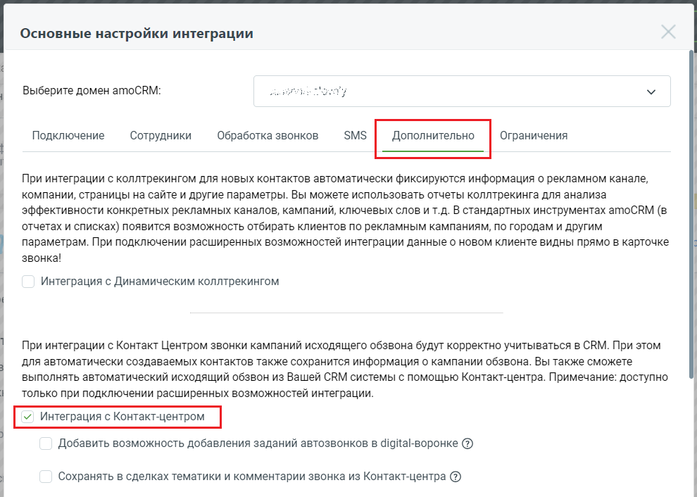

# 14.1. Учет кампаний исходящего обзвона в amoCRM

> Трассировка: PDF §14.1 · сквозные стр. 124-125 · источники: ч.1 `kb/sources/integration_amocrm/Mango_office_integration_amoCRM.pdf` с.124-125.

Если Вы подключили Контакт Центр MANGO OFFICE (далее по тексту – КЦ) к Виртуальной АТС, то в рамках интеграции с amoCRM будет доступна дополнительная возможность: учет кампаний исходящего обзвона в amoCRM. То есть, звонки, выполненные в рамках кампаний исходящего обзвона КЦ, обрабатываются (с показом карточки) и фиксируются в amoCRM только при включенной опции “Интеграция с Контакт-центром”.

Кроме того, если запущена кампания исходящего обзвона из КЦ, то при входящем звонке будет показана информация о контакте из настроек кампании:

Если контакт создается в amoCRM автоматически (согласно настройкам виджета) или создается из карточки звонка, то в контакте автоматически сохранятся данные:

| Поле в amoCRM | Описание |
| --- | --- |

Интеграция Виртуальной АТС MANGO OFFICE и amoCRM | Версия от 25.08.2025

| ЦОВ: Привлечен кампанией исходящего обзвона | Имя кампании |
| --- | --- |
| ЦОВ: Идентификатор кампании исходящего обзвона | Уникальный идентификатор кампании |
| ЦОВ: Идентификатор Клиента | Уникальный идентификатор кампании из кампании |
