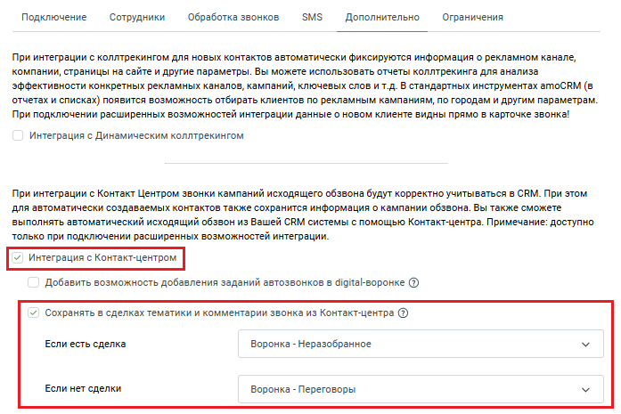

# 14.3. Сохранять в сделках тематики и комментарии звонка из Контакт-центра

> Трассировка: PDF §14.3 · сквозные стр. 136-139 · источники: ч.1 `kb/sources/integration_amocrm/Mango_office_integration_amoCRM.pdf` с.136-139.

Контакт-центра Принцип работы При проведении кампании ИО, оператор КЦ может в данные каждого совершенного им исходящего звонка, вносить тематики разговора и комментарии. Вы можете в настройках интеграции включить передачу этих тематик и комментариев ваш amoCRM. По умолчанию настройка “Сохранять в сделках тематики и комментарии звонка из Контакт- центра” выключена. Если настройка будет включена, то в течение 1 часа с момента начала звонка в рамках исходящего обзвона, сервис интеграций будет автоматически сохранять в amoCRM тематики и комментарии, сделанные оператором в рамках кампании ИО. При этом надо учесть следующее: - если в настройках интеграции включены опции “Создавать контакт при звонке на новый номер” и “Создавать сделку при звонке на новый номер”, то: 1. если номер телефона не сохранен в контакты вашего amoCRM, то виджет интеграции автоматически создаст в amoCRM контакт и сделку. При этом, в настройке вам нужно заранее указать этап воронки, на которой будет создана сделка; 2. если номер телефона сохранен в контактах amoCRM и нет открытых сделок, то будет виджет интеграции автоматически создаст в amoCRM новую сделку. При этом, в настройке вам нужно заранее указать этап воронки, на которой будет создана сделка; 3. если номер телефона сохранен в контактах amoCRM и есть открытая сделка, то будет виджет интеграции автоматически создаст в amoCRM новую сделку на отдельном этапе воронки. При этом, в настройке вам нужно заранее указать этап воронки, на которой будет создана сделка. - если в настройках интеграции выключены опции “Создавать контакт при звонке на новый номер” и “Создавать сделку при звонке на новый номер” и, при этом включена данная настройка “Сохранять в сделках тематики и комментарии звонка из Контакт-центра”, то действия а)-в) будут выполняться только для исходящих звонков в рамках кампании исходящего обзвона. Как включить В окне “Основные настройки интеграции” на закладке “Дополнительно” необходимо: Интеграция Виртуальной АТС MANGO OFFICE и amoCRM | Версия от 25.08.2025

1) активируйте переключатели “Интеграция с Контакт-центром” и “Сохранять в сделках тематики и комментарии звонка из Контакт-центра”; 2) в поле “Если есть сделка” выберите этап воронки продаж, на котором будет создана еще одна сделка, если к контакту уже привязана открытая сделка; 3) в поле “Если нет сделки” выберите этап воронки продаж, на котором будет создана новая сделка; Примечание. Перед тем как создавать новую сделку, виджет интеграции проверяет наличие в amoCRM открытой сделки, привязанной к этому номеру: - если такая сделка есть, то виджет интеграции в amoCRM: 1. создаст новую сделку на этапе воронке, указанной в поле “Если есть сделка”; 2. в созданную сделку в комментарии сохранит тематики и комментарии оператора КЦ; - если к контакту не привязана открытая сделка, то виджет интеграции в amoCRM создаст новую сделку на этапе воронке, указанной в поле “Если нет сделки” и в эту сделку сохранит тематики и комментарии оператора КЦ. 4) нажмите кнопку “Сохранить” в самом низу закладки “Дополнительно”:

Интеграция Виртуальной АТС MANGO OFFICE и amoCRM | Версия от 25.08.2025 Интеграция Виртуальной АТС MANGO OFFICE и amoCRM | Версия от 25.08.2025
