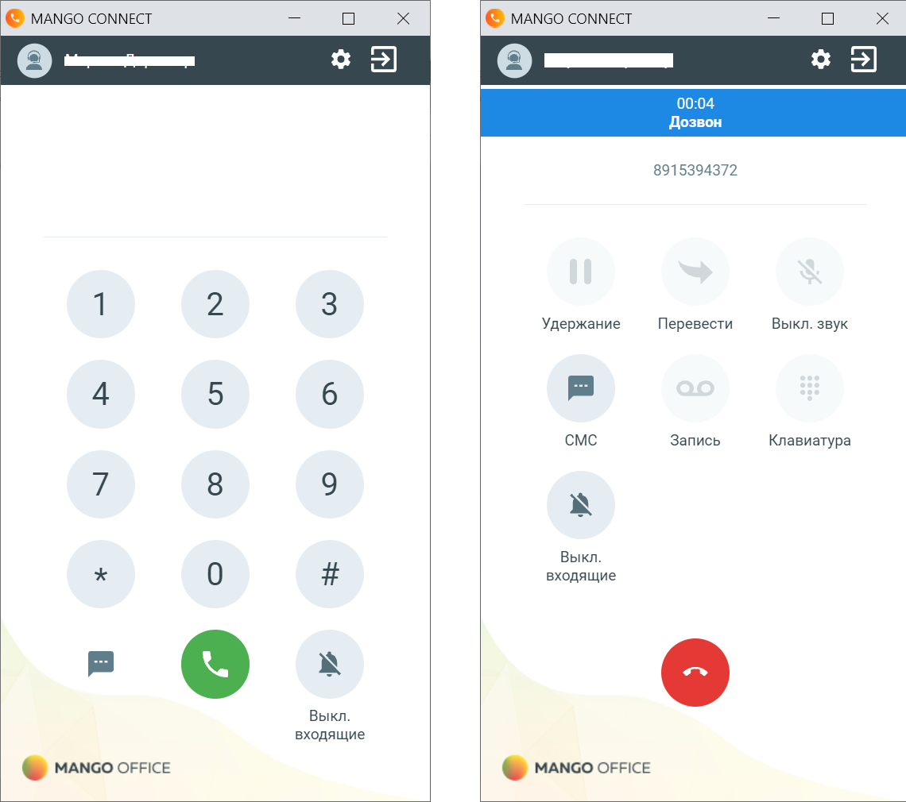

# 15.1. Обзор

> Трассировка: PDF §15.1 · сквозные стр. 139-140 · источники: ч.1 `kb/sources/integration_amocrm/Mango_office_integration_amoCRM.pdf` с.139-140.

Софтфон “MANGO CONNECT” — расширение для Google Chrome, которое при интеграции виртуальной АТС с amoCRM-системой позволит звонить, принимать вызовы и отправлять SMS из окна браузера. Работает с amoCRM и только при наличии услуги “Расширенные возможности интеграции”. Для корректной работы MANGO CONNECT нужно обеспечить доступ к порту 7443 по протоколу WSS, путем открытия этого порта в файрволе (firewall), используемом в вашей сети, и снятии всех ограничений на использование данного порта. Не нужно ограничивать доступ к порту 7443 в вашей сети, если нужно звонить и принимать вызовы при помощи MANGO CONNECT. Нужно открыть порт 7443, тогда MANGO CONNECT сможет корректно выполнять свои функции. Внимание! Браузерный софтфон MANGO CONNECT предназначен только для работы в браузере Chrome! Для установки софтфона перейти в Chrome по ссылке - Софтфон MANGO CONNECT Чтобы звонить из браузера требуется только установленное расширение MANGO CONNECT и гарнитура. Все функции MANGO CONNECT: • прием входящих звонков; • работа в режиме “Не беспокоить” / DND, в котором все входящие вызовы автоматически сбрасываются; • набор номера на клавиатуре или с помощью номеронабирателя в приложении; • исходящие звонки по клику из amoCRM-системы; • возможность набора DTMF-команд при дозвоне на голосовое меню; • перевод вызова на другого сотрудника или внешний номер; • запись разговора во время звонка; • отключение звука во время разговора; • постановка вызова на удержание; • отображение имени или телефона Клиента; • отправка SMS из приложения; • всплывающее уведомление и звуковое оповещение при входящем звонке; • приложение работает со всеми гарнитурами. Интеграция Виртуальной АТС MANGO OFFICE и amoCRM | Версия от 25.08.2025

