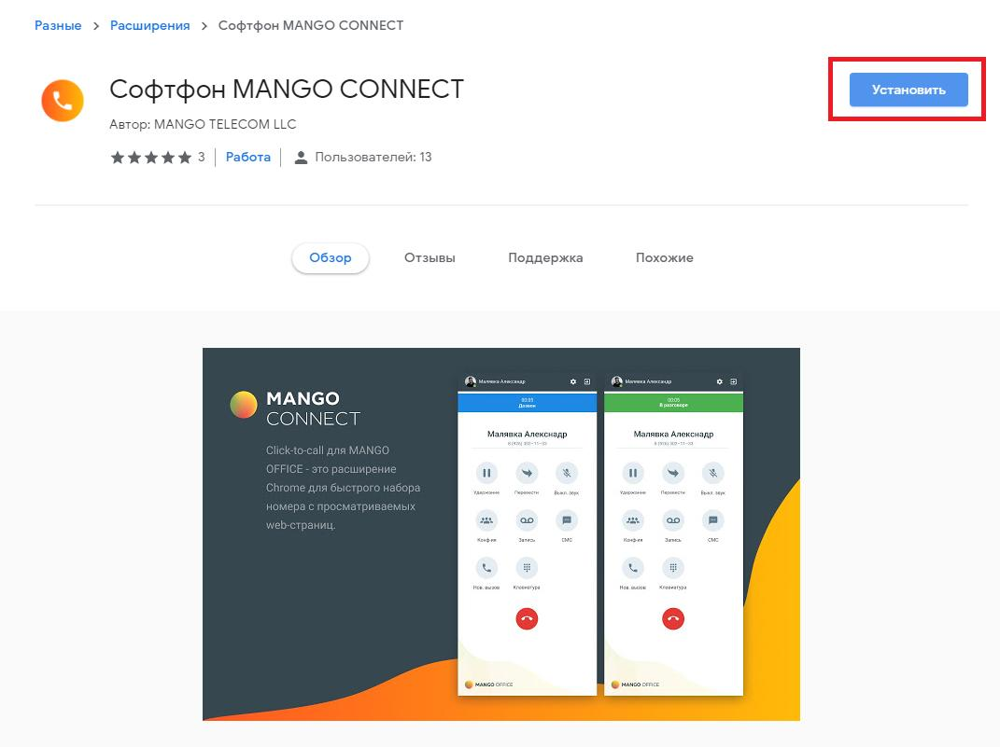
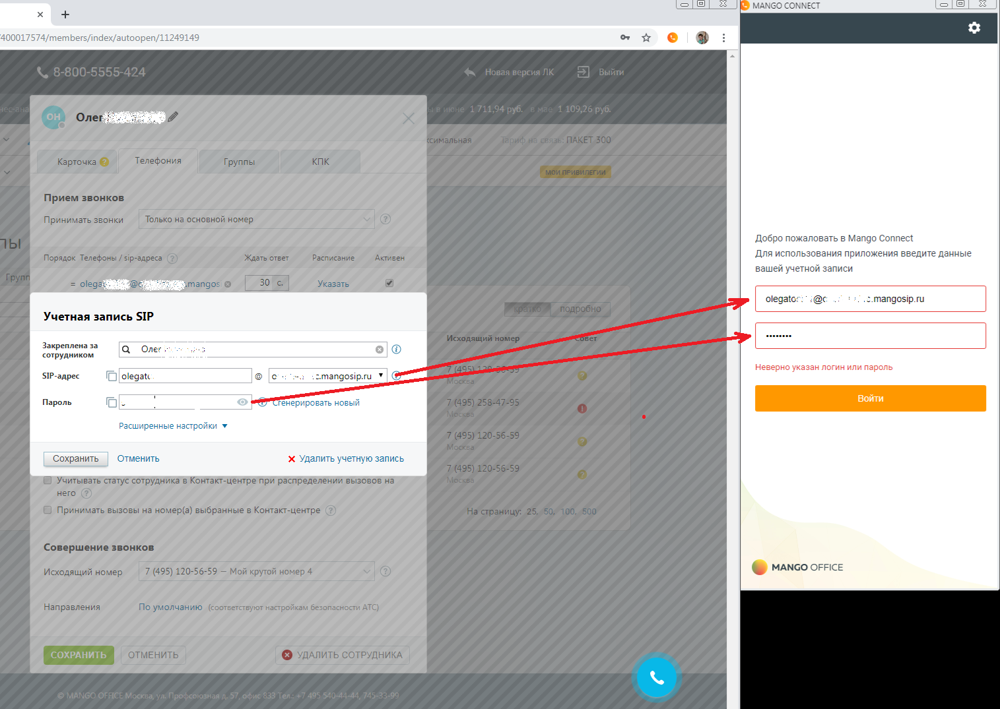
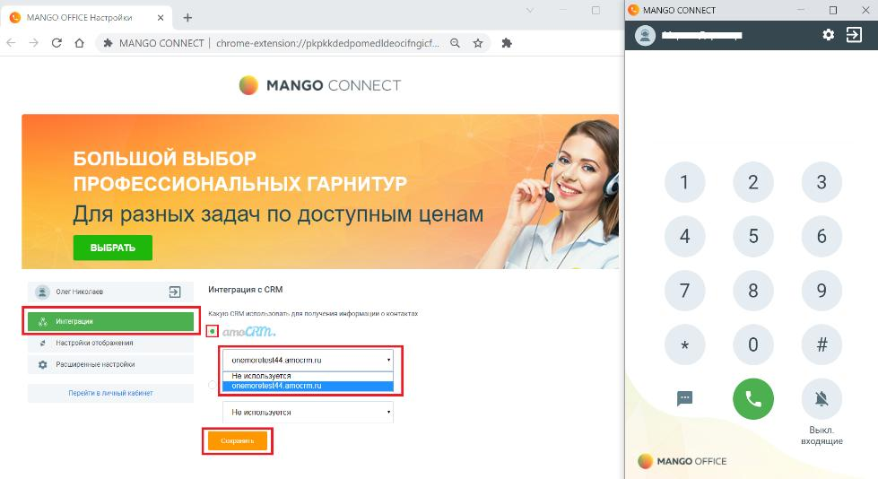

# 15.2. Установка и первый запуск работы

> Трассировка: PDF §15.2 · сквозные стр. 140-143 · источники: ч.1 `kb/sources/integration_amocrm/Mango_office_integration_amoCRM.pdf` с.140-143.

Установку расширения необходимо выполнить каждому сотруднику. 1) нажать “Установить”:

Интеграция Виртуальной АТС MANGO OFFICE и amoCRM | Версия от 25.08.2025 2) подтвердить разрешение на установку:

3) ввести данные SIP ID сотрудника и пароля; 4) нажать на кнопку “Войти”:

5) после успешной авторизации пользователя будут показаны настройки расширения и окно софт фона: Интеграция Виртуальной АТС MANGO OFFICE и amoCRM | Версия от 25.08.2025

6) после авторизации уже можно звонить и принимать звонки:

7) в настройках расширения указать ваш домен в amoCRM и нажать кнопку “Сохранить”:

8) Софтфон MANGO CONNECT настроен на работу с amoCRM. Интеграция Виртуальной АТС MANGO OFFICE и amoCRM | Версия от 25.08.2025
