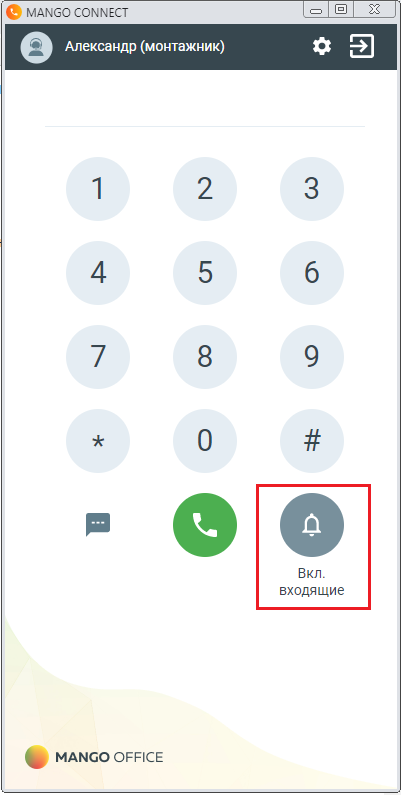
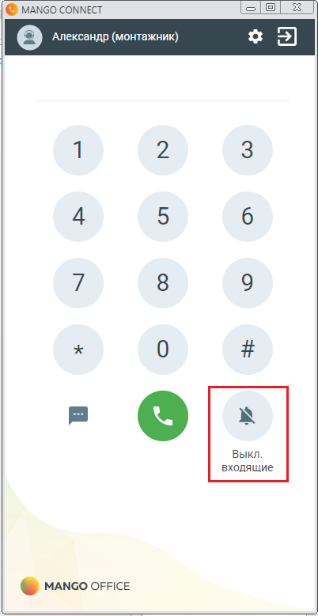

# 15.3. Дополнительно

> Трассировка: PDF §15.3 · сквозные стр. 143-144 · источники: ч.1 `kb/sources/integration_amocrm/Mango_office_integration_amoCRM.pdf` с.143-144.

Как включить и выключить режим “Не беспокоить” / DND MANGO CONNECT поддерживает режим “Не беспокоить”. Если вы включили данный режим, то все ваши всходящие звонки автоматически сбрасываются. Примечание. В данном режиме входящий звонок завершается с кодом 1123, который означает “Получен сигнал”Не беспокоить”. Чтобы перевести ваш MANGO CONNECT в режим “Не беспокоить”, нужно нажать на кнопку. Чтобы отключить “Режим не беспокоить”, в вашем MANGO CONNECT нужно нажать кнопку

.

а) б) Интеграция Виртуальной АТС MANGO OFFICE и amoCRM | Версия от 25.08.2025
