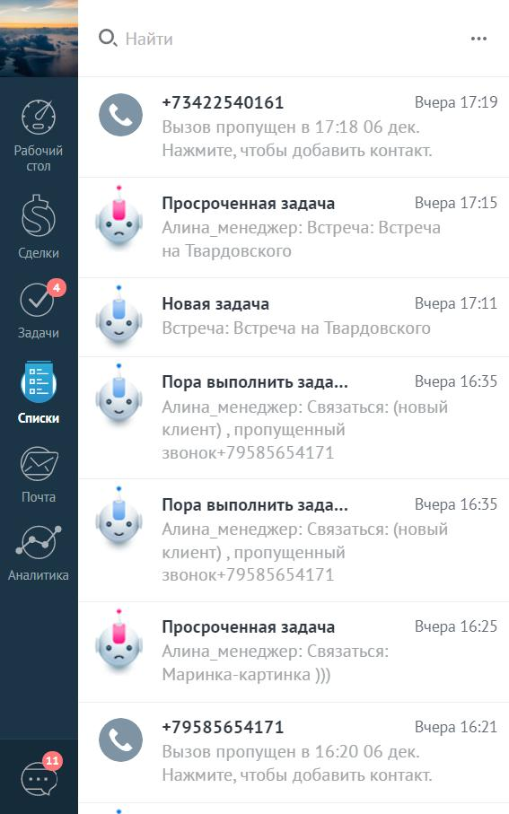

# 17.1. Обзор

> Трассировка: PDF §17.1 · сквозные стр. 145-146 · источники: ч.1 `kb/sources/integration_amocrm/Mango_office_integration_amoCRM.pdf` с.145-146.

Можно самостоятельно устранить некоторые ошибки, связанные с интеграцией amoCRM и виртуальной АТС MANGO OFFICE, или отправить заявку на исправление этих ошибок в службу поддержки Клиентов MANGO OFFICE. При возникновении ошибки, в левом нижнем углу экрана amoCRM появляется специальное уведомление. Эти уведомления отмечаются заголовком Нажать для справки. Внимание! Это уведомление отображается на экране в течение 5 секунд.

Затем, специальное уведомление об ошибке можно найти в области уведомлений amoCRM:

Текст каждого уведомления содержит краткое описание и код ошибки. При нажатии на уведомление, в зависимости от ошибки, будет открыта новая вкладка браузера, в которой показано подробное описание варианта решения проблемы ИЛИ будет открыта страница “Поддержка” сайта www.mango-office.ru Интеграция Виртуальной АТС MANGO OFFICE и amoCRM | Версия от 25.08.2025
