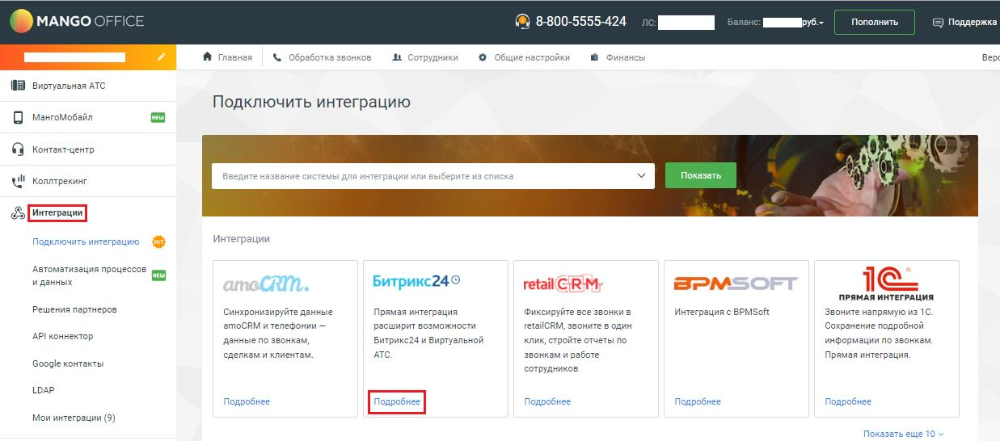
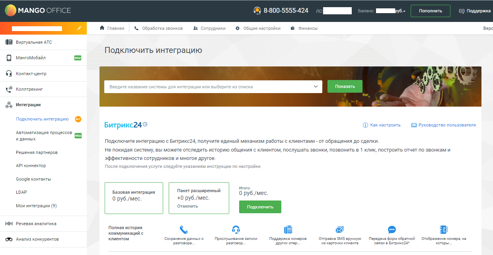
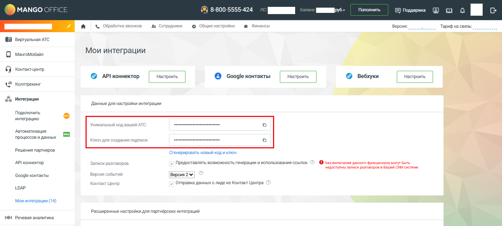
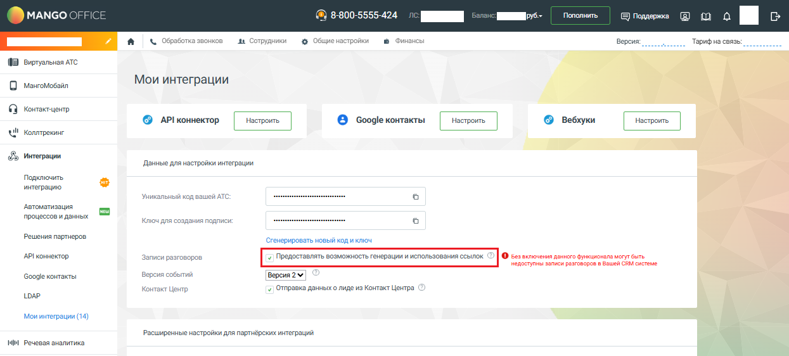

# Шаг 3. Настройка Виртуальной АТС. Выбор пакета интеграции

> Трассировка: PDF §1.1 · сквозные стр. 5-7 · источники: ч.1 `kb/sources/integration-bitrix24/Mango_office_integration_Bitrix24.pdf` с.5-7.

Это нужно сделать, чтобы Виртуальная АТС MANGO OFFICE могла передавать в ваш Битрикс24 данные о звонках. Выполните следующие действия: 1) войдите в Личный кабинет Виртуальной АТС; 2) перейдите в раздел "Интеграции"; 3) нажмите "Подробнее" в блоке "Битрикс24": Интеграция Виртуальной АТС MANGO OFFICE и Битрикс24 | Версия от 03.03.2026

4) подключите услугу "Базовая интеграция". А если вы хотите получить расширенные возможности интеграции выберите также "Расширенная интеграция";

Далее, будет автоматически открыта страница "Мои интеграции" Личного кабинета MANGO OFFICE. Важно. Не закрывайте страницу "Мои интеграции", вам понадобятся значения параметров "Уникальный код вашей АТС" и "Ключ для создания подписи" при настройке приложения интеграции в Битрикс24: Интеграция Виртуальной АТС MANGO OFFICE и Битрикс24 | Версия от 03.03.2026

Важно. Если вы используете сервис "Запись разговоров" Виртуальной АТС, но НЕ хотите, чтобы записи попадали в Битрикс24, то ВЫКЛЮЧИТЕ флаг "Предоставлять возможность генерации и использования ссылок" и нажмите кнопку "Сохранить", которая расположена внизу страницы "Мои интеграции":

