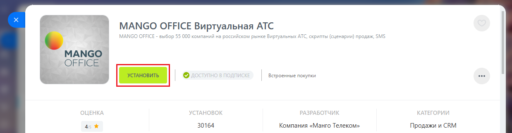
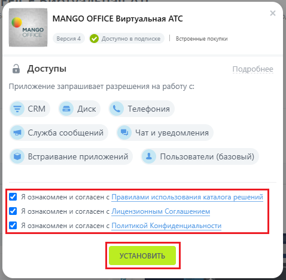
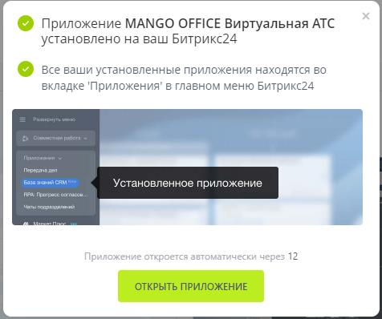
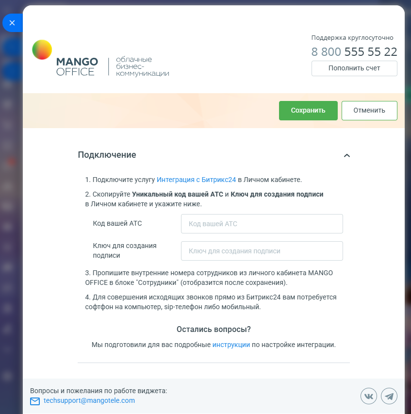
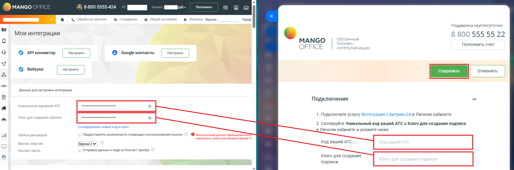

# Шаг 4. Установка приложения интеграции в Битрикс24

> Трассировка: PDF §1.1 · сквозные стр. 7-10 · источники: ч.1 `kb/sources/integration-bitrix24/Mango_office_integration_Bitrix24.pdf` с.7-10.

Чтобы в вашем Битрикс24 установить приложение интеграции MANGO OFFICE, выполните: 1) войдите в ваш Битрикс24 под пользователем с правами администратора; 2) перейдите в раздел "Приложение –> Маркетплейс"; 3) перейдите в раздел "Интеграции" или в поле "Поиск" введите MANGO OFFICE и нажмите кнопку "Enter" на клавиатуре; 4) нажмите на строку с данными приложения "MANGO OFFICE Виртуальная АТС": Интеграция Виртуальной АТС MANGO OFFICE и Битрикс24 | Версия от 03.03.2026

5) нажмите на кнопку "Установить":

6) в открывшемся окне обязательно установите флаги: - Я ознакомлен с Правилами использования каталога решений; - Я ознакомлен и согласен с лицензионным соглашением; - Я ознакомлен и согласен с политикой конфиденциальности; 7) нажмите на кнопку "Установить":

8) приложение будет установлено в ваш Битрикс24, об этому будет выдано уведомление: Интеграция Виртуальной АТС MANGO OFFICE и Битрикс24 | Версия от 03.03.2026

9) после показа уведомления, будет открыта форма для подключения вашего Битрикс24 к вашей Виртуальной АТС:

10) укажите значения "Уникальный код вашей АТС" и "Ключ для создания подписи", скопированные из Личного кабинета; Интеграция Виртуальной АТС MANGO OFFICE и Битрикс24 | Версия от 03.03.2026 11) нажмите на кнопку "Сохранить" (зеленая кнопка, в верхней части формы настройки приложения):

После сохранения кода и ключа, в приложении открывается доступ к настройкам, в зависимости от вашего пакета интеграции.
