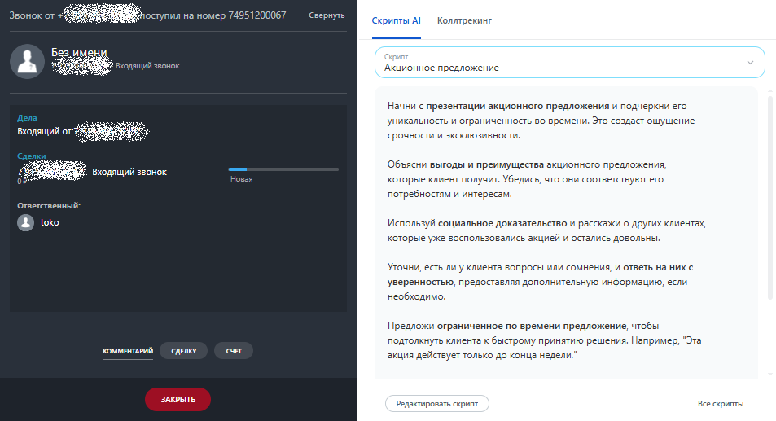
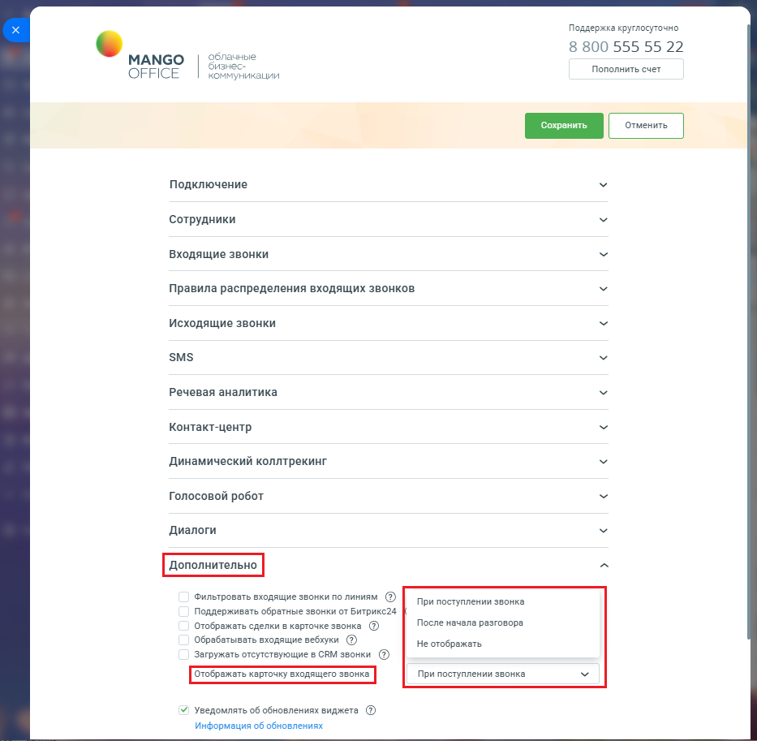

# 2.20. Настройка отображения карточки звонка

> Трассировка: PDF §2.20 · сквозные стр. 104-105 · источники: ч.1 `kb/sources/integration-bitrix24/Mango_office_integration_Bitrix24.pdf` с.104-105.

Вы можете настроить показ карточки входящего звонка (см. рисунок ниже) на экране. Примечание. Настройка доступна в расширенном пакете интеграции.

Чтобы настроить отображение карточки, необходимо: 1) откройте форму настройки приложения интеграции; 2) откройте блок "Дополнительно"; 3) в поле "Отображать карточку входящего звонка" выберите вариант отображения карточки звонка:

| Вариант отображения | Примечание |
| --- | --- |
| При поступлении звонка | Выбран по умолчанию. Карточка отображается одновременно с входящем звонком |
| После начала разговора | Карточка покажется на экране только того, как вы примите входящий звонок (поднимите трубку). |
| Не отображать | Карточка звонка не будет отображаться на экране |

4) нажмите кнопку "Сохранить". Интеграция Виртуальной АТС MANGO OFFICE и Битрикс24 | Версия от 03.03.2026

