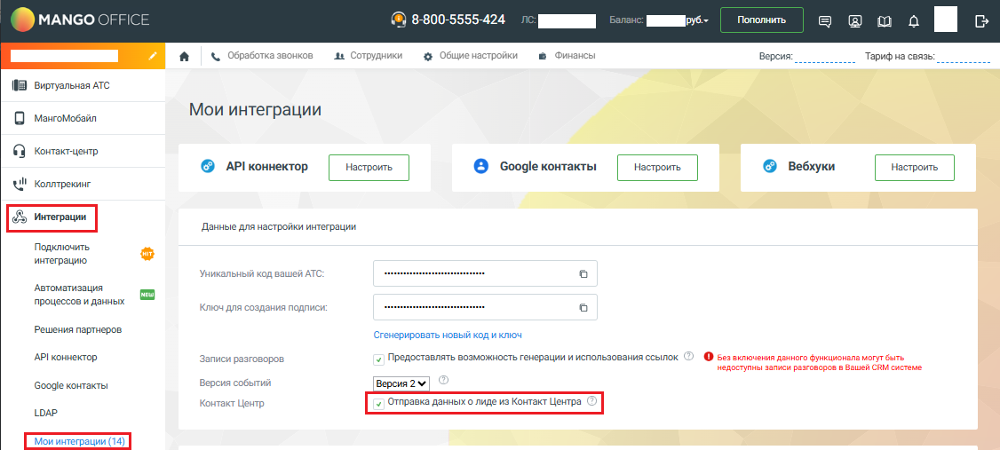
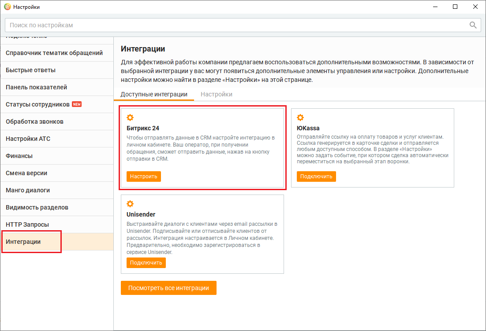

# Настройка интеграции с Контакт-центром MANGO OFFICE. Общие инструкции

> Трассировка: PDF §2.22 · сквозные стр. 106-108 · источники: ч.1 `kb/sources/integration-bitrix24/Mango_office_integration_Bitrix24.pdf` с.106-108.

инструкции Примечание. В этом разделе описано, как настроить интеграцию с Контакт- центром MANGO OFFICE для передачи данных об обращениях и тематиках, а также сохранении истории чатов. Чтобы автоматически добавлять задания в кампанию исходящего обзвона при изменении в воронке продаж Битрикс24, вы можете настроить интеграцию через вебхуки. Чтобы настроить интеграцию с Контакт-центром MANGO OFFICE, необходимо: 1) открыть Личный кабинет MANGO OFFICE; 2) в меню выбрать "Интеграции"; 3) выбрать "Мои интеграции"; 4) поставить "галочку" в поле "Отправка данных о лиде из Контакт-центра"; 5) нажать кнопку "Сохранить":

Интеграция Виртуальной АТС MANGO OFFICE и Битрикс24 | Версия от 03.03.2026 Далее проверьте, что интеграция успешно подключена. Для этого необходимо: 1) открыть Контакт-центр MANGO OFFICE; 2) открыть настройки Контакт-центра MANGO OFFICE; 3) открыть раздел "Интеграции"; 4) нажать на пункт "Настроить";

Будет открыл ваш Личный кабинет MANGO OFFICE, в котором открыт раздел "Интеграции". Проверьте, что интеграция ВАТС и Битрикс24 подключена. Далее, вы можете настроить передачу данных из Контакт-центр MANGO OFFICE в Битрикс24. Интеграция Виртуальной АТС MANGO OFFICE и Битрикс24 | Версия от 03.03.2026
