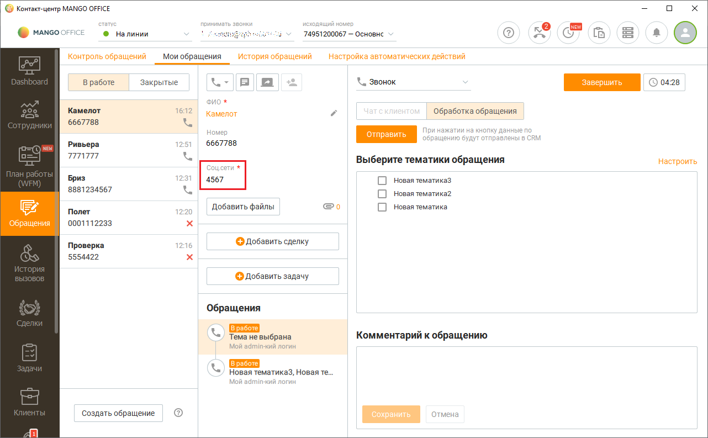
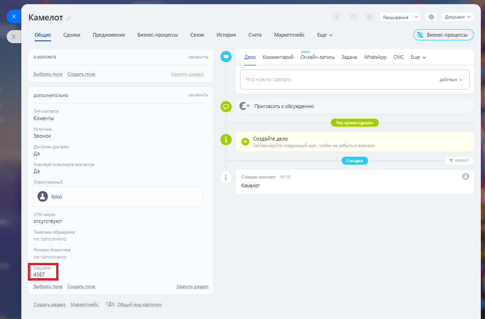

# Импорт данных из "пользовательских" полей

> Трассировка: PDF §2.22 · сквозные стр. 109-110 · источники: ч.1 `kb/sources/integration-bitrix24/Mango_office_integration_Bitrix24.pdf` с.109-110.

В Контакт-центре MANGO OFFICE пользователь может настроить структуру контакта, путем добавления "пользовательских" (своих) полей к стандартным полям контакта. Пример. Если в вашем Контакт-центре MANGO OFFICE имеется "пользовательское" поле "Соц. сети":

То данные из этого поля можно сохранять в контакте Битрикс24 в разделе "Дополнительно":

Интеграция Виртуальной АТС MANGO OFFICE и Битрикс24 | Версия от 03.03.2026
