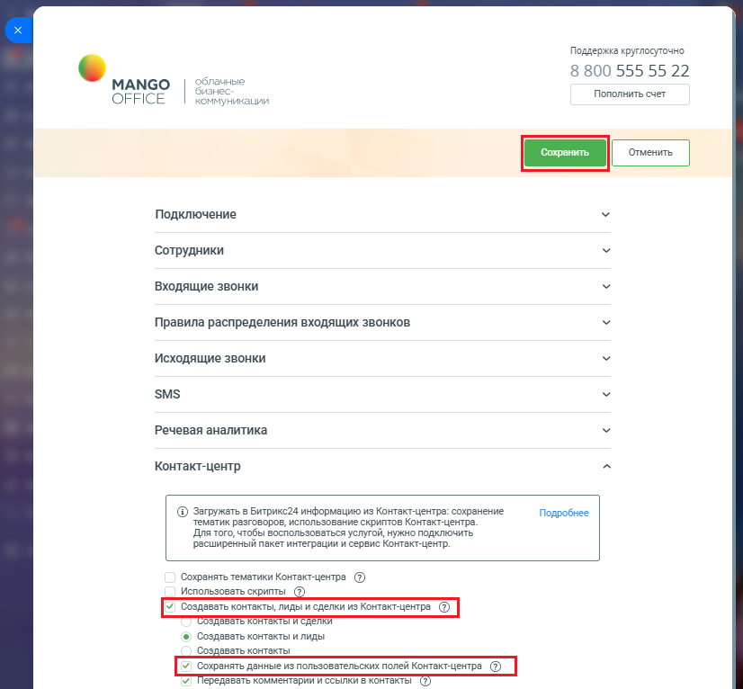

# Как настроить

> Трассировка: PDF §2.22 · сквозные стр. 110-111 · источники: ч.1 `kb/sources/integration-bitrix24/Mango_office_integration_Bitrix24.pdf` с.110-111.

Чтобы импортировать данные из "пользовательских" полей Контакт-центра MANGO OFFICE в ваши контакты Битрикс24, у вас в приложении интеграции следует: 1) открыть блок "Контакт-центр"; 2) активировать переключатель "Создавать контакты, лиды и сделки из Контакт-центра". Будут открыты дополнительные поля; 3) активировать переключатель "Сохранять данные из пользовательских полей Контакт-центра"; 4) нажмите кнопку "Сохранить" в верхней части окна настроек.

В таком случае, "пользовательские" поля будут сохраняться в новых контактах и/или добавляться к ранее существующим контактам Битрикс24 в разделе "Дополнительно". Интеграция Виртуальной АТС MANGO OFFICE и Битрикс24 | Версия от 03.03.2026
