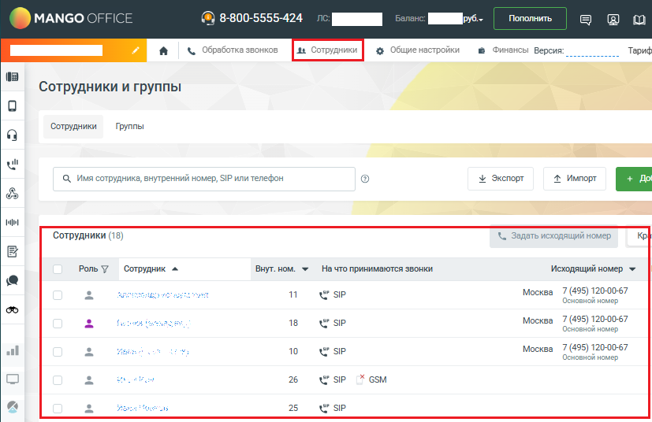
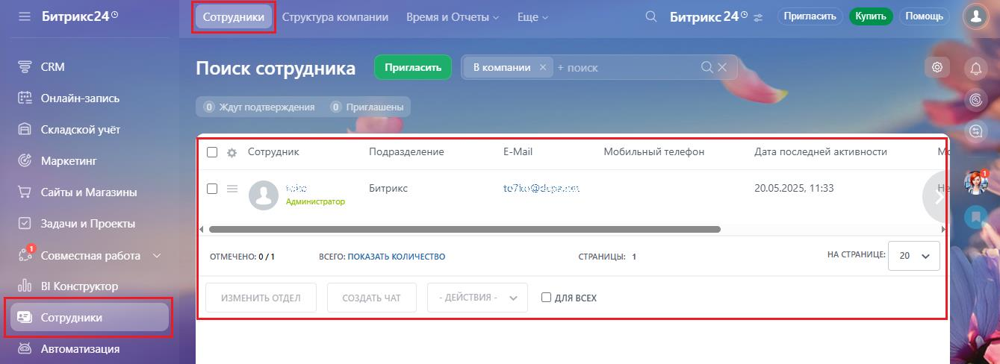

# Как посмотреть списки сотрудников ВАТС и сотрудников Битрикс24

> Трассировка: PDF §1.1 · сквозные стр. 14-15 · источники: ч.1 `kb/sources/integration-bitrix24/Mango_office_integration_Bitrix24.pdf` с.14-15.

В Вашей Виртуальной АТС есть список сотрудников. Посмотреть этот список сотрудников вы можете в Личном кабинете MANGO OFFICE: 1) откройте личный кабинет по ссылке https://lk.mango-office.ru/ 2) откройте раздел "Сотрудники"; Вы увидите список сотрудников вашей Виртуальной АТС:

Интеграция Виртуальной АТС MANGO OFFICE и Битрикс24 | Версия от 03.03.2026 А также, в Вашем Битрикс24 есть список сотрудников. Вы можете его посмотреть в вашем Битрикс24:

