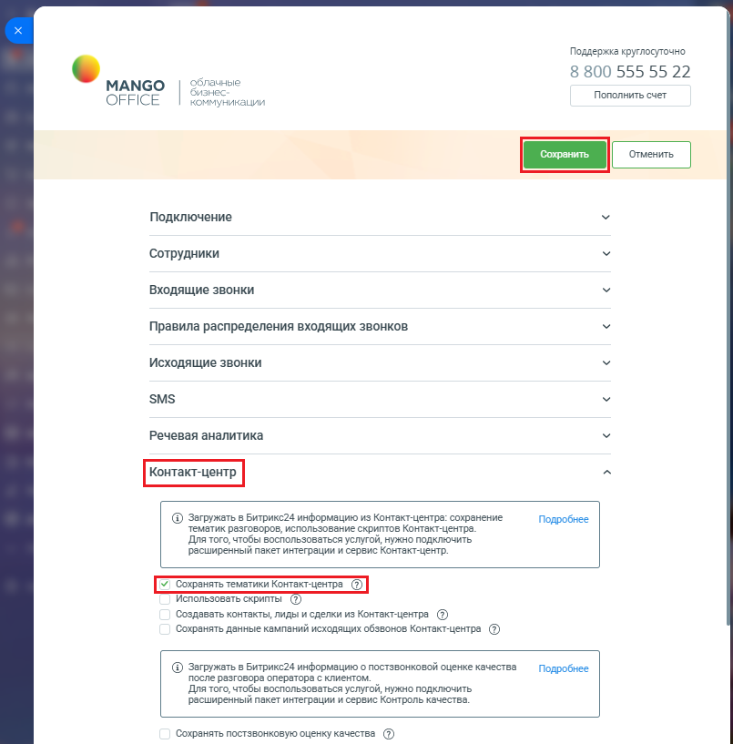

# Как включить настройку

> Трассировка: PDF §2.22 · сквозные стр. 119-120 · источники: ч.1 `kb/sources/integration-bitrix24/Mango_office_integration_Bitrix24.pdf` с.119-120.

Чтобы включить настройку, необходимо: 1) откройте форму настройки приложения интеграции; 2) открыть блок "Контакт-центр"; 3) установите флаг "Сохранять тематики Контакт-Центра"; 4) нажмите кнопку "Сохранить" в верхней части формы настройки приложения интеграции.

Интеграция Виртуальной АТС MANGO OFFICE и Битрикс24 | Версия от 03.03.2026
