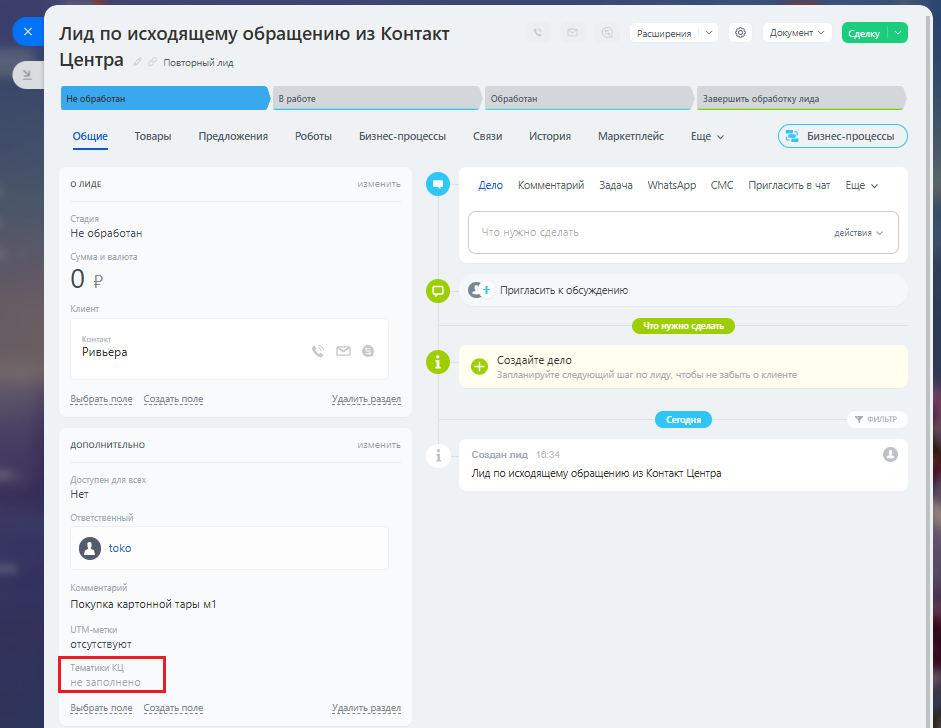

# Как посмотреть тематику Контакт-Центра

> Трассировка: PDF §2.22 · сквозные стр. 120 · источники: ч.1 `kb/sources/integration-bitrix24/Mango_office_integration_Bitrix24.pdf` с.120.

Тематики сохраняются в контакте, компании или лиде Битрикс24 в поле под названием "Тематики КЦ". Например, на рисунке ниже красным выделено это поле в лиде:

