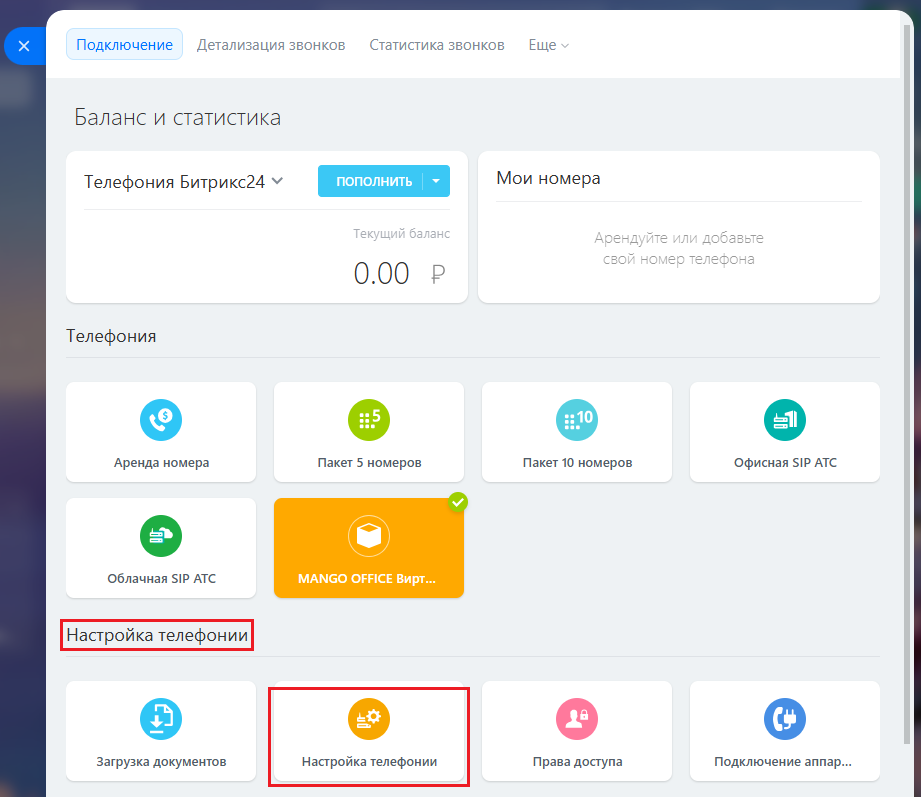
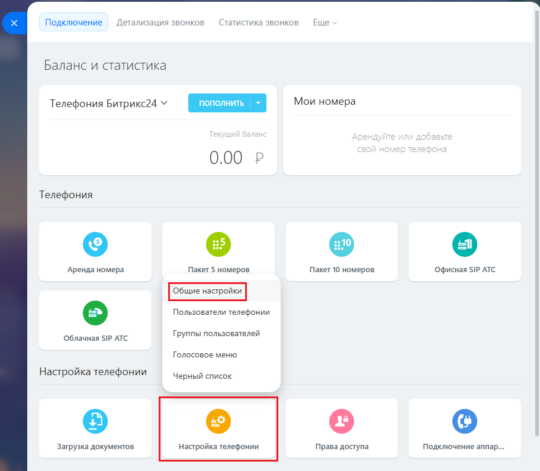
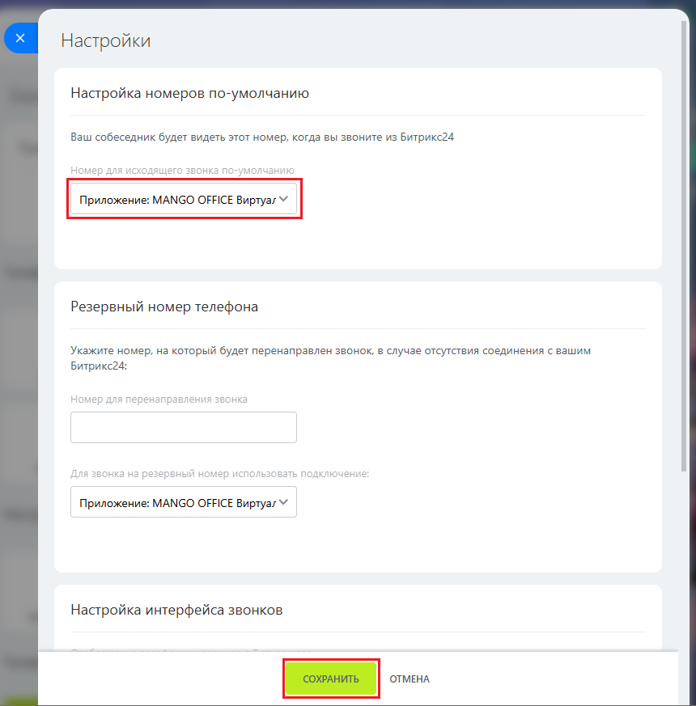

# Шаг 6. Проверка настройки телефонии

> Трассировка: PDF §1.1 · сквозные стр. 15-18 · источники: ч.1 `kb/sources/integration-bitrix24/Mango_office_integration_Bitrix24.pdf` с.15-18.

Обычно настройки телефонии устанавливаются одновременно с установкой приложения интеграции, но в некоторых случаях они могут быть не установлены автоматически. Чтобы проверить установлены ли настройки телефонии, откройте раздел "Телефония" вашего Битрикс24 и выполните следующие действия: 1) нажмите кнопку "Настройка телефонии" или в поле "Поиск" введите "Телефония";

Интеграция Виртуальной АТС MANGO OFFICE и Битрикс24 | Версия от 03.03.2026 2) в группе полей "Настройки телефонии" нажмите на кнопку "Настройки телефонии":

Интеграция Виртуальной АТС MANGO OFFICE и Битрикс24 | Версия от 03.03.2026 В открывшемся меню нажмите "Общие настройки”:

Интеграция Виртуальной АТС MANGO OFFICE и Битрикс24 | Версия от 03.03.2026 3) в открывшейся форме "Настройки" проверьте, что в поле "Настройка номеров по умолчанию" указано значение Приложение: MANGO OFFICE 4) Если там указано иное значение, то вам нужно: - в поле "Настройка номеров по умолчанию" выбрать "Приложение: MANGO OFFICE"; - нажать кнопку "Сохранить" в нижней части формы "Настройки":

Вы установили и настроили интеграцию между Виртуальной АТС и Битрикс24.
