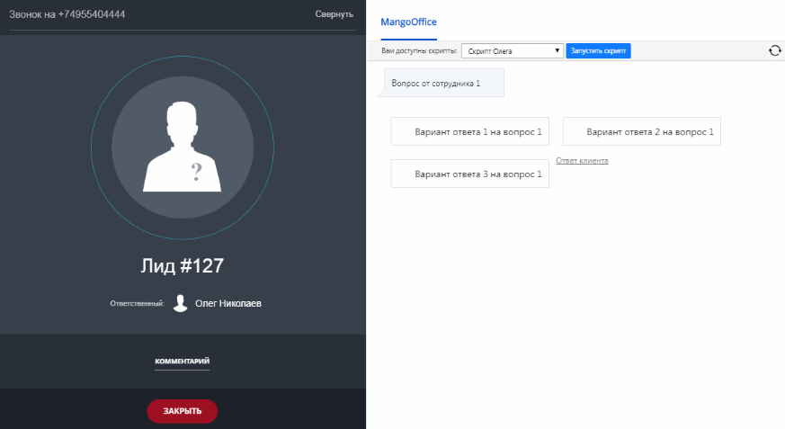
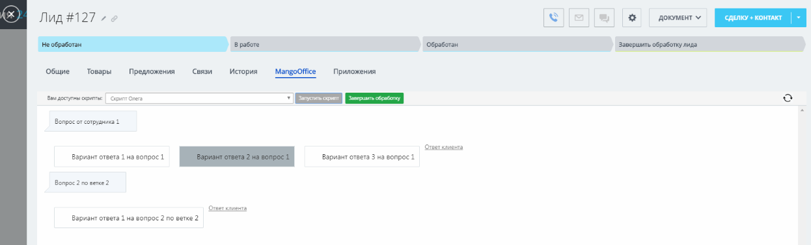

# Скрипты

> Трассировка: PDF §2.22 · сквозные стр. 126-127 · источники: ч.1 `kb/sources/integration-bitrix24/Mango_office_integration_Bitrix24.pdf` с.126-127.

Если вы хотите: ● повысить продажи, средний чек и удовлетворенность Клиентов; ● обучать сотрудников и повышать компетенцию компании; ● сообщать Клиентам и получать у Клиентов точную информацию, то начните использовать скрипты разговора в Битрикс24. Прямо в интерфейсе Битрикс24 при поступлении звонка, у сотрудника открывается диалоговое окно с вопросом, который он задает Клиенту и вариантами ответа на него:

Интеграция Виртуальной АТС MANGO OFFICE и Битрикс24 | Версия от 03.03.2026

Сотрудник выбирает вариант ответа Клиента, при необходимости дополняет его комментарием. При необходимости уточнить данные по Клиенту, сотрудник переходит в карточку Клиента и там же продолжает прохождение скрипта, и тут же обновляя данные о Клиенте:

Работа со скриптами доступна только во время звонка или после окончания звонка, если во время звонка было начато прохождение скрипта.
