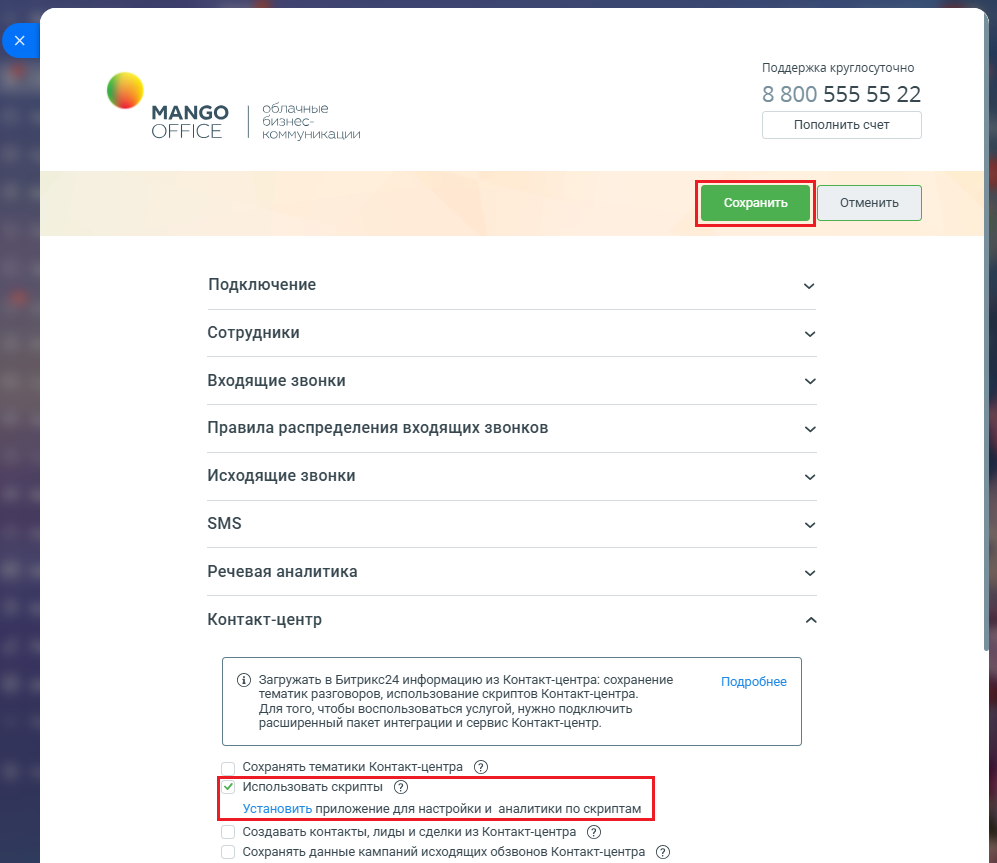

# Как включить использование скриптов в приложении

> Трассировка: PDF §2.22 · сквозные стр. 130-132 · источники: ч.1 `kb/sources/integration-bitrix24/Mango_office_integration_Bitrix24.pdf` с.130-132.

Для начала убедитесь, что вы используете расширенный пакет интеграции и Контакт-центр, с доступом к скриптам. Кроме того, включать использование скриптов могут только сотрудники Битрикс24, которым предоставлен доступ к приложению интеграции. Чтобы включить использованием скриптов, в вашем Битрикс24 необходимо: 1) откройте форму настройки приложения интеграции; 2) откройте блок "Контакт-центр"; 3) установите флаг "Использовать скрипты"; Примечание. Приложение интеграции с Битрикс24 должно быть настроено в соответствии с требованиями, чтобы в нем был доступен флаг "Использовать скрипты". 4) нажмите кнопку "Сохранить" в верхней части формы настройки приложения интеграции: Интеграция Виртуальной АТС MANGO OFFICE и Битрикс24 | Версия от 03.03.2026

Интеграция Виртуальной АТС MANGO OFFICE и Битрикс24 | Версия от 03.03.2026
