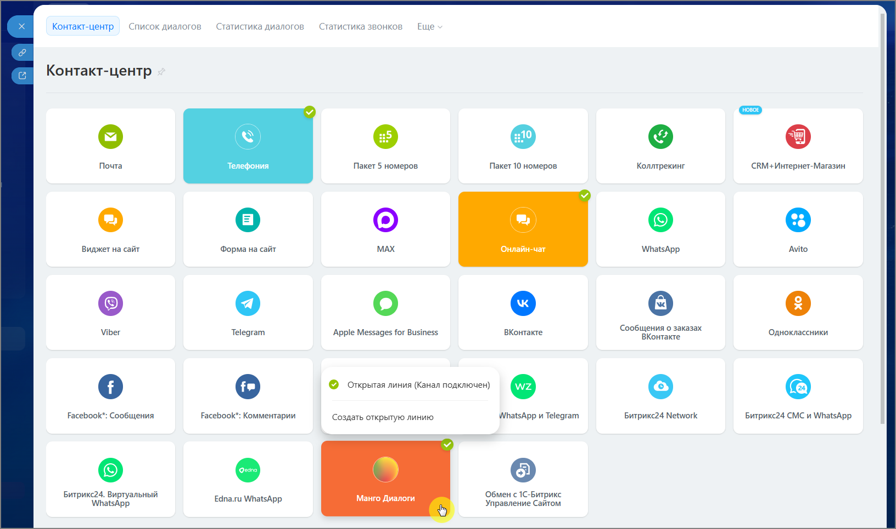
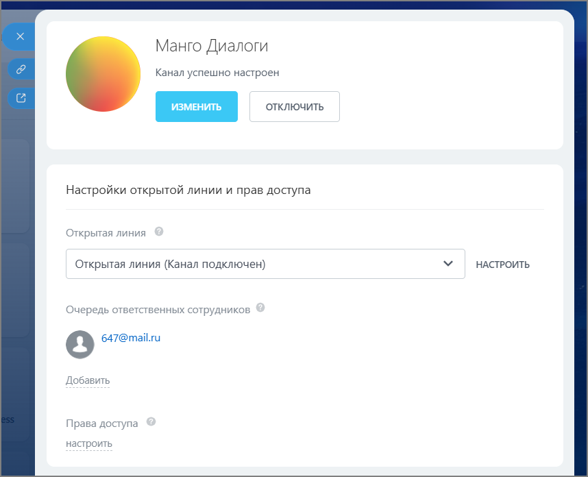
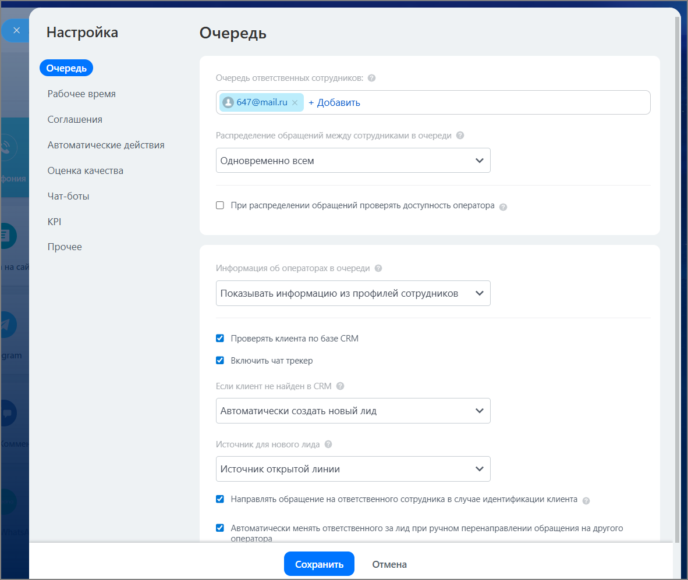

# 2.24.6. Настройте «Открытую линию» в Битрикс24

> Трассировка: PDF §2.24.6 · сквозные стр. 141-143 · источники: ч.1 `kb/sources/integration-bitrix24/Mango_office_integration_Bitrix24.pdf` с.141-143.

Открытая линия в Битрикс24 — это инструмент, который собирает все сообщения от клиентов из разных каналов в одном месте и автоматически распределяет их между сотрудниками. Все входящие сообщения из подключенных каналов «Манго Диалоги» попадают в один интерфейс Битрикс24. Менеджеру не нужно переключаться между десятком приложений - он отвечает на все вопросы в одном окне Контакт-центра. Внимание! Настраивать Открытые линии могут администратор Битрикс24 и сотрудники с ролью Администратор в правах доступа. Для настройки Открытой линии нажмите на активный виджет «Манго Диалоги» и выберите существующую линию для настройки или создайте новую. Интеграция Виртуальной АТС MANGO OFFICE и Битрикс24 | Версия от 03.03.2026

Откроется окно Открытой линии.

Добавьте ответственных сотрудников, которые будут иметь доступ к обработке сообщений из каналов «Манго Диалоги». Добавьте права доступа для ролей. Интеграция Виртуальной АТС MANGO OFFICE и Битрикс24 | Версия от 03.03.2026 Нажмите кнопку Настроить и в открывшемся окне произведите необходимые настройки Открытой линии.

Подробная инструкция по настройке Открытой линии приведена на официальном портале техподдержки Битрикс24: https://helpdesk.bitrix24.ru/open/25004908/
