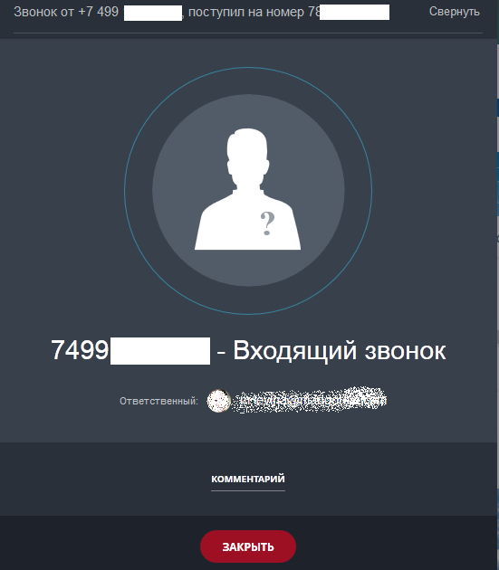
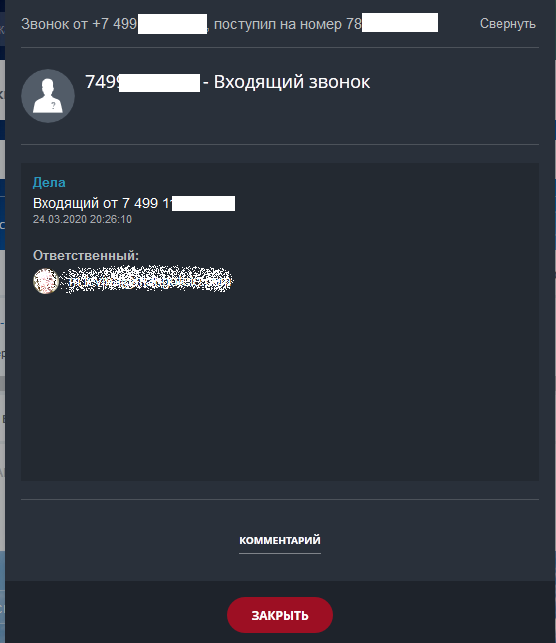
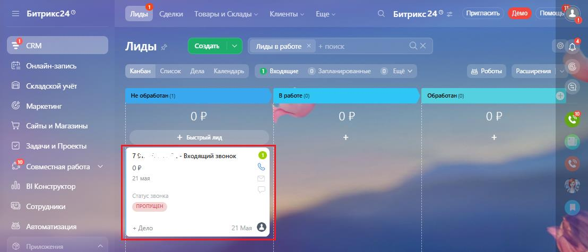
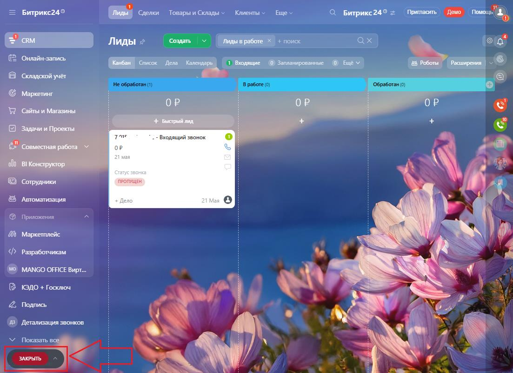

# 3.1. Входящий звонок

> Трассировка: PDF §3.1 · сквозные стр. 146-149 · источники: ч.1 `kb/sources/integration-bitrix24/Mango_office_integration_Bitrix24.pdf` с.146-149.

При входящем звонке у сотрудника зазвонит телефон (указанный в карточке сотрудника в Личном кабинете в качестве средства приема вызова), а в Битрикс24 покажется карточка звонка: • если Клиент звонит вам впервые, то карточка входящего звонка будет выглядеть так:

Интеграция Виртуальной АТС MANGO OFFICE и Битрикс24 | Версия от 03.03.2026 • если Клиент звонит вам повторно, то карточка звонка будет выглядеть так:

При этом в Битрикс24 автоматически будет создан лид, если соответствующая настройка включена ("Номер телефона" - Входящий звонок):

Интеграция Виртуальной АТС MANGO OFFICE и Битрикс24 | Версия от 03.03.2026 Сотрудник принимает звонок на своем телефоне и разговаривает с абонентом. Во время разговора, сотрудник может свернуть карточку звонка, нажав кнопку "Свернуть" в левом верхнем углу этой карточки. Тогда, в вашем Битрикс24 будет отображена кнопка "Закрыть":

Чтобы выйти из режима свернутого окна, нажмите кнопку . Будет открыта карточка звонка. Интеграция Виртуальной АТС MANGO OFFICE и Битрикс24 | Версия от 03.03.2026
