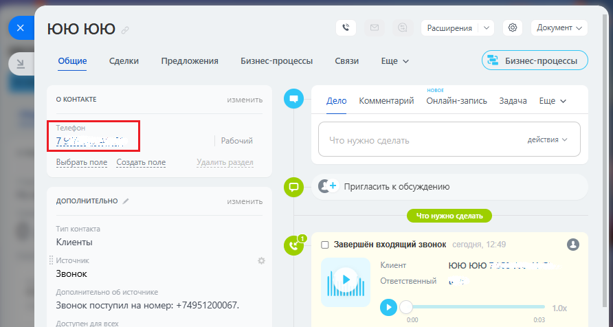
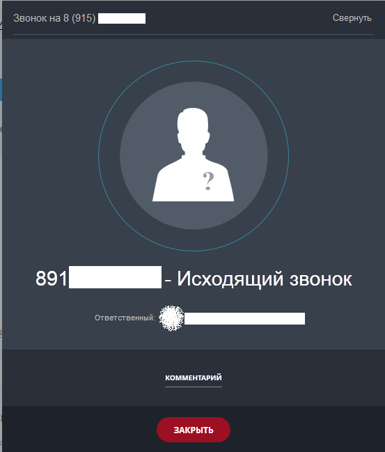

# 3.2. Исходящий звонок

> Трассировка: PDF §3.2 · сквозные стр. 149-150 · источники: ч.1 `kb/sources/integration-bitrix24/Mango_office_integration_Bitrix24.pdf` с.149-150.

Сотрудник может кликнуть на номер телефона в Битрикс24, набрать его в номеронабирателе Битрикс24:

или набрать его на своем рабочем телефоне. При этом, если сотрудник кликнул на номер телефона в Битрикс24, то сначала зазвонит его рабочий телефон, и только после того как сотрудник поднимет трубку – начнется звонок на выбранный номер телефона. При этом, в Битрикс24 будет показана карточка исходящего звонка:

Интеграция Виртуальной АТС MANGO OFFICE и Битрикс24 | Версия от 03.03.2026
