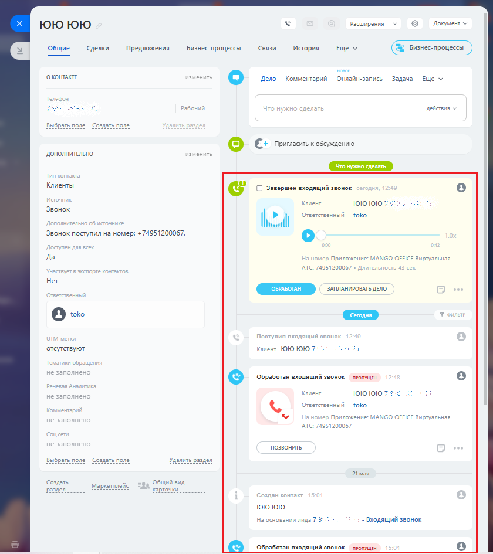

# 3.5. История вызовов

> Трассировка: PDF §3.5 · сквозные стр. 157-158 · источники: ч.1 `kb/sources/integration-bitrix24/Mango_office_integration_Bitrix24.pdf` с.157-158.

Каждый звонок от Клиента отображается в карточке клиента, в истории взаимоотношений с ним:

Интеграция Виртуальной АТС MANGO OFFICE и Битрикс24 | Версия от 03.03.2026 Если в Виртуальной АТС включена услуга записи разговоров, то здесь же можно прослушать или скачать запись разговора. Примечание. Запись разговора может отобразиться в карточке контакта с небольшой задержкой.
